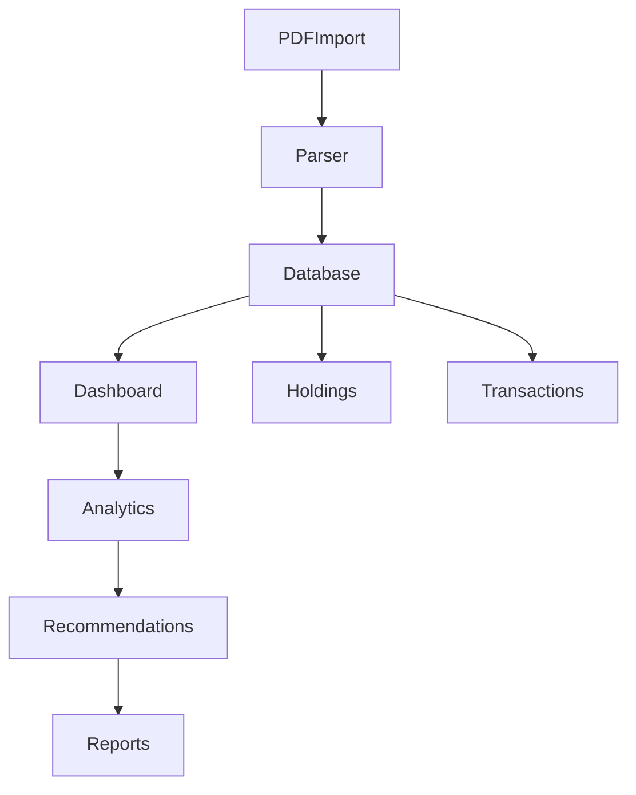

# 03_FeatureCatalog.md

# CAS Analyzer

## Feature Catalog

**Document Version:** 1.0

**Status:** Draft

---

# 1. Purpose

This document defines every functional capability of the CAS Analyzer application.

Each feature is assigned a unique identifier that will be referenced throughout the project.

Feature IDs are used in:

* Architecture Documents
* Database Design
* UI Specifications
* Implementation Tasks
* Test Cases
* Release Planning

This document is the master catalog of application functionality.

---

# 2. Feature Categories

Features are grouped into logical modules.

| Category ID | Category            |
| ----------- | ------------------- |
| CAT-01      | PDF Import          |
| CAT-02      | CAS Parser          |
| CAT-03      | Data Management     |
| CAT-04      | Dashboard           |
| CAT-05      | Holdings            |
| CAT-06      | Transactions        |
| CAT-07      | Portfolio Analytics |
| CAT-08      | Recommendations     |
| CAT-09      | Reports             |
| CAT-10      | Settings            |
| CAT-11      | Security            |
| CAT-12      | Future AI Features  |

---

# 3. Feature Status

| Status      | Meaning                   |
| ----------- | ------------------------- |
| Planned     | Not started               |
| In Progress | Under development         |
| Completed   | Fully implemented         |
| Deferred    | Moved to a future release |
| Cancelled   | No longer planned         |

---

# 4. Feature Priority

| Priority | Meaning                |
| -------- | ---------------------- |
| Critical | Required for Version 1 |
| High     | Strongly recommended   |
| Medium   | Valuable enhancement   |
| Low      | Future improvement     |

---

# 5. Feature Definition Template

Every feature follows the structure below.

* Feature ID
* Name
* Category
* Description
* Priority
* Target Release
* Dependencies
* Related Goals
* Related Scope
* Acceptance Criteria
* Future Enhancements

---

# 6. Version 1 Feature Catalog

## CAT-01 — PDF Import

### FT-001

**Feature Name**

Import CAS PDF

**Description**

Allow users to select one or more NSDL/CDSL CAS PDF files from device storage.

**Priority**

Critical

**Release**

Version 1

**Dependencies**

None

**Related Goals**

FG-01

UG-02

TG-01

**Acceptance Criteria**

* User can select supported PDF files.
* Invalid files are rejected.
* Import process begins successfully.

---

### FT-002

Validate PDF

Priority: Critical

Validate file type, accessibility, and supported CAS format before processing.

---

### FT-003

Import History

Priority: High

Maintain history of imported statements.

---

### FT-004

Duplicate Import Detection

Priority: High

Prevent accidental duplicate imports of the same statement.

---

# CAT-02 — CAS Parser

### FT-005

Extract Text

Priority: Critical

Extract searchable text from supported PDF documents.

---

### FT-006

Detect Statement Sections

Priority: Critical

Identify logical sections within the CAS statement.

---

### FT-007

Parse Investor Information

Priority: Critical

Extract investor details.

---

### FT-008

Parse Demat Accounts

Priority: Critical

Extract demat account information.

---

### FT-009

Parse Mutual Funds

Priority: Critical

Extract mutual fund holdings.

---

### FT-010

Parse Equity Holdings

Priority: Critical

Extract listed equity holdings.

---

### FT-011

Parse Transactions

Priority: Critical

Extract investment transactions.

---

### FT-012

Parse Nominee Information

Priority: High

Extract nominee details.

---

### FT-013

Parse Corporate Actions

Priority: Medium

Extract bonus, split, dividend, merger and related corporate action details where available.

---

# CAT-03 — Data Management

### FT-014

SQLite Storage

Priority: Critical

Persist extracted information.

---

### FT-015

Database Migration

Priority: High

Support future schema evolution.

---

### FT-016

Data Validation

Priority: High

Validate imported data before persistence.

---

### FT-017

Data Cleanup

Priority: Medium

Remove orphaned and invalid records.

---

# CAT-04 — Dashboard

### FT-018

Portfolio Summary

Priority: Critical

Display overall portfolio statistics.

---

### FT-019

Asset Allocation

Priority: Critical

Display allocation by asset class.

---

### FT-020

Recent Imports

Priority: Medium

Display recently imported statements.

---

### FT-021

Quick Insights

Priority: High

Highlight important portfolio observations.

---

# CAT-05 — Holdings

### FT-022

Holdings List

Priority: Critical

Display all holdings.

---

### FT-023

Holding Details

Priority: High

Display detailed holding information.

---

### FT-024

Search Holdings

Priority: Medium

Search by name, ISIN or folio.

---

### FT-025

Filter Holdings

Priority: Medium

Filter by asset class.

---

# CAT-06 — Transactions

### FT-026

Transaction History

Priority: Critical

Display all investment transactions.

---

### FT-027

Transaction Search

Priority: Medium

Search transaction history.

---

### FT-028

Transaction Filters

Priority: Medium

Filter transactions.

---

### FT-029

Transaction Details

Priority: Medium

Display detailed transaction information.

---

# CAT-07 — Portfolio Analytics

### FT-030

Portfolio Overview

Priority: Critical

Display portfolio analytics.

---

### FT-031

Allocation Analysis

Priority: High

Analyze allocation.

---

### FT-032

Diversification Analysis

Priority: High

Analyze diversification.

---

### FT-033

Sector Exposure

Priority: Medium

Display sector concentration.

---

### FT-034

Portfolio Trends

Priority: Medium

Provide historical portfolio insights where data is available.

---

# CAT-08 — Recommendations

### FT-035

Missing Nominee Detection

Priority: Critical

Detect investments without nominees.

---

### FT-036

Portfolio Concentration

Priority: High

Detect excessive concentration.

---

### FT-037

Duplicate Investments

Priority: High

Identify overlapping holdings.

---

### FT-038

Investment Suggestions

Priority: Medium

Provide basic recommendation rules based on available data.

---

# CAT-09 — Reports

### FT-039

Portfolio Report

Priority: High

Generate portfolio summary report.

---

### FT-040

Holdings Report

Priority: Medium

Generate holdings report.

---

### FT-041

Transaction Report

Priority: Medium

Generate transaction report.

---

### FT-042

Export Data

Priority: Medium

Export reports in supported formats.

---

# CAT-10 — Settings

### FT-043

Application Settings

Priority: High

Manage user preferences.

---

### FT-044

Theme Selection

Priority: Medium

Support Light and Dark themes.

---

### FT-045

Backup and Restore

Priority: Medium

Allow local backup and restoration of application data.

---

### FT-046

About Screen

Priority: Low

Display application information and version.

---

# CAT-11 — Security

### FT-047

Biometric Authentication

Priority: Deferred

Optional biometric protection for future releases.

---

### FT-048

Encrypted Database

Priority: Deferred

Encrypt local database in a future release.

---

# CAT-12 — AI Features

### FT-049

AI Portfolio Summary

Priority: Future

Generate natural language summaries of portfolio status.

---

### FT-050

AI Investment Assistant

Priority: Future

Allow users to ask questions about their portfolio using AI-generated insights.

---

# 7. Feature Dependency Strategy

Features should be implemented in dependency order.



---

# 8. Feature Traceability

Each feature should map to:

* Business Goal
* User Goal
* Functional Goal
* Architecture Component
* Implementation Task
* Test Case

This traceability will be maintained throughout the project.

---

# 9. Feature Lifecycle


---

# 10. AI Development Notes

When implementing a feature:

* Reference the Feature ID in commits.
* Reference the Feature ID in implementation documents.
* Reference the Feature ID in test cases.
* Keep implementation aligned with the documented acceptance criteria.

Example commit:

```
feat(FT-018): Implement portfolio summary dashboard
```

---

# 11. Future Revisions

Future versions of this document may include:

* Estimated implementation effort
* Risk rating
* UI references
* Database dependencies
* API dependencies
* Performance targets
* Accessibility requirements

---

# Revision History

| Version | Date       | Author       | Description             |
| ------- | ---------- | ------------ | ----------------------- |
| 1.0     | 2026-06-28 | Project Team | Initial feature catalog |
