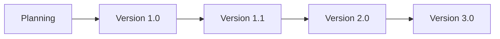

# 04_ProductRoadmap.md

# CAS Analyzer

## Product Roadmap

**Document Version:** 1.0

**Status:** Draft

---

# 1. Purpose

This document defines the planned evolution of the CAS Analyzer product.

It describes:

* Product releases
* Development milestones
* Feature delivery strategy
* Release objectives
* Long-term vision

Unlike the Feature Catalog, which defines **what** the application does, this roadmap defines **when** functionality is expected to be delivered.

The roadmap is intended to guide planning and prioritization. It may evolve as requirements, technical constraints, or user feedback change.

---

# 2. Roadmap Principles

The roadmap follows these principles:

* Deliver working software incrementally.
* Build a stable foundation before adding advanced features.
* Prioritize user value over feature count.
* Minimize technical debt.
* Keep every release production-ready.
* Maintain backward compatibility where practical.

---

# 3. Release Strategy

The product roadmap is organized into incremental releases.

Each release builds on the previous one while preserving data compatibility.

---

# 4. Development Phases

The implementation of Version 1 is divided into architectural phases.

| Phase   | Name               | Primary Outcome                          |
| ------- | ------------------ | ---------------------------------------- |
| Phase 1 | Project Foundation | Documentation and planning               |
| Phase 2 | Architecture       | Clean architecture and project structure |
| Phase 3 | Database           | SQLite schema and repositories           |
| Phase 4 | PDF Parser         | CAS parsing engine                       |
| Phase 5 | Core Features      | Dashboard, Holdings, Transactions        |
| Phase 6 | Analytics          | Portfolio analysis and recommendations   |
| Phase 7 | Reports            | Reporting and export                     |
| Phase 8 | Testing & Release  | Stabilization and production release     |

Each phase concludes with a review before moving to the next phase.

---

# 5. Version 1.0 – Minimum Viable Product (MVP)

## Objective

Deliver a stable offline application capable of importing and analyzing standard NSDL/CDSL CAS statements.

### Features

* PDF Import
* CAS Parsing
* SQLite Storage
* Portfolio Dashboard
* Holdings
* Transactions
* Portfolio Summary
* Basic Analytics
* Basic Recommendations
* Reports
* Application Settings

### Success Criteria

* Standard CAS statements are parsed successfully.
* Portfolio information is accurate.
* The application functions completely offline.
* Core user workflows are stable and responsive.

---

# 6. Version 1.1 – Enhanced Analytics

## Objective

Expand analytical capabilities without changing the core architecture.

### Planned Features

* Improved portfolio insights
* Better filtering and searching
* Enhanced dashboard widgets
* Additional charts
* Improved recommendation engine
* Import performance improvements
* Parser optimizations

### Success Criteria

* Improved usability
* Faster import performance
* More actionable recommendations

---

# 7. Version 2.0 – Intelligent Portfolio Analysis

## Objective

Introduce advanced investment analysis and planning tools.

### Planned Features

* XIRR calculation
* CAGR analysis
* Portfolio diversification analysis
* Sector allocation analysis
* Fund overlap analysis
* Historical portfolio snapshots
* Goal tracking (initial)

### Success Criteria

* Users gain deeper insights into portfolio performance.
* Analytics remain performant on large datasets.

---

# 8. Version 3.0 – AI Assisted Portfolio Intelligence

## Objective

Provide intelligent, explainable insights using AI while preserving user privacy.

### Planned Features

* AI portfolio summaries
* Natural language queries
* Personalized investment insights
* Portfolio health score
* AI-generated recommendations

### Guiding Principle

AI should **assist** users in understanding their investments. Final decisions remain with the user.

---

# 9. Future Vision

Potential future releases may include:

### Security

* Encrypted local database
* Biometric authentication
* Secure backup encryption

### Cloud (Optional)

* Cloud backup
* Device synchronization
* Optional account login

### Asset Expansion

* ETFs
* Bonds
* Sovereign Gold Bonds
* NPS
* REITs
* InvITs
* International investments

### Advisor Mode

* Multiple client portfolios
* Consolidated reporting
* Advisor dashboard

---

# 10. Release Readiness Criteria

Before any release:

* All critical features implemented.
* Unit tests passing.
* Integration tests passing.
* Documentation updated.
* Database migrations verified.
* Performance targets met.
* No critical defects remain.

---

# 11. Risks to the Roadmap

Potential risks include:

* CAS format changes.
* Underestimated parser complexity.
* Performance issues with large PDFs.
* New Android platform restrictions.
* Scope expansion.

Mitigation strategies will be documented during architecture and implementation planning.

---

# 12. Roadmap Governance

The roadmap should be reviewed:

* At the completion of each development phase.
* Before each planned release.
* After significant user feedback.
* When major architectural changes occur.

Changes should be documented in the revision history.

---

# 13. Relationship to Other Documents

This document should be read together with:

* README.md
* 00_ProjectVision.md
* 01_ProjectGoals.md
* 02_ProjectScope.md
* 03_FeatureCatalog.md

Architecture and implementation documents should align with the current roadmap.

---

# 14. AI Development Notes

When implementing features:

* Prioritize features scheduled for the current release.
* Avoid implementing future-release functionality prematurely.
* Keep feature flags or extension points where they simplify future expansion without increasing current complexity.

---

# 15. Future Revisions

Future versions of this roadmap may include:

* Estimated release timelines
* Effort estimates
* Risk ratings
* Feature completion tracking
* User feedback summaries
* Change history by release

---

# Revision History

| Version | Date       | Author       | Description             |
| ------- | ---------- | ------------ | ----------------------- |
| 1.0     | 2026-06-28 | Project Team | Initial product roadmap |
