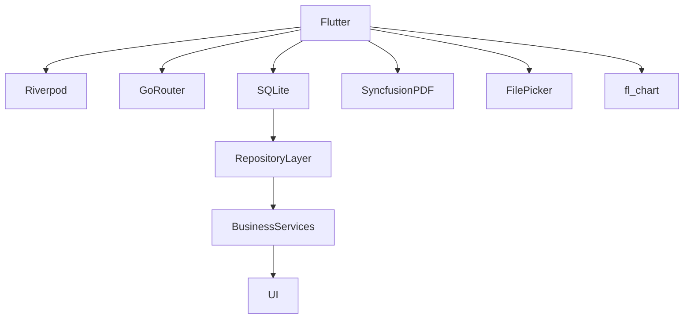

# 05_TechnologyStack.md

# CAS Analyzer

## Technology Stack

**Document Version:** 1.0

**Status:** Draft

---

# 1. Purpose

This document defines the approved technology stack for the CAS Analyzer project.

It explains:

* Technologies selected
* Purpose of each technology
* Reasons for selection
* Alternatives considered
* Future replacement strategy
* Technology governance

This document is the primary reference for all technology-related decisions.

---

# 2. Technology Selection Principles

The technology stack has been selected using the following principles:

* Long-term maintainability
* Strong community support
* Cross-platform capability
* Offline-first architecture
* Minimal external dependencies
* Production readiness
* AI-assisted development compatibility

---

# 3. High-Level Technology Stack

| Layer              | Technology                                 |
| ------------------ | ------------------------------------------ |
| Language           | Dart                                       |
| Framework          | Flutter                                    |
| Architecture       | Clean Architecture                         |
| State Management   | Riverpod                                   |
| Navigation         | GoRouter                                   |
| Database           | SQLite                                     |
| Local Preferences  | SharedPreferences                          |
| PDF Processing     | Syncfusion Flutter PDF                     |
| File Selection     | File Picker                                |
| Charts             | fl_chart                                   |
| Logging            | logger                                     |
| Testing            | flutter_test                               |
| Version Control    | Git                                        |
| Repository Hosting | GitHub                                     |
| IDE                | Visual Studio Code                         |
| AI Assistance      | ChatGPT, Cursor, GitHub Copilot (Optional) |

---

# 4. Programming Language

## Dart

### Purpose

Primary programming language.

### Why Selected

* Native Flutter support
* Strong type safety
* Excellent tooling
* Fast compilation
* Modern language features
* Well suited for mobile applications

### Alternatives Considered

* Kotlin
* Java
* React Native (JavaScript/TypeScript)

### Decision

Flutter requires Dart and provides the best integrated development experience.

---

# 5. Application Framework

## Flutter

### Purpose

Cross-platform mobile application framework.

### Why Selected

* Single codebase
* Excellent performance
* Rich UI capabilities
* Strong community
* Large package ecosystem
* Easy Android/iOS expansion

### Alternatives

* Native Android (Kotlin)
* React Native
* .NET MAUI

### Decision

Flutter provides the best balance of performance, productivity, and future cross-platform support.

---

# 6. Architecture

## Clean Architecture

### Purpose

Separate business logic from UI and infrastructure.

### Benefits

* Testability
* Maintainability
* Scalability
* Loose coupling
* Easier AI-generated code review

### Alternatives

* MVC
* MVVM
* Feature-only architecture

### Decision

Clean Architecture aligns with the project's long-term goals.

---

# 7. State Management

## Riverpod

### Purpose

Manage application state.

### Why Selected

* Compile-time safety
* Easy testing
* Dependency injection support
* Excellent Flutter integration
* Minimal boilerplate

### Alternatives

* Provider
* Bloc
* GetX
* MobX

### Decision

Riverpod provides a good balance of simplicity and scalability.

---

# 8. Navigation

## GoRouter

### Purpose

Application navigation and route management.

### Why Selected

* Officially recommended by Flutter ecosystem
* Deep linking support
* Declarative routing
* Scalable route definitions

### Alternatives

* Navigator 2.0
* AutoRoute

### Decision

GoRouter offers a clean and maintainable routing solution.

---

# 9. Database

## SQLite

### Purpose

Local persistent storage.

### Why Selected

* Mature technology
* Relational model
* SQL querying
* Offline capability
* Stable ecosystem

### Alternatives

* Isar
* Hive
* ObjectBox

### Decision

SQLite is well suited for structured financial data and complex queries.

---

# 10. PDF Processing

## Syncfusion Flutter PDF

### Purpose

Read and process PDF documents.

### Why Selected

* Reliable PDF text extraction
* Good Flutter integration
* Mature library

### Alternatives

* pdf package
* pdfx
* Native Android PDF libraries

### Decision

Chosen for reliable processing of large CAS statements.

---

# 11. File Selection

## File Picker

### Purpose

Allow users to choose PDF files from device storage.

### Why Selected

* Cross-platform
* Easy integration
* Well maintained

---

# 12. Charts

## fl_chart

### Purpose

Portfolio visualization.

### Planned Charts

* Pie Chart
* Line Chart
* Bar Chart
* Allocation Chart

### Alternatives

* Syncfusion Charts
* Charts Flutter

### Decision

Sufficient for Version 1 with minimal complexity.

---

# 13. Local Preferences

## SharedPreferences

### Purpose

Store lightweight application settings.

### Examples

* Theme
* Last import folder
* User preferences

Database storage should not be used for simple configuration values.

---

# 14. Logging

## logger

### Purpose

Application logging during development and troubleshooting.

### Principles

* No sensitive financial information in logs.
* Configurable log levels.
* Disabled or minimized in production builds.

---

# 15. Testing

Testing technologies include:

* flutter_test
* mocktail
* integration_test

Testing levels:

* Unit Tests
* Widget Tests
* Integration Tests

Business logic should have high test coverage.

---

# 16. Version Control

## Git

### Purpose

Source control.

### Repository Strategy

* Main branch
* Feature branches
* Pull requests
* Code reviews

Detailed branching strategy is defined in `07_GitWorkflow.md`.

---

# 17. Development Environment

Recommended tools:

* Visual Studio Code
* Android Studio (Android SDK and emulator)
* Flutter SDK
* Dart SDK
* Git

Optional:

* Cursor
* GitHub Copilot

---

# 18. AI Development Tools

Supported AI tools:

* ChatGPT
* Cursor
* GitHub Copilot

Guidelines:

* AI-generated code must be reviewed.
* Architecture decisions remain human-owned.
* AI should accelerate development, not replace design reviews.

---

# 19. Technology Governance

New technologies or packages should only be introduced if they:

* Solve a clear problem.
* Are actively maintained.
* Have appropriate licensing.
* Do not duplicate existing functionality.
* Align with project architecture.

Technology additions should be documented and, where significant, captured in an ADR.

---

# 20. Future Technology Considerations

Potential future additions:

* SQLCipher (database encryption)
* Biometric authentication
* Secure storage
* Cloud backup integration
* AI inference libraries (for optional on-device intelligence)

These are intentionally excluded from Version 1.

---

# 21. Technology Dependency Diagram

---

# 22. Relationship to Other Documents

This document supports:

* 00_ProjectVision.md
* 01_ProjectGoals.md
* 02_ProjectScope.md
* 04_ProjectConstraints.md
* 06_CodingStandards.md
* 07_GitWorkflow.md

---

# 23. AI Development Notes

When generating code:

* Use only approved technologies.
* Do not introduce new dependencies without justification.
* Follow the architectural patterns defined by the project.
* Prefer reusable, well-tested packages over custom implementations when appropriate.

---

# 24. Future Revisions

Future versions may include:

* Package version matrix
* Upgrade strategy
* Dependency lifecycle management
* Third-party license inventory
* Technology deprecation policy

---

# Revision History

| Version | Date       | Author       | Description                         |
| ------- | ---------- | ------------ | ----------------------------------- |
| 1.0     | 2026-06-28 | Project Team | Initial technology stack definition |
