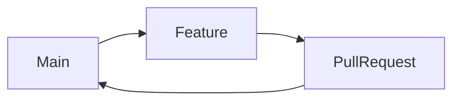
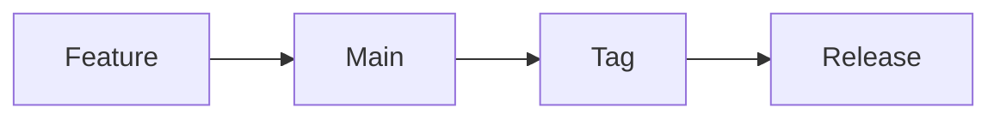

# 07_GitWorkflow.md

# CAS Analyzer

## Git Workflow

**Document Version:** 1.0

**Status:** Approved

---

# 1. Purpose

This document defines the Git workflow for the CAS Analyzer project.

The objectives are to:

* Maintain a clean Git history.
* Support incremental development.
* Simplify code reviews.
* Reduce merge conflicts.
* Support AI-assisted development.
* Enable future collaboration.

This workflow is intentionally lightweight for a solo developer while remaining scalable for a small team.

---

# 2. Workflow Principles

The Git workflow follows these principles:

* Small commits
* Small pull requests
* One feature per branch
* Frequent integration
* Stable `main` branch
* Descriptive commit messages
* Traceability to documentation and feature IDs

---

# 3. Repository Structure

The project uses a single Git repository.

```text
CAS-Analyzer/
│
├── app/
├── docs/
├── prompts/
├── diagrams/
├── scripts/
└── README.md
```

Documentation and source code are versioned together.

---

# 4. Branching Strategy

## Main Branch

`main`

* Always stable.
* Always deployable.
* Protected from direct commits (recommended if collaborating).

---

## Feature Branches

Every new feature is developed in its own branch.

Naming convention:

```text
feature/FT-001-import-pdf
feature/FT-018-dashboard
feature/FT-031-analytics
```

---

## Bug Fix Branches

```text
bugfix/FT-018-dashboard-refresh

bugfix/parser-null-pointer
```

---

## Documentation Branches

```text
docs/update-parser-design

docs/database-schema
```

---

## Experiment Branches

Temporary branches for research or prototypes.

```text
experiment/new-parser

experiment/ai-recommendations
```

These branches are not merged unless approved.

---

# 5. Branch Lifecycle



Feature branches are deleted after merging.

---

# 6. Commit Strategy

Commits should:

* Be small.
* Represent one logical change.
* Compile successfully.
* Leave the project in a working state.

Avoid large "catch-all" commits.

---

# 7. Commit Message Convention

Use Conventional Commits.

Format:

```text
type(scope): summary
```

Examples:

```text
feat(parser): add transaction parser

feat(FT-018): implement dashboard summary

fix(parser): handle empty folio

docs(scope): update architecture

refactor(repository): simplify queries

test(parser): add mutual fund tests

chore(deps): update packages
```

---

# 8. Commit Types

| Type     | Purpose                 |
| -------- | ----------------------- |
| feat     | New functionality       |
| fix      | Bug fix                 |
| docs     | Documentation           |
| refactor | Code improvement        |
| test     | Tests                   |
| style    | Formatting only         |
| chore    | Maintenance             |
| perf     | Performance improvement |
| build    | Build configuration     |
| ci       | Continuous Integration  |

---

# 9. Pull Request Guidelines

Every Pull Request should include:

* Summary
* Related Feature ID
* Related Goal IDs
* Related Architecture Document
* Testing performed
* Screenshots (for UI changes)
* Checklist completion

---

# 10. Merge Strategy

Preferred strategy:

**Squash and Merge**

Benefits:

* Cleaner history.
* One commit per feature.
* Easier rollback.
* Easier release notes.

---

# 11. Version Tags

Use Semantic Versioning.

Examples:

```text
v1.0.0

v1.0.1

v1.1.0

v2.0.0
```

---

# 12. Release Workflow



Every tagged release should:

* Pass tests.
* Update documentation.
* Update CHANGELOG.
* Update version number.

---

# 13. Code Review Guidelines

Before merging:

* Builds successfully.
* Tests pass.
* Documentation updated.
* Architecture followed.
* No debugging code.
* No unnecessary dependencies.
* Feature acceptance criteria satisfied.

---

# 14. Handling AI-Generated Code

AI-generated code should:

* Be committed like any other code.
* Be reviewed before merging.
* Include tests when applicable.
* Follow project standards.

Commit messages should not indicate whether code was AI-generated.

The focus is on code quality, not its origin.

---

# 15. Documentation Updates

Whenever a significant change is made:

* Update related documentation.
* Update revision history.
* Cross-reference new documents where appropriate.

Documentation changes may be committed separately or together with related code changes.

---

# 16. Working with Feature IDs

Every implementation should reference the Feature Catalog.

Example commit:

```text
feat(FT-026): implement transaction history screen
```

Every Pull Request should reference the corresponding feature.

---

# 17. Backup Strategy

The remote GitHub repository is the primary source of truth.

Recommendations:

* Push changes frequently.
* Keep local clones synchronized.
* Tag stable milestones.

---

# 18. Conflict Resolution

If merge conflicts occur:

1. Pull the latest `main`.
2. Resolve conflicts locally.
3. Run tests.
4. Verify the application.
5. Commit the resolution.

Never merge unresolved conflicts.

---

# 19. Branch Protection (Future Team)

If collaborators join:

* Protect `main`.
* Require Pull Requests.
* Require passing tests.
* Require review approval.
* Restrict force pushes.

These rules may be relaxed while working solo.

---

# 20. Relationship to Other Documents

This document complements:

* 00_DocumentationStandards.md
* 05_TechnologyStack.md
* 06_CodingStandards.md
* 09_DevelopmentWorkflow.md

---

# 21. AI Development Notes

When generating code with AI:

* Work on a dedicated feature branch.
* Commit frequently.
* Review generated code before committing.
* Reference Feature IDs in commits.
* Keep commits focused on a single change.

---

# 22. Future Revisions

Future versions may include:

* GitHub Actions workflow
* Branch protection rules
* Release automation
* CI/CD pipeline
* Signed commits
* Automated changelog generation

---

# Revision History

| Version | Date       | Author       | Description                     |
| ------- | ---------- | ------------ | ------------------------------- |
| 1.0     | 2026-06-28 | Project Team | Initial Git workflow definition |
