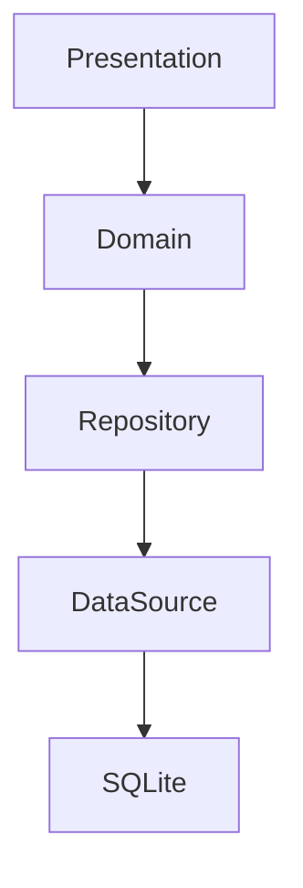

# 08_ProjectStructure.md

# CAS Analyzer

## Project Structure

**Document Version:** 1.0

**Status:** Approved

---

# 1. Purpose

This document defines the standard directory structure for the CAS Analyzer project.

Its objectives are to:

* Organize the project consistently.
* Improve discoverability.
* Support Clean Architecture.
* Simplify onboarding.
* Separate source code from documentation and tooling.
* Support AI-assisted development.

The directory structure defined here should remain stable throughout the project lifecycle.

---

# 2. High-Level Repository Structure

```text
CAS-Analyzer/
│
├── app/                    # Flutter application
├── docs/                   # Project documentation
├── prompts/                # AI prompt library
├── diagrams/               # Mermaid and exported diagrams
├── scripts/                # Utility scripts
├── samples/                # Sample CAS PDFs and test data
├── .github/                # GitHub configuration
├── .vscode/                # VS Code settings
├── README.md
├── CHANGELOG.md
├── LICENSE
└── .gitignore
```

---

# 3. Application Structure

The Flutter application resides entirely within the `app/` directory.

```text
app/
│
├── android/
├── ios/
├── web/
├── linux/
├── macos/
├── windows/
│
├── assets/
├── lib/
├── test/
├── integration_test/
│
├── pubspec.yaml
└── analysis_options.yaml
```

Platform-specific folders should only contain generated or platform-specific code.

Business logic belongs in `lib/`.

---

# 4. Assets Structure

```text
assets/
│
├── icons/
├── images/
├── fonts/
├── json/
├── sample_pdfs/
└── themes/
```

Guidelines:

* Keep images optimized.
* Use SVG where appropriate.
* Do not store large datasets in assets.
* Test PDFs belong in `sample_pdfs/`.

---

# 5. Source Code Structure

The `lib/` folder follows a feature-based Clean Architecture.

```text
lib/
│
├── main.dart
├── app.dart
│
├── core/
├── shared/
├── models/
├── repositories/
└── features/
```

---

# 6. Core Module

The `core/` module contains reusable infrastructure shared across the application.

```text
core/
│
├── constants/
├── database/
├── exceptions/
├── extensions/
├── routes/
├── services/
├── theme/
├── utils/
└── widgets/
```

The `core/` module must not contain business-specific functionality.

---

# 7. Shared Module

The `shared/` module contains reusable UI components and helpers.

```text
shared/
│
├── widgets/
├── dialogs/
├── formatters/
├── validators/
└── mixins/
```

These components should be generic and reusable across features.

---

# 8. Feature Modules

Each feature is self-contained.

Example:

```text
features/
│
├── dashboard/
├── pdf_import/
├── cas_parser/
├── holdings/
├── transactions/
├── portfolio/
├── analytics/
├── recommendations/
├── reports/
├── nominee/
├── settings/
└── about/
```

Every feature owns its presentation, business logic, and data access.

---

# 9. Feature Structure

Every feature follows the same layout.

```text
feature_name/
│
├── data/
│   ├── datasource/
│   ├── models/
│   └── repository/
│
├── domain/
│   ├── entities/
│   ├── repository/
│   └── usecases/
│
├── presentation/
│   ├── providers/
│   ├── screens/
│   └── widgets/
│
└── services/
```

This consistency reduces cognitive load and supports AI-assisted development.

---

# 10. Documentation Structure

```text
docs/
│
├── 00_Project/
├── 01_Architecture/
├── 02_Database/
├── 03_Parser/
├── 04_UI/
├── 05_BusinessLogic/
├── 06_Testing/
├── 07_AI/
├── 08_Development/
├── ADR/
├── diagrams/
└── templates/
```

All architectural decisions should be documented before implementation.

---

# 11. Prompt Library

The `prompts/` directory stores reusable AI prompts.

```text
prompts/
│
├── parser/
├── repository/
├── widgets/
├── testing/
├── database/
└── documentation/
```

These prompts help maintain consistency when using AI tools.

---

# 12. Scripts

Utility scripts belong in:

```text
scripts/
│
├── build/
├── database/
├── release/
├── migration/
└── utilities/
```

Scripts should automate repetitive development tasks.

---

# 13. Sample Data

The `samples/` directory contains development-only resources.

```text
samples/
│
├── pdf/
├── database/
├── json/
└── screenshots/
```

Sensitive user data must never be committed.

Only anonymized or synthetic sample data may be stored.

---

# 14. Naming Conventions

## Files

snake_case

Example:

```text
portfolio_repository.dart
```

---

## Classes

PascalCase

Example:

```dart
class PortfolioRepository {}
```

---

## Variables

camelCase

Example:

```dart
final portfolioValue = 0.0;
```

---

## Folders

snake_case

Example:

```text
portfolio_analysis/
```

---

# 15. Dependency Rules

The project follows these dependency rules:



Rules:

* Presentation never accesses SQLite.
* Domain never depends on Flutter UI.
* Features communicate through public interfaces.
* Shared components remain generic.

---

# 16. File Ownership

Every file should have a clear responsibility.

Avoid "miscellaneous" or "helper" files containing unrelated logic.

If a file becomes too large or has multiple responsibilities, refactor it.

---

# 17. Growth Strategy

The project structure is designed to accommodate future additions without major reorganization.

Examples:

* New features are added under `features/`.
* New shared components belong in `shared/`.
* New infrastructure belongs in `core/`.
* Documentation expands under the appropriate `docs/` section.

---

# 18. AI Development Considerations

A consistent structure improves AI-assisted development by:

* Making code easier to locate.
* Reducing ambiguity in prompts.
* Encouraging reusable components.
* Simplifying code generation.

Prompt example:

> "Create a Riverpod provider for `PortfolioRepository` in the `portfolio` feature."

---

# 19. Relationship to Other Documents

This document complements:

* 00_DocumentationStandards.md
* 05_TechnologyStack.md
* 06_CodingStandards.md
* 09_DevelopmentWorkflow.md

---

# 20. Future Revisions

Future versions may include:

* Multi-package (monorepo) structure.
* Shared Dart packages.
* Plugin architecture.
* Generated code organization.
* Localization resources.
* CI/CD configuration.

---

# Revision History

| Version | Date       | Author       | Description                          |
| ------- | ---------- | ------------ | ------------------------------------ |
| 1.0     | 2026-06-28 | Project Team | Initial project structure definition |
