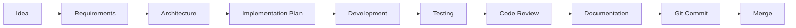

# 09_DevelopmentWorkflow.md

# CAS Analyzer

## Development Workflow

**Document Version:** 1.0

**Status:** Approved

---

# 1. Purpose

This document defines the end-to-end software development workflow for the CAS Analyzer project.

It establishes a repeatable process that ensures:

* Consistent implementation
* High code quality
* Architectural compliance
* Complete documentation
* Effective AI-assisted development
* Incremental delivery

Every feature should follow this workflow.

---

# 2. Development Philosophy

The project follows these principles:

* Documentation before implementation
* Architecture before coding
* Small incremental changes
* Testable software
* Continuous improvement
* AI-assisted, human-reviewed development

The goal is to build a maintainable product rather than simply completing features quickly.

---

# 3. Development Lifecycle

Every feature progresses through the following stages:



No stage should be skipped without justification.

---

# 4. Feature Development Process

For each feature:

### Step 1 – Review Documentation

Read:

* Project Goals
* Project Scope
* Feature Catalog
* Relevant Architecture Documents

Understand the problem before writing code.

---

### Step 2 – Create Implementation Plan

Define:

* Objective
* Dependencies
* Files to create or modify
* Acceptance criteria
* Test strategy
* Risks

Large features should be broken into smaller implementation tasks.

---

### Step 3 – Design Review

Before coding:

* Verify alignment with Clean Architecture.
* Confirm technology choices.
* Review dependencies.
* Identify reusable components.

If the design changes the architecture, create or update an ADR.

---

### Step 4 – Create Feature Branch

Example:

```text
feature/FT-018-dashboard
```

Development begins on a dedicated branch.

---

### Step 5 – Implement Incrementally

Implement one logical task at a time.

Recommended sequence:

1. Domain
2. Data
3. Repository
4. Service
5. Provider
6. UI
7. Tests

Each step should leave the project in a buildable state.

---

### Step 6 – Test

Run:

* Unit tests
* Widget tests (where applicable)
* Manual verification

Critical business logic must be validated before review.

---

### Step 7 – Review

Review for:

* Architecture compliance
* Naming conventions
* Readability
* Test coverage
* Documentation updates

---

### Step 8 – Commit

Create small, descriptive commits.

Example:

```text
feat(FT-018): implement portfolio summary
```

---

### Step 9 – Merge

After successful review:

* Squash commits
* Merge into `main`
* Delete feature branch

---

# 5. AI-Assisted Development Workflow

AI is a development assistant, not an architect.

Recommended workflow:

```mermaid
flowchart LR

Requirement
      ↓
Architecture
      ↓
AI Prompt
      ↓
Generated Code
      ↓
Developer Review
      ↓
Testing
      ↓
Refinement
      ↓
Commit
```

All AI-generated code must be reviewed before integration.

---

# 6. Documentation Workflow

Documentation evolves alongside the code.

Whenever a feature changes:

* Update relevant design documents.
* Revise implementation notes.
* Update revision history.
* Cross-reference new documents.

Documentation should never significantly lag behind implementation.

---

# 7. Testing Workflow

Testing is performed continuously.

Recommended order:

1. Unit tests
2. Widget tests
3. Integration tests
4. Manual verification

Testing should begin as soon as business logic is implemented rather than waiting until the end of a feature.

---

# 8. Architecture Decision Workflow

When implementation requires an architectural change:

1. Identify the issue.
2. Evaluate alternatives.
3. Record the decision in an ADR.
4. Update architecture documentation.
5. Continue implementation.

This preserves the reasoning behind significant decisions.

---

# 9. Issue Management

Each implementation task should:

* Reference a Feature ID.
* Define acceptance criteria.
* Record completion status.
* Link to relevant documentation.

Future GitHub Issues should follow this structure.

---

# 10. Code Quality Gates

Before merging, verify:

* Builds successfully.
* Passes automated tests.
* No analyzer warnings.
* Follows coding standards.
* Documentation updated.
* Acceptance criteria met.

These gates apply to both manual and AI-generated code.

---

# 11. Release Workflow

Each planned release should include:

* Feature freeze
* Regression testing
* Documentation review
* Version update
* Release tag
* Changelog update

Only stable code should be released.

---

# 12. Daily Development Routine

Suggested routine:

1. Pull latest changes.
2. Review current implementation task.
3. Update documentation if needed.
4. Implement one logical unit of work.
5. Run tests.
6. Commit changes.
7. Push branch.
8. Record progress.

This keeps work predictable and reduces integration issues.

---

# 13. AI Usage Guidelines

AI is well suited for:

* Boilerplate code
* Unit tests
* Refactoring suggestions
* Documentation drafts
* Repetitive code generation

AI should not make:

* Product decisions
* Architecture decisions
* Business rule decisions
* Security decisions without review

---

# 14. Definition of Done

A feature is complete only when:

* Acceptance criteria satisfied.
* Code reviewed.
* Tests passing.
* Documentation updated.
* No known critical defects.
* Merged into `main`.

Implementation alone does not constitute completion.

---

# 15. Metrics

The workflow aims to improve:

* Build stability
* Code quality
* Test coverage
* Documentation completeness
* Small commit frequency
* Lead time from feature start to completion

Metrics should be used to improve the process, not to evaluate individuals.

---

# 16. Relationship to Other Documents

This document complements:

* 05_TechnologyStack.md
* 06_CodingStandards.md
* 07_GitWorkflow.md
* 08_ProjectStructure.md
* 03_FeatureCatalog.md

---

# 17. AI Development Notes

When requesting code from AI:

* Reference the relevant Feature ID.
* Mention the target architecture layer.
* Specify the folder where the code belongs.
* Request tests where appropriate.
* Review generated code before committing.

Use AI to accelerate implementation, not to replace engineering judgment.

---

# 18. Future Revisions

Future versions may include:

* CI/CD workflow integration
* Automated quality gates
* Coverage targets
* Performance benchmarking workflow
* Release automation
* Security review workflow

---

# Revision History

| Version | Date       | Author       | Description                  |
| ------- | ---------- | ------------ | ---------------------------- |
| 1.0     | 2026-06-28 | Project Team | Initial development workflow |
