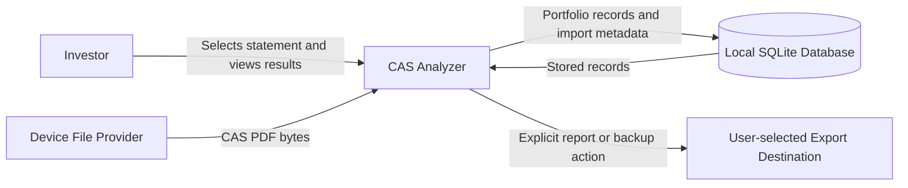
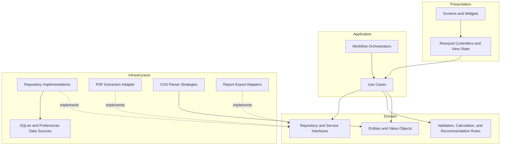
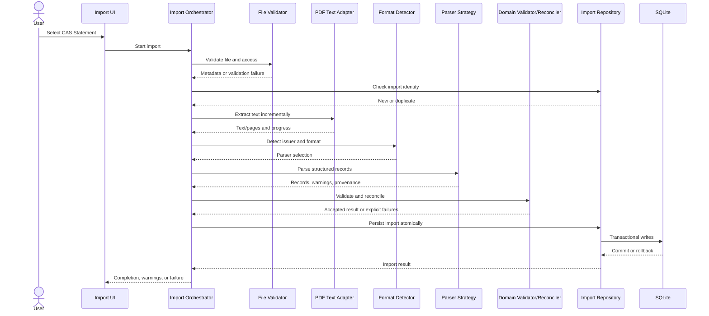
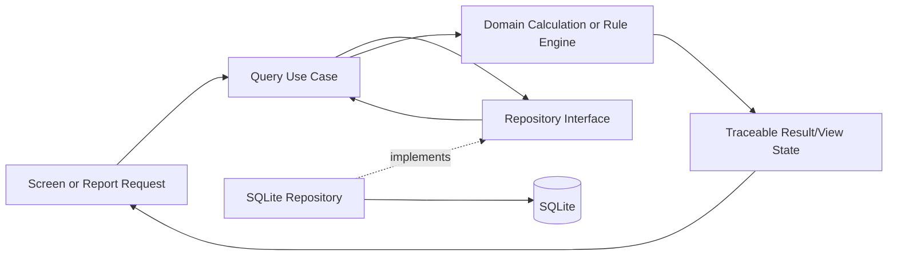
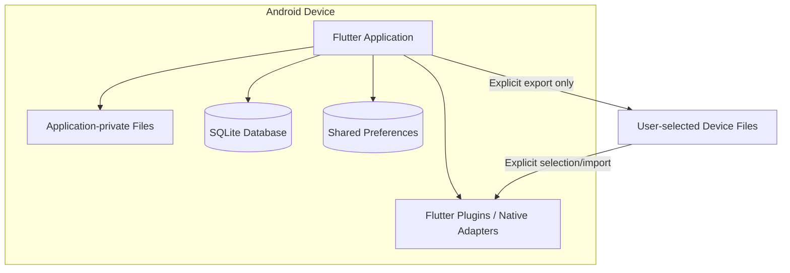

# CAS Analyzer Solution Architecture

**Document Version:** 0.1

**Status:** Draft

**Last Updated:** 2026-07-05

## 1. Purpose

This document defines the high-level solution architecture for CAS Analyzer. It establishes the system boundaries, architectural layers, major modules, dependency rules, runtime flows, and quality strategies that guide detailed design and implementation.

This is the primary architecture overview. Detailed database schemas, parser rules, user-interface specifications, business algorithms, and test plans belong in their respective documentation areas.

## 2. Audience

This document is intended for:

- Developers and reviewers.
- Product and architecture owners.
- Test engineers.
- AI coding assistants working in this repository.

## 3. Architectural Scope

The architecture covers Version 1 of the Flutter application:

- Offline import of text-based NSDL/CDSL CAS Statements.
- Local extraction, parsing, validation, reconciliation, and persistence.
- Portfolio queries, analytics, explainable recommendations, and reports.
- Android as the primary platform with reasonable portability to iOS.

The following are outside the Version 1 architecture boundary:

- OCR and scanned statements.
- Live market data and brokerage services.
- Cloud synchronization and remote user accounts.
- Trading, tax planning, and advanced financial planning.
- AI-generated investment advice.

## 4. Architecture Drivers

### 4.1 Functional Drivers

| Driver | Architectural Impact |
| --- | --- |
| Import large CAS Statements | Requires staged processing, progress reporting, cancellation boundaries, and memory-aware extraction. |
| Support NSDL/CDSL variations | Requires replaceable format detection and modular parser strategies. |
| Prevent duplicate data | Requires stable import identity, idempotent persistence, and reconciliation rules. |
| Preserve history | Requires normalized persistence, source provenance, and controlled migrations. |
| Explain portfolio results | Requires deterministic calculations and traceable source data. |
| Export reports | Requires read-only reporting boundaries and explicit handling of sensitive output. |

### 4.2 Quality Drivers

The following priorities guide trade-offs, in order:

1. Financial correctness and data integrity.
2. Privacy and local data ownership.
3. Reliability and recoverability.
4. UI responsiveness and bounded resource use.
5. Maintainability and testability.
6. Extensibility for new statement formats, asset types, and analytics.
7. Cross-platform portability where it does not compromise Version 1 delivery.

### 4.3 Constraints

- Flutter and Dart are required.
- Core functionality must operate without internet access.
- SQLite is the persistent data store.
- Riverpod is used for state management and dependency injection.
- GoRouter is used for navigation.
- Persistent access must pass through repositories.
- Investment data must not leave the device without an explicit user action.
- The application must remain responsive while processing statements of approximately 200-300 pages.
- External dependencies must be minimal, justified, maintained, and license-compatible.

## 5. Architecture Principles

1. **Correctness before convenience:** reject or clearly identify uncertain financial data rather than silently guessing.
2. **Offline and private by default:** local files, local processing, and local persistence are the default path.
3. **Explicit boundaries:** presentation, application orchestration, domain rules, and infrastructure have distinct responsibilities.
4. **Dependency inversion:** domain behavior depends on abstractions; infrastructure implements those abstractions.
5. **Traceable data:** important records and derived values retain enough provenance to explain their origin.
6. **Idempotent import:** processing the same logical statement more than once must not duplicate portfolio data.
7. **Atomic persistence:** an import must not leave an internally inconsistent database.
8. **Modular parsing:** statement variants and parsing stages are independently testable and replaceable.
9. **Explainable insight:** analytics and recommendations expose inputs, rule identifiers, and explanations.
10. **Evolution through extension:** new statement formats and asset classes should not require rewriting stable modules.

## 6. System Context

CAS Analyzer is a standalone application. It reads user-selected CAS files and writes only to application-controlled local storage or to an explicitly selected export destination.

### 6.1 Trust Boundaries

- A selected PDF is untrusted external input until validated.
- Data inside the application boundary is sensitive financial and personal information.
- Export and backup destinations are outside application-controlled storage and require explicit user intent.
- No network service is part of the core Version 1 runtime.

## 7. Solution Decomposition

The solution uses feature-based Clean Architecture. Each feature may contain presentation, domain, and data concerns, while shared infrastructure remains in `core/` and generic reusable UI remains in `shared/`.

The composition root uses Riverpod providers to connect interfaces to implementations. Runtime dependency injection must not reverse the source-code dependency direction.

## 8. Layer Responsibilities

### 8.1 Presentation Layer

Responsibilities:

- Render screens and reusable widgets.
- Capture user intent.
- Observe immutable view state.
- Display progress, warnings, validation results, and recoverable errors.
- Initiate use cases through Riverpod controllers/providers.

Presentation must not:

- Execute SQL.
- Parse CAS text.
- Contain portfolio calculations or recommendation thresholds.
- Depend on concrete data sources.

### 8.2 Application Layer

Responsibilities:

- Implement task-oriented use cases.
- Coordinate multi-step workflows such as import and report generation.
- Define transactional boundaries and ordering.
- Map domain results to presentation-friendly outcomes without embedding UI behavior.
- Publish progress and support cancellation where technically safe.

Application services may coordinate domain objects and ports but must not own infrastructure-specific parsing or SQL logic.

### 8.3 Domain Layer

Responsibilities:

- Define entities, value objects, and invariants.
- Define repository and service interfaces required by use cases.
- Implement deterministic validation, reconciliation, calculation, and recommendation rules.
- Represent expected failures as explicit domain outcomes where appropriate.

The domain layer must not depend on Flutter widgets, Riverpod, SQLite, file pickers, PDF packages, or platform APIs.

### 8.4 Infrastructure and Data Layer

Responsibilities:

- Extract text from PDFs.
- Detect and parse CAS formats.
- Implement repository interfaces.
- Execute SQLite queries, transactions, and migrations.
- Store lightweight preferences.
- Generate supported export formats.
- Adapt platform APIs and third-party libraries to project-owned interfaces.

Infrastructure details must not leak into domain entities or public feature contracts.

## 9. Major Modules

| Module | Primary Responsibility | Depends On | Feature Range |
| --- | --- | --- | --- |
| App shell | Startup, routing, theme, dependency composition | Core, feature public interfaces | FT-043, FT-044, FT-046 |
| PDF import | File selection, validation, progress, history, duplicate checks | Parser, import repository | FT-001-FT-004 |
| CAS parser | Extraction adaptation, format/section detection, structured parsing | Domain models and parser contracts | FT-005-FT-013 |
| Data management | Validation, import transaction, repositories, migrations, cleanup | SQLite data sources | FT-014-FT-017 |
| Portfolio | Portfolio read model and summary use cases | Holdings and transaction repositories | FT-018, FT-019, FT-030 |
| Dashboard | Summary, recent imports, and quick insights | Portfolio and import use cases | FT-018-FT-021 |
| Holdings | Holding queries, search, filtering, and details | Holding repository | FT-022-FT-025 |
| Transactions | Transaction queries, search, filtering, and details | Transaction repository | FT-026-FT-029 |
| Analytics | Allocation, diversification, sector exposure, and trends | Portfolio read models | FT-030-FT-034 |
| Recommendations | Explainable rules and detected observations | Analytics and portfolio read models | FT-035-FT-038 |
| Reports | Report composition and explicit export | Portfolio query interfaces | FT-039-FT-042 |
| Settings | Preferences and local data-management actions | Preferences and approved maintenance interfaces | FT-043-FT-046 |

Module ownership will be refined in `ModuleArchitecture.md`. A feature may consume another feature only through a documented public contract or shared domain abstraction.

## 10. Import Pipeline

Import is the highest-risk workflow because it processes untrusted input and mutates durable financial data.

### 10.1 Import Invariants

- No durable portfolio mutation occurs before file, format, and domain validation complete.
- Persistence uses a database transaction and rolls back on failure.
- Each stored record is associated with import/source provenance.
- Duplicate detection is checked before expensive work where possible and enforced again at persistence.
- Parser warnings are not silently converted into valid values.
- Cancellation before persistence leaves no portfolio records; cancellation behavior during a database transaction must be defined safely.
- Temporary extracted content is released promptly and is not logged.

The precise import identity, overlap reconciliation, password handling, and partial-import policy remain open decisions and require dedicated design or ADRs.

## 11. Query and Insight Flow

Dashboard, holdings, transactions, analytics, recommendations, and reports operate on persisted, validated data rather than reparsing source PDFs.

Derived values should identify the valuation basis, calculation version, and source records when those details affect interpretation.

## 12. Data Architecture Principles

The detailed schema is defined under `docs/02_Database/`. The solution-level rules are:

- SQLite is the single source of truth after a successful import.
- Domain entities are not SQLite row objects.
- Data models map explicitly between database representation and domain representation.
- Schema changes use ordered, tested migrations; destructive migration is not an acceptable default.
- Foreign keys, uniqueness constraints, and database transactions reinforce domain integrity.
- Source imports, accounts, holdings, transactions, nominees, and parse diagnostics require stable identities.
- Money, units, and rates must use precision-safe representations; binary floating-point must not be introduced without an explicit accuracy analysis.
- Dates must be stored and interpreted without accidental timezone shifts.
- Deletion and re-import behavior must preserve consistency and be specified before implementation.
- Preferences such as theme belong in SharedPreferences; portfolio data does not.

## 13. State Management

Riverpod has three roles:

- Dependency composition at the application boundary.
- Lifecycle-aware access to use cases and repositories.
- Observable UI/view state for asynchronous operations and queries.

Guidelines:

- Providers expose abstractions or immutable state.
- Controllers translate user intent into use-case calls.
- Domain entities do not depend on providers.
- Long-running operations expose explicit states such as idle, validating, extracting, parsing, persisting, completed, cancelled, and failed.
- Provider invalidation after successful writes must be deliberate so dependent screens refresh consistently.
- Sensitive domain content must not be embedded in diagnostic provider names or logs.

## 14. Concurrency and Performance

- File I/O, PDF extraction, parsing, and large calculations must not block the main isolate.
- CPU-heavy stages should use isolates or an equivalent Flutter-supported background mechanism when profiling shows material UI impact.
- Data crossing isolate boundaries should be bounded and serializable; avoid copying an entire large document repeatedly.
- Extract and parse incrementally where the PDF library permits it.
- Batch database writes inside transactions.
- Use pagination or bounded queries for large holdings and transaction lists.
- Add indexes based on measured query patterns, not speculation.
- UI progress should represent meaningful stages rather than fabricated percentages.
- Resource cleanup must occur on success, cancellation, and failure.

Performance targets beyond startup under three seconds remain to be quantified through representative-device benchmarks.

## 15. Reliability and Error Handling

Failures are classified at architectural boundaries:

| Failure Category | Example | Expected Handling |
| --- | --- | --- |
| Input | Unsupported or inaccessible PDF | Reject before import with actionable message. |
| Extraction | Encrypted, corrupt, or non-searchable PDF | Stop safely and explain the unsupported condition. |
| Parsing | Unknown layout or malformed section | Return structured diagnostics; follow the approved partial-import policy. |
| Validation | Invalid units, dates, or relationships | Do not silently persist; report affected source context safely. |
| Persistence | Constraint, migration, or storage failure | Roll back transaction and preserve previous data. |
| Calculation | Missing valuation input or invalid invariant | Return unavailable/qualified result rather than a misleading value. |
| Export | Permission or write failure | Preserve application data and allow retry. |

Technical details may be logged only after redaction. User-facing errors must not expose stack traces, SQL, raw CAS content, or personal data.

## 16. Security and Privacy Architecture

### 16.1 Data Protection

- Process CAS content entirely on-device.
- Use application-private storage for SQLite and temporary artifacts.
- Avoid unnecessary copies of source files and extracted text.
- Delete temporary artifacts when no longer needed.
- Do not include user financial data in analytics, crash reports, logs, fixtures, screenshots, or source control.
- Require an explicit user action before exporting or backing up data.
- Warn users that exported files may be readable outside application-controlled storage.

### 16.2 Input and Platform Safety

- Treat file names, paths, metadata, and PDF content as untrusted.
- Validate file accessibility, type, size limits, and supported content before processing.
- Request only permissions required by the modern Android storage model.
- Do not execute content embedded in a PDF.
- Keep third-party packages and licenses reviewed and documented.

Database encryption and biometric access are deferred, but Version 1 still requires an explicit threat model and an ADR describing accepted residual risk.

## 17. Explainability and Auditability

Financial outputs must be explainable without relying on logs. Where applicable, a result should expose:

- The source statement/import.
- The source records used.
- The valuation or statement date.
- The calculation or rule identifier and version.
- Relevant thresholds and missing inputs.
- Warnings or assumptions that qualify the result.

Recommendations are observations produced by deterministic rules. They must not be presented as guaranteed outcomes or personalized regulated financial advice.

## 18. Deployment Architecture

Version 1 is packaged as a Flutter Android application.

There is no required server-side deployment. Platform-specific code must remain behind adapters so the core domain and use cases are portable.

## 19. Testing Strategy

Architecture is verified through multiple test levels:

- **Unit tests:** parsers, validators, value objects, reconciliation, calculations, recommendations, and use cases.
- **Repository tests:** mappings, queries, constraints, transactions, and migrations against a real test database.
- **Widget tests:** presentation state, progress, warnings, failures, and user interactions.
- **Integration tests:** import-to-dashboard flow, duplicate import, rollback, migration, report export, and restart persistence.
- **Golden/sample tests:** anonymized or synthetic NSDL/CDSL variants with expected structured output.
- **Performance tests:** representative large statements on supported Android device profiles.

Tests must not contain real user financial or personal data. Parser fixtures must be synthetic or irreversibly anonymized.

## 20. Architecture Enforcement

The following checks should become automated as the project matures:

- `dart analyze` and formatting checks.
- Unit, widget, repository, and integration tests.
- Dependency checks preventing presentation-to-SQLite and domain-to-Flutter imports.
- Migration tests across all supported schema versions.
- Sensitive logging review.
- Third-party dependency and license review.
- Documentation and ADR checks for significant changes.

Code review must reject boundary violations even when the implementation appears to work.

## 21. Architectural Decisions and Open Questions

### 21.1 Established Direction

The following directions are mandated by current project documents but should receive ADRs where the trade-off warrants a durable record:

- Flutter/Dart and Android-first delivery.
- Feature-based Clean Architecture.
- Riverpod and GoRouter.
- SQLite with repositories and migrations.
- Syncfusion Flutter PDF behind a project-owned adapter.
- Fully local core processing.

### 21.2 Decisions Required Before Affected Implementation

| Decision | Blocks or Influences | Target Record |
| --- | --- | --- |
| Portfolio valuation source and date semantics | Dashboard, analytics, reports | ADR and business-rule document |
| Password-protected PDF handling | Import UX and extraction adapter | Parser design / ADR |
| Import identity and duplicate algorithm | Import and database constraints | ADR |
| Overlapping statement reconciliation | Transactions, holdings, re-import | ADR and database design |
| Atomic versus partial import | Import workflow and diagnostics | ADR |
| Money and unit precision representation | Domain and database schema | ADR |
| Background execution mechanism | Import performance and cancellation | ADR |
| V1 local-data threat model | Storage, logging, backup/export | Security architecture / ADR |
| Sector/category reference source | Analytics and offline boundary | ADR |
| Report formats and data safeguards | Reports and export | ADR |
| Syncfusion license and capability validation | PDF extraction and distribution | Technology ADR |

## 22. Risks and Mitigations

| Risk | Impact | Architectural Mitigation |
| --- | --- | --- |
| CAS layout changes | Import failure or incorrect data | Format detection, versioned parser strategies, fixtures, explicit unsupported-format errors. |
| Silent parsing error | Incorrect financial output | Provenance, strict validation, confidence-free deterministic parsing, golden tests. |
| Large PDF resource use | Crash or frozen UI | Incremental processing, isolates where suitable, bounded data transfer, profiling. |
| Duplicate/overlapping data | Inflated holdings or transactions | Stable identities, database constraints, idempotent imports, approved reconciliation policy. |
| Corrupt migration | Data loss or unavailable app | Ordered migrations, backups where approved, rollback strategy, migration tests. |
| Sensitive-data leakage | Privacy harm | Local processing, private storage, redacted logging, explicit exports, threat modeling. |
| Architecture over-complexity | Slow delivery and poor maintainability | Add abstractions at meaningful boundaries; keep feature internals proportional. |
| Unavailable reference data | Misleading analytics | Mark insights unavailable or qualified; never fabricate missing classifications or prices. |

## 23. Traceability

This architecture supports:

- Business goals: BG-01 through BG-05.
- User goals: UG-01 through UG-09.
- Functional goals: FG-01 through FG-13; FG-14 remains optional.
- Technical goals: TG-01 through TG-09.
- Version 1 features: FT-001 through FT-046, excluding deferred FT-047 and FT-048 where explicitly noted.
- Constraints: BC-01 through BC-04, FC-01 through FC-04, TC-01 through TC-07, PC-01 through PC-04, PERF-01 through PERF-04, SEC-01 through SEC-03, and DEV-01 through DEV-05.

Detailed architecture and implementation documents must narrow this mapping to the specific goals and Feature IDs they address.

## 24. Cross References

- `docs/project_context.md`
- `docs/00_Project/ProjectVision.md`
- `docs/00_Project/01_ProjectGoals.md`
- `docs/00_Project/02_ProjectScope.md`
- `docs/00_Project/03_FeatureCatalog.md`
- `docs/00_Project/04_ProjectConstraints.md`
- `docs/00_Project/05_TechnologyStack.md`
- `docs/00_Project/06_CodingStandards.md`
- `docs/00_Project/08_ProjectStructure.md`
- `docs/01_Architecture/ArchitecturePrinciples.md`
- `docs/01_Architecture/ModuleArchitecture.md`
- `docs/01_Architecture/DataFlowArchitecture.md`
- `docs/01_Architecture/ImportPipelineArchitecture.md`
- `docs/ADR/`

Planned companion documents:

- `docs/01_Architecture/ErrorHandlingArchitecture.md`
- `docs/01_Architecture/SecurityArchitecture.md`

## 25. AI Development Notes

When generating or reviewing implementation from this architecture:

- Identify the target feature, layer, use case, and affected Feature IDs.
- Preserve the dependency direction; concrete infrastructure must not leak into domain code.
- Do not invent valuation, reconciliation, partial-import, security, or recommendation rules that are still open.
- Model expected failures explicitly and preserve safe provenance.
- Include tests for boundary behavior, invalid input, duplicates, rollback, and deterministic results.
- Avoid adding generic base classes, global services, or cross-feature helpers without demonstrated reuse.
- Consult the relevant detailed design and ADR before implementing a decision listed as open.

## 26. Revision History

| Version | Date | Author | Description |
| --- | --- | --- | --- |
| 0.1 | 2026-07-05 | Project Team | Initial draft of the solution architecture. |
