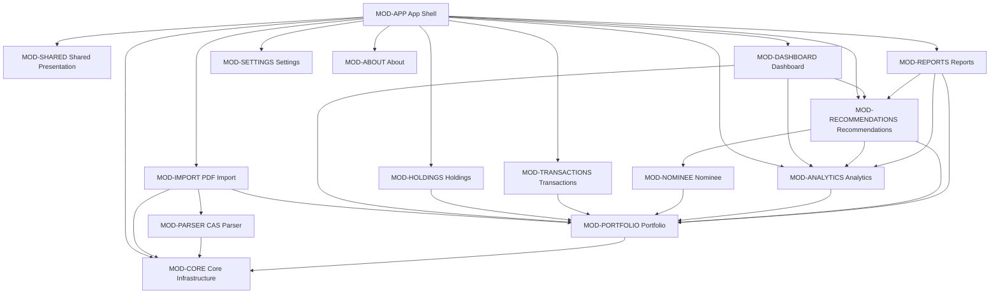
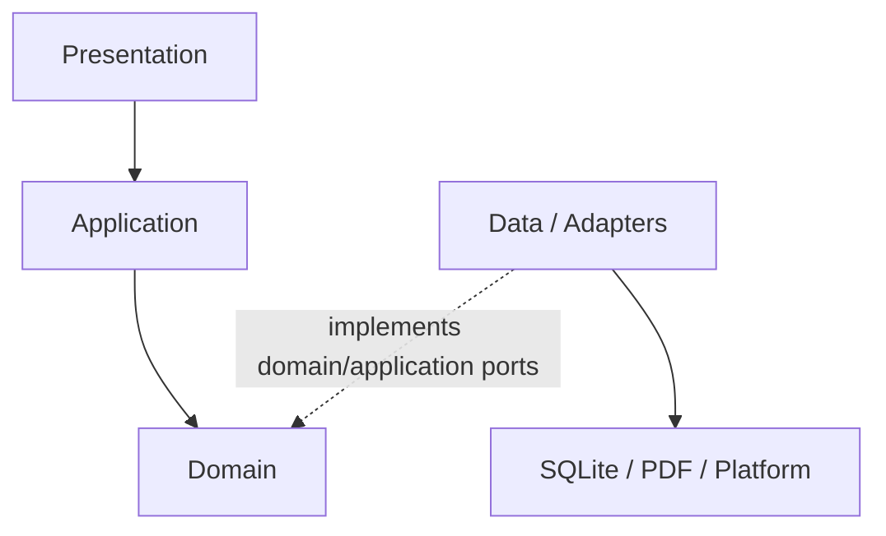

# CAS Analyzer Module Architecture

**Document Version:** 0.1

**Status:** Draft

**Last Updated:** 2026-07-05

## 1. Purpose

This document defines the logical modules of CAS Analyzer, their responsibilities, ownership boundaries, public contracts, and allowed dependencies. It translates the feature-based Clean Architecture direction into a structure that can be implemented and reviewed consistently.

The central rule is simple: a folder is not a module boundary unless ownership and dependencies are also controlled.

## 2. Scope

This document covers:

- Application shell, core infrastructure, shared presentation, and feature modules.
- Internal layers within a feature.
- Cross-feature communication.
- Repository, parser, provider, and composition-root ownership.
- Allowed and prohibited dependencies.
- Module-level testing and evolution rules.

It does not define:

- Physical database schemas.
- Parser grammars or format signatures.
- Detailed data-flow stage behavior.
- UI layouts.
- Final business rules for valuation, reconciliation, recommendations, or partial imports.

## 3. Governing Principles

This architecture is governed primarily by:

- AP-04: Explicit architectural boundaries.
- AP-05: Dependencies point inward.
- AP-06: Feature ownership with narrow contracts.
- AP-10: Modular and version-aware parsing.
- AP-14: Testability by design.
- AP-15: Evolution without speculative complexity.
- AP-16: Dependencies are liabilities.
- AP-17: Documentation and decisions evolve together.

It must also preserve the data-flow invariants in `DataFlowArchitecture.md`.

## 4. Module Definition

A module is a cohesive unit that:

- Owns a business capability or a generic technical responsibility.
- Controls its internal representations.
- Exposes a small, intentional public contract.
- Can be tested through that contract.
- Has an explicit dependency direction.
- Can evolve internally without forcing unrelated modules to change.

A directory containing unrelated classes is not a valid module. A module must not become a namespace for miscellaneous helpers.

## 5. Module Types

| Type | Purpose | May Contain Business Rules? | Examples |
| --- | --- | --- | --- |
| App shell | Bootstrap, routing, theme selection, and composition | No portfolio policy | `app`, `bootstrap` |
| Core infrastructure | Generic technical capabilities shared by features | No feature-specific policy | database connection, logging, failures, platform adapters |
| Shared presentation | Generic reusable UI and formatting | No domain decisions | buttons, dialogs, generic loading/error widgets |
| Feature module | Owns a user/business capability end to end | Yes, within its domain layer | import, holdings, analytics, reports |
| Test support | Synthetic builders, fakes, and test utilities | Test-only representations | fixture factories, fake clocks |

## 6. Top-Level Module Map



The arrows represent permitted consumption of public contracts, not permission to import internal files. The dependency set should be narrowed further when concrete use cases are designed.

## 7. Intended Source Structure

```text
app/lib/
  main.dart
  app.dart
  bootstrap/
    providers/
    router/
    startup/
  core/
    database/
    errors/
    logging/
    platform/
    time/
    types/
  shared/
    presentation/
      dialogs/
      formatters/
      theme/
      widgets/
  features/
    pdf_import/
    cas_parser/
    portfolio/
    holdings/
    transactions/
    nominee/
    dashboard/
    analytics/
    recommendations/
    reports/
    settings/
    about/
```

### 7.1 Structure Alignment Note

`docs/00_Project/08_ProjectStructure.md` currently lists top-level `models/` and `repositories/` folders and places use cases under a feature's `domain/` folder. This module architecture refines that draft structure as follows:

- Business models and repository implementations are feature-owned; new global `models/` or `repositories/` folders should not be created.
- Workflow use cases belong in `application/`; pure business rules and repository interfaces belong in `domain/`.
- Generic database connection/migration infrastructure may live in `core/database/`, but feature queries and mappings remain owned by features.

If this document is approved, `08_ProjectStructure.md` should be updated to remove the ambiguity. Until then, implementation plans must call out this alignment item rather than choosing silently.

## 8. Standard Feature Structure

A feature uses only the layers it needs. Empty folders and one-class abstractions are not required.

```text
feature_name/
  public/
    feature_contract.dart
  domain/
    entities/
    value_objects/
    repositories/
    services/
    rules/
  application/
    commands/
    queries/
    use_cases/
    dto/
  data/
    data_sources/
    models/
    mappers/
    repositories/
  presentation/
    controllers/
    providers/
    screens/
    widgets/
```

### 8.1 Public Contract

The optional `public/` directory contains only contracts intended for other feature modules. It may expose:

- Query and command interfaces.
- Narrow immutable result types.
- Stable cross-feature identifiers or value objects.
- Provider entry points intended for composition/presentation.

It must not expose:

- Data-source types.
- SQLite models or SQL details.
- Parser internals.
- Feature-private providers/controllers.
- Internal mapping DTOs.
- Broad barrel exports of the entire feature.

Direct explicit imports are preferred. A public barrel file may be used only when it exports a deliberately small contract and does not conceal dependency cycles.

### 8.2 Domain Layer

The feature domain owns:

- Entities and value objects.
- Business invariants.
- Pure domain services and rules.
- Repository/service interfaces required by its policy.
- Domain failures or outcomes.

It does not depend on Flutter, Riverpod, SQLite, file/PDF plugins, platform APIs, or another feature's implementation.

### 8.3 Application Layer

The application layer owns:

- User/task-oriented commands and queries.
- Use cases and workflow orchestration.
- Transactional intent and operation ordering.
- Application DTOs crossing into presentation or another public contract.
- Coordination of domain services and repository interfaces.

It must not contain SQL, widget behavior, or third-party adapter details.

### 8.4 Data Layer

The data layer owns:

- Repository implementations.
- SQLite queries and feature-owned data sources.
- Persistence models and explicit domain mappings.
- Adapters for external representations owned by the feature.

It implements inward-facing interfaces and may depend on generic `core` infrastructure. Its models do not become shared domain models.

### 8.5 Presentation Layer

The presentation layer owns:

- Screens and feature widgets.
- Riverpod providers/controllers for UI state and dependency access.
- Presentation formatting and immutable view state.
- Mapping use-case outcomes into user-visible state.

It invokes application contracts and must not access feature data sources directly.

## 9. Module Catalog

| Module ID | Module | Capability | Primary Feature IDs |
| --- | --- | --- | --- |
| MOD-APP | App shell | Bootstrap, routing, global theme, dependency composition | Cross-cutting |
| MOD-CORE | Core infrastructure | Generic database/platform/logging/error/time facilities | Cross-cutting |
| MOD-SHARED | Shared presentation | Generic UI components and non-business formatting | Cross-cutting |
| MOD-IMPORT | PDF import | File selection, validation, duplicate pre-check, import orchestration/history/progress | FT-001-FT-004 |
| MOD-PARSER | CAS parser | Extraction contract, format detection, section parsing, candidate records/diagnostics | FT-005-FT-013 |
| MOD-PORTFOLIO | Portfolio | Canonical portfolio access, persistence ownership coordination, summaries | FT-014-FT-019, FT-030 |
| MOD-HOLDINGS | Holdings | Holding list, details, search, and filters | FT-022-FT-025 |
| MOD-TRANSACTIONS | Transactions | Transaction history, details, search, and filters | FT-026-FT-029 |
| MOD-NOMINEE | Nominee | Nominee facts and missing-nominee inputs | FT-012, FT-035 |
| MOD-DASHBOARD | Dashboard | Composition of summary, allocation, imports, and quick insights | FT-018-FT-021 |
| MOD-ANALYTICS | Analytics | Allocation, diversification, sector exposure, and trends | FT-030-FT-034 |
| MOD-RECOMMENDATIONS | Recommendations | Versioned explainable recommendation findings | FT-035-FT-038 |
| MOD-REPORTS | Reports | Report composition and explicit export | FT-039-FT-042 |
| MOD-SETTINGS | Settings | Preferences and explicit maintenance/backup entry points | FT-043-FT-045 |
| MOD-ABOUT | About | Application identity, version, and notices | FT-046 |

Feature-to-module mapping is architectural ownership, not a claim that every feature is implemented in a single folder. Cross-cutting persistence mechanics remain generic, while business meaning stays with the owning module.

## 10. MOD-APP: App Shell

### Responsibilities

- Flutter startup and root widget.
- Composition root for concrete dependency bindings.
- GoRouter route registration.
- Global theme application.
- Startup migration/initialization coordination.
- Application lifecycle integration.

### Public Surface

- Application entry point.
- Route destinations composed from feature-provided screens/builders.
- Root Riverpod scope and provider overrides.

### Must Not Own

- Portfolio rules or calculations.
- SQL queries.
- CAS parsing.
- Feature view state.
- A global service locator.

The app shell may depend on feature presentation/public contracts to assemble the application. Features must not depend on the app shell.

## 11. MOD-CORE: Core Infrastructure

### Responsibilities

- SQLite connection lifecycle and migration runner infrastructure.
- Generic transaction primitive exposed to repository composition where needed.
- Structured redacted logging facilities.
- Base technical failures that are genuinely cross-cutting.
- Clock/time abstraction.
- Platform/file primitives shared by more than one adapter.
- Precision-safe primitive types only if they are truly universal and approved by ADR.

### Must Not Own

- `Portfolio`, `Holding`, `Transaction`, `Nominee`, or parser business concepts.
- Feature repository interfaces.
- Feature-specific SQL queries.
- Recommendation thresholds.
- Generic `utils.dart`, `helpers.dart`, or catch-all services.

Core is not a higher layer. Features may use core infrastructure, but core must not import features.

## 12. MOD-SHARED: Shared Presentation

### Responsibilities

- Generic loading, empty, confirmation, and error presentation components.
- Theme primitives and accessible visual tokens.
- Generic formatters that do not decide financial meaning.
- Reusable dialogs with no feature-specific workflow.

### Must Not Own

- Portfolio totals or allocation widgets with business behavior.
- Domain validators.
- Feature routes/controllers.
- SQLite or repository access.
- Financial rounding or valuation policy disguised as display formatting.

A component should move to shared only after reuse is demonstrated and semantics are genuinely identical.

## 13. MOD-IMPORT: PDF Import

### Responsibilities

- Receive explicit file-selection intent.
- Validate file accessibility and supported input constraints.
- Coordinate early duplicate checks.
- Orchestrate extraction, parsing, domain validation/reconciliation, and persistence.
- Publish stage progress, cancellation state, warnings, and final result.
- Query import history.

### Consumes

- Parser facade from MOD-PARSER.
- Import/portfolio commit contract from MOD-PORTFOLIO.
- Generic file/platform and logging facilities from MOD-CORE.

### Exposes

- `ImportCasStatement` command/use case.
- `ObserveImportProgress` or equivalent immutable state contract.
- `GetImportHistory` query.
- Stable import result, stage, warning, and failure contracts.

### Must Not Own

- NSDL/CDSL parsing rules.
- SQLite table-specific implementation details.
- Dashboard refresh logic.
- Final duplicate/reconciliation policy before its ADR is approved.

MOD-IMPORT owns orchestration, not every implementation participating in the pipeline.

## 14. MOD-PARSER: CAS Parser

### Responsibilities

- Adapt PDF extraction behind a project-owned interface.
- Detect supported CAS issuer/layout/version.
- Identify statement sections.
- Parse investor, account, holding, transaction, nominee, and corporate-action candidates.
- Emit structured provenance and redacted diagnostics.
- Keep format-specific strategies isolated.

### Exposes

- Parser facade accepting a validated source/extraction request.
- Bounded extraction/parser progress contract.
- Candidate statement model independent of SQLite and Flutter.
- Parser identity/version and diagnostics.

### Must Not Own

- Durable persistence.
- Portfolio reconciliation with existing data.
- UI messages/widgets.
- Financial analytics or recommendations.
- Arbitrary fallback behavior for unsupported layouts.

The parser may produce candidate records but must not claim that they satisfy all domain invariants.

## 15. MOD-PORTFOLIO: Portfolio

MOD-PORTFOLIO is the central business data boundary, not a god module.

### Responsibilities

- Own canonical portfolio-facing identities and read contracts.
- Coordinate feature-owned repository interfaces needed to commit an accepted import.
- Provide portfolio summary/read models used by downstream capabilities.
- Preserve source provenance and transactional consistency.
- Own portfolio-level validation/reconciliation services after policy approval.

### Exposes

- Accepted import commit contract.
- Portfolio snapshot/summary query contract.
- Narrow holding, transaction, account, and nominee query contracts where common domain ownership warrants it.
- Source-data version or change token for cache invalidation.

### Must Not Own

- Every screen's view model.
- Parser layout behavior.
- Recommendation or report presentation.
- Feature-specific search UI state.
- Undifferentiated access to raw database rows.

### Ownership Note

Detailed database design must decide whether holding, transaction, and nominee repositories are subcontracts within MOD-PORTFOLIO or owned by their dedicated feature modules. The decision must preserve one canonical write model and avoid circular dependencies. Until then, modules consume portfolio-facing query contracts rather than database implementations.

## 16. MOD-HOLDINGS, MOD-TRANSACTIONS, and MOD-NOMINEE

These modules provide focused capabilities over canonical portfolio data.

### MOD-HOLDINGS

- Owns holding browse, detail, search, filter, and presentation behavior.
- Consumes a holding query contract from MOD-PORTFOLIO or owns its repository interface if established by database design.
- Does not calculate dashboard totals independently.

### MOD-TRANSACTIONS

- Owns transaction browse, detail, search, filter, ordering, and presentation behavior.
- Consumes canonical transaction data through a narrow query contract.
- Does not change imported transactions through read screens.

### MOD-NOMINEE

- Owns nominee facts and domain interpretation needed by missing-nominee rules.
- Exposes only the facts/queries required by recommendations and detail presentation.
- Must protect nominee data as restricted personal data.

These modules must not reach directly into MOD-PORTFOLIO's data sources or reuse persistence models as view models.

## 17. MOD-DASHBOARD: Dashboard

### Responsibilities

- Compose portfolio summary, allocation, recent imports, and quick insights.
- Coordinate loading/error/empty states for dashboard sections.
- Render shared results consistently without recalculating them in widgets.

### Consumes

- Summary/allocation contracts from MOD-PORTFOLIO and MOD-ANALYTICS.
- Import-history query from MOD-IMPORT.
- Finding query from MOD-RECOMMENDATIONS.

### Exposes

- Dashboard screen and presentation entry point.
- Dashboard-specific immutable view state.

### Must Not Own

- Source financial calculations.
- SQL joins spanning features.
- Recommendation thresholds.
- A second portfolio-summary definition.

Dashboard is a presentation composition module. It does not become the owner of every capability it displays.

## 18. MOD-ANALYTICS: Analytics

### Responsibilities

- Deterministic allocation, diversification, concentration, sector, and trend calculations.
- Effective-date and missing-input handling.
- Versioned analytics results with explanations/provenance.

### Consumes

- Canonical portfolio snapshot/read contracts.
- Approved local classification/valuation sources if later defined.
- Clock abstraction only when an explicit effective date cannot be supplied by the caller; explicit dates remain preferred.

### Exposes

- Focused analytic query/use-case contracts.
- Immutable qualified results with algorithm versions and warnings.

### Must Not Own

- Live market/network acquisition.
- Recommendation wording or severity.
- UI chart widgets.
- Silent caching without source-data and algorithm-version identity.

## 19. MOD-RECOMMENDATIONS: Recommendations

### Responsibilities

- Execute approved, versioned, deterministic recommendation rules.
- Produce explainable findings with rule IDs, inputs, thresholds, effective dates, and qualifications.
- Combine portfolio facts and analytics through public contracts.

### Exposes

- Evaluate/list findings query contracts.
- Stable finding and rule metadata types.

### Must Not Own

- Free-form AI advice in Version 1.
- Trading or automatic portfolio mutation.
- Portfolio persistence.
- Unapproved thresholds or regulated-advice assumptions.

The module may depend on MOD-ANALYTICS and MOD-PORTFOLIO contracts. Neither module may depend back on recommendations.

## 20. MOD-REPORTS: Reports

### Responsibilities

- Query committed portfolio, analytics, and recommendation results.
- Compose a versioned report model.
- Render supported formats through adapters.
- Write only to an explicitly selected destination.
- Report success/failure without mutating portfolio data.

### Exposes

- Report-type and export command contracts.
- Export progress/result types.
- Reports screen/presentation entry point.

### Must Not Own

- Duplicate financial calculations.
- Direct access to other modules' SQLite tables.
- Implicit background export.
- Export format decisions before they are approved.

## 21. MOD-SETTINGS and MOD-ABOUT

### MOD-SETTINGS

Owns:

- Theme and lightweight user preferences.
- Explicit entry points for database maintenance.
- Optional backup/restore workflow composition after detailed approval.

It does not own portfolio data merely because it offers a data-management screen. Maintenance commands must go through the owning application/repository contracts.

### MOD-ABOUT

Owns:

- Application name/version/build metadata.
- License and attribution presentation.
- Static product information.

It must not become a general settings or diagnostics module.

## 22. Dependency Rules

### 22.1 Layer Direction Within a Feature



Runtime dependency injection connects data implementations to inward-facing interfaces. It does not permit application/domain code to import data implementations.

### 22.2 Cross-Module Rules

- A feature imports another feature only through its `public/` contract or a deliberately shared domain abstraction.
- Presentation-to-presentation dependencies are prohibited; navigation is composed by MOD-APP.
- Data-layer-to-data-layer dependencies across features are prohibited.
- A module must not import another module's internal providers, DTOs, mappers, or persistence models.
- Cyclic feature dependencies are prohibited.
- If two modules need each other, extract the minimum stable contract to the rightful domain owner or compose them in an application-level module.
- MOD-CORE and MOD-SHARED must never depend on feature modules.
- MOD-APP may depend on feature entry points, but feature modules must not depend on MOD-APP.

## 23. Allowed Dependency Matrix

`Yes` means a public contract may be consumed when required. It does not authorize internal imports.

| Consumer \ Provider | CORE | SHARED | IMPORT | PARSER | PORTFOLIO | HOLDINGS | TRANSACTIONS | NOMINEE | ANALYTICS | RECOMMENDATIONS | REPORTS | SETTINGS | ABOUT |
| --- | --- | --- | --- | --- | --- | --- | --- | --- | --- | --- | --- | --- | --- |
| APP | Yes | Yes | Yes | No | Yes | Yes | Yes | Yes | Yes | Yes | Yes | Yes | Yes |
| IMPORT | Yes | Yes* | - | Yes | Yes | No | No | No | No | No | No | No | No |
| PARSER | Yes | No | No | - | No | No | No | No | No | No | No | No | No |
| PORTFOLIO | Yes | No | No | No | - | No | No | No | No | No | No | No | No |
| HOLDINGS | Yes | Yes* | No | No | Yes | - | No | No | No | No | No | No | No |
| TRANSACTIONS | Yes | Yes* | No | No | Yes | No | - | No | No | No | No | No | No |
| NOMINEE | Yes | Yes* | No | No | Yes | No | No | - | No | No | No | No | No |
| DASHBOARD | Yes | Yes | Yes | No | Yes | No | No | No | Yes | Yes | No | No | No |
| ANALYTICS | Yes | No | No | No | Yes | No | No | No | - | No | No | No | No |
| RECOMMENDATIONS | Yes | No | No | No | Yes | No | No | Yes | Yes | - | No | No | No |
| REPORTS | Yes | Yes* | No | No | Yes | No | No | No | Yes | Yes | - | No | No |
| SETTINGS | Yes | Yes | No | No | Yes** | No | No | No | No | No | No | - | No |
| ABOUT | Yes | Yes | No | No | No | No | No | No | No | No | No | No | - |

`Yes*` applies only to presentation code using generic shared UI. Domain/application/data layers do not depend on MOD-SHARED.

`Yes**` applies only to explicit, narrow maintenance/backup contracts; MOD-SETTINGS cannot access portfolio internals.

MOD-DASHBOARD is shown in the matrix but omitted as a provider because no feature should consume dashboard internals.

## 24. Public Contract Design

Public contracts should be:

- Narrow and capability-oriented.
- Immutable at module boundaries.
- Named in domain/application language.
- Independent of Flutter widgets except explicit presentation entry points.
- Independent of SQLite, PDF, and plugin types.
- Versioned semantically through code/document changes when behavior changes materially.
- Explicit about failure, missing data, effective date, and provenance when relevant.

Avoid public contracts that:

- Return `Map<String, dynamic>` for business data.
- Expose raw database rows or SQL cursors.
- Return untyped exceptions as normal outcomes.
- Require consumers to know the provider's internal workflow.
- Bundle unrelated operations into a broad service.
- Expose mutable collections or live internal state.

## 25. Repository Ownership

- A repository interface is owned by the domain/application consumer whose language it expresses.
- A repository implementation is owned by the feature data layer responsible for the mapped persistence behavior.
- Generic database connection and migration execution belong to MOD-CORE; business queries do not.
- Widgets and presentation providers never execute SQL.
- One physical transaction may coordinate multiple feature-owned repositories through a dedicated unit-of-work/import commit boundary; the exact design requires database architecture.
- Repositories return domain/read models or explicit application results, not database models.
- A repository must not become a generic CRUD abstraction when the domain requires meaningful operations.

## 26. Riverpod and Composition Ownership

Riverpod is used at the composition and presentation boundaries:

- MOD-APP owns root `ProviderScope`, global overrides, and application composition.
- A feature presentation layer owns its controllers and UI-state providers.
- A feature may expose a narrow provider entry point through its public contract when composition requires it.
- Infrastructure provider bindings should live near the composition root or owning feature adapter, not in domain code.
- Providers must not conceal service-locator behavior through unrestricted global reads.
- Use cases and domain services remain constructible without a Riverpod container.

Provider dependency graphs must follow the same module matrix as direct imports.

## 27. Navigation Ownership

- MOD-APP owns the GoRouter instance and top-level route graph.
- Features own their screens and may expose route builders or typed destination metadata.
- A feature does not import another feature's screen to navigate directly.
- Cross-feature navigation communicates stable identifiers or narrow arguments, not mutable domain objects or persistence models.
- Authorization is not a Version 1 concern, but sensitive values still must not be embedded unnecessarily in route strings.
- Deep-link support must not expose local financial data without appropriate future security design.

## 28. Error Contract Ownership

- A module maps low-level implementation exceptions at its boundary.
- Public failures use stable categories/codes and redacted safe context.
- Domain failures describe violated business conditions without SQL/PDF/plugin details.
- Presentation maps public failures to user-facing content; modules do not return localized widget strings from domain/data layers.
- Empty, unavailable, cancelled, rejected, and failed are distinct outcomes where materially different.

Detailed taxonomy will be defined in `ErrorHandlingArchitecture.md`.

## 29. Testing by Module Boundary

| Boundary | Required Verification |
| --- | --- |
| Domain | Pure rule, invariant, precision, date, missing-data, and edge-case tests. |
| Application | Use-case orchestration, port interaction, cancellation, and failure mapping. |
| Data | Mapping, repository, query, constraints, transaction, and migration tests. |
| Presentation | Controller/view-state and widget interaction tests. |
| Public contract | Consumer/provider contract tests for success, missing, and failure outcomes. |
| Module dependency | Automated import/dependency rules when source modules exist. |
| End-to-end composition | Integration tests for import, query, recommendation, and report flows. |

Test support code follows production ownership. A shared test helper must be generic and proven reusable; feature-specific builders remain with the feature tests.

## 30. Module Evolution Rules

### Add a New Module When

- It represents a distinct capability with its own vocabulary and lifecycle.
- It needs a public contract consumed by more than its own presentation.
- Its rules or dependencies would otherwise make an existing module incohesive.
- It can be assigned clear ownership and tested independently.

### Do Not Add a Module Merely Because

- One class needs a folder.
- A package or framework uses a particular term.
- A future feature might someday need it.
- Similar code exists but has different business meaning.

### Split an Existing Module When

- It has multiple independent reasons to change.
- Its public contract becomes broad and unrelated.
- Teams/features repeatedly bypass ownership to reach separate capabilities.
- Tests require extensive unrelated setup.

### Merge Modules When

- Their boundaries are artificial and always change together.
- One contains only pass-through abstractions without policy or isolation value.
- Separation causes cyclic or chatty contracts with no independent lifecycle.

Any significant module addition, split, merge, or dependency reversal requires an ADR and updates to this document.

## 31. Prohibited Structures and Dependencies

- Global business `models/`, `repositories/`, or `services/` dumping grounds.
- Feature internals exported through broad barrel files.
- `core/` importing a feature.
- `shared/` containing portfolio rules or database access.
- Domain code importing Flutter, Riverpod, SQLite, PDF, file-picker, or platform packages.
- Feature data layers importing one another.
- Widgets accessing repositories/data sources when an application use case is required.
- Dashboard or reports reimplementing portfolio calculations.
- Settings owning portfolio persistence.
- Parser persisting records directly.
- Recommendation rules mutating portfolio data.
- Circular provider or module dependencies.
- Generic base repository/use-case classes added only for visual consistency.

## 32. Module Invariants

| ID | Invariant |
| --- | --- |
| MI-01 | Every production file has one clear owning module. |
| MI-02 | Domain code has no framework, plugin, persistence, or presentation dependency. |
| MI-03 | Cross-feature imports target only intentional public contracts. |
| MI-04 | MOD-CORE and MOD-SHARED never depend on features. |
| MI-05 | MOD-APP composes features; features do not depend on MOD-APP. |
| MI-06 | Parser candidates cannot be persisted without application/domain validation. |
| MI-07 | A financial calculation has one authoritative owner and is reused by UI and reports. |
| MI-08 | Repository interfaces express domain/application needs, not generic storage CRUD. |
| MI-09 | Riverpod wiring does not leak into domain policy. |
| MI-10 | No module dependency cycle is permitted. |
| MI-11 | Infrastructure models do not cross public feature boundaries. |
| MI-12 | Module changes update contracts, tests, dependency documentation, and ADRs as applicable. |

## 33. Architecture Enforcement

When implementation begins, enforce boundaries through:

- Dart analyzer rules and import conventions.
- A dependency-check script or architecture test over `lib/` imports.
- Restricted public entry points for cross-feature consumption.
- Code review using the dependency matrix and MI invariants.
- Unit/contract tests that construct domain/application code without Flutter/plugin infrastructure.
- Detection of cycles and forbidden feature-internal imports in CI.

The enforcement mechanism should be proportionate; do not introduce a large framework solely to police a small source tree.

## 34. Open Decisions

| Decision | Module Impact | Required Follow-up |
| --- | --- | --- |
| Exact ownership of holding/transaction/nominee repository interfaces | PORTFOLIO, HOLDINGS, TRANSACTIONS, NOMINEE | Database and domain architecture decision. |
| Accepted import transaction/unit-of-work design | IMPORT, PORTFOLIO, CORE | Database design and ADR. |
| Parser extraction boundary and background execution | IMPORT, PARSER, CORE | Import pipeline design and ADR. |
| Precision-safe universal value types | CORE versus feature domains | ADR; avoid premature global ownership. |
| Classification/valuation reference-data owner | ANALYTICS, PORTFOLIO | Business design and ADR. |
| Recommendation persistence versus on-demand evaluation | RECOMMENDATIONS, PORTFOLIO | Business/data design. |
| Report renderer/export adapter ownership and formats | REPORTS, CORE | Report design and ADR. |
| Backup/restore ownership and format | SETTINGS, PORTFOLIO, CORE | Security/database design and ADR. |
| Public contract/provider convention | APP and all features | Confirm during project scaffold; document convention. |
| Alignment with `08_ProjectStructure.md` | All source modules | Update approved structure after architecture approval. |

## 35. Review Checklist

- [ ] The change has one clear owning module (MI-01).
- [ ] Layer placement matches responsibility, not convenience.
- [ ] Domain code remains framework/infrastructure independent (MI-02).
- [ ] Cross-feature use is through a narrow public contract (MI-03).
- [ ] The dependency appears as allowed in the matrix.
- [ ] No cycle or reverse dependency is introduced (MI-04, MI-05, MI-10).
- [ ] Public types exclude infrastructure representations (MI-11).
- [ ] Financial policy has one owner and is not duplicated (MI-07).
- [ ] Repositories express meaningful use-case needs (MI-08).
- [ ] Riverpod is limited to composition/presentation boundaries (MI-09).
- [ ] New shared/core code is genuinely generic and demonstrated.
- [ ] Tests cover the module contract and relevant failures.
- [ ] Documentation and ADR impacts are addressed (MI-12).

## 36. Traceability

This design primarily supports:

- Technical goals TG-02, TG-03, TG-04, TG-07, TG-08, and TG-09.
- Business goals BG-02, BG-03, and BG-04.
- Constraints TC-04, TC-05, TC-06, TC-07, DEV-02, DEV-03, and DEV-04.
- Version 1 features FT-001 through FT-046 through explicit capability ownership.
- Architecture principles AP-04 through AP-06 and AP-10, AP-14 through AP-17.
- Data-flow invariants DFI-02 through DFI-08 and DFI-12.

## 37. Cross References

- `docs/project_context.md`
- `docs/01_Architecture/SolutionArchitecture.md`
- `docs/01_Architecture/ArchitecturePrinciples.md`
- `docs/01_Architecture/DataFlowArchitecture.md`
- `docs/01_Architecture/ImportPipelineArchitecture.md`
- `docs/00_Project/03_FeatureCatalog.md`
- `docs/00_Project/04_ProjectConstraints.md`
- `docs/00_Project/05_TechnologyStack.md`
- `docs/00_Project/08_ProjectStructure.md`
- `docs/02_Database/`
- `docs/03_Parser/`
- `docs/ADR/`

## 38. AI Development Notes

When generating code from this architecture:

- Name the target module ID and layer before proposing files.
- List every new cross-module dependency and verify it against the matrix.
- Use public contracts; do not discover and import convenient internal files.
- Keep use cases in `application/` and pure rules/interfaces in `domain/`.
- Do not create global business `models`, `repositories`, `services`, or generic base classes.
- Do not place feature logic in MOD-CORE or MOD-SHARED to avoid a dependency decision.
- Ask for an ADR when a change adds a module, reverses a dependency, introduces a cycle workaround, or changes ownership materially.
- Include module contract, failure, and dependency-boundary tests.
- Preserve open decisions rather than generating placeholder implementations that become accidental policy.

## 39. Revision History

| Version | Date | Author | Description |
| --- | --- | --- | --- |
| 0.1 | 2026-07-05 | Project Team | Initial draft of the module architecture. |
