# CAS Analyzer Data Flow Architecture

**Document Version:** 0.1

**Status:** Draft

**Last Updated:** 2026-07-05

## 1. Purpose

This document defines how data enters, moves through, changes within, and leaves CAS Analyzer. It describes data classifications, trust boundaries, processing stages, ownership, persistence boundaries, provenance, and the principal command and query flows.

The goal is to ensure that every flow preserves financial correctness, privacy, traceability, consistency, and UI responsiveness.

## 2. Scope

This document covers Version 1 data flows for:

- CAS Statement selection and validation.
- PDF text extraction and CAS parsing.
- Domain validation and reconciliation.
- Import history and SQLite persistence.
- Dashboard, holdings, transaction, and analytics queries.
- Rule-based recommendations.
- Report generation and explicit export.
- Settings and optional local backup/restore boundaries.
- Failure, diagnostic, and progress information.

This document does not define:

- Physical database tables or SQL.
- Detailed parser grammars and layout signatures.
- Final UI screen composition.
- Final valuation, duplicate identity, reconciliation, or partial-import policies.
- Cloud or network flows, which are outside Version 1.

## 3. Governing Principles

The following architecture principles are especially relevant:

- AP-01: Correctness before convenience.
- AP-02: Offline and private by default.
- AP-03: Explicit user control.
- AP-04 and AP-05: Explicit boundaries and inward dependencies.
- AP-07: Traceable source and derived data.
- AP-08: Idempotent and consistent import.
- AP-09: Validate at trust boundaries.
- AP-10: Modular and version-aware parsing.
- AP-11: Deterministic and explainable insight.
- AP-12: Responsive, bounded work.
- AP-13: Explicit failures and safe recovery.

## 4. Data Flow Vocabulary

| Term | Meaning |
| --- | --- |
| Command | A request that may change application state, such as importing or deleting data. |
| Query | A read-only request that returns stored or derived information. |
| Raw input | File bytes or unvalidated metadata received from outside the application trust boundary. |
| Extracted content | Text and layout information obtained from a PDF but not yet understood as CAS data. |
| Parsed record | Typed candidate data produced by a parser, before complete domain validation. |
| Domain record | Validated business data satisfying defined invariants. |
| Persisted record | Durable data committed to SQLite. |
| Derived result | A calculation, summary, analytic, recommendation, or report value computed from domain records. |
| Provenance | Metadata connecting a record or result to its source import, source location, transformation, and rule version. |
| Diagnostic | A structured warning or failure description that excludes unnecessary sensitive content. |
| View state | Presentation-specific state derived from use-case results, progress, and failures. |

## 5. Data Classification

All CAS-derived data is sensitive by default. Classification controls where data may flow and what may be logged or exported.

| Class | Examples | Storage/Flow Rules |
| --- | --- | --- |
| Restricted personal data | Investor name, PAN-like identifiers, contact details, demat and folio identifiers, nominee details | Application-private storage only; never logged; export only through explicit supported user action. |
| Restricted financial data | Holdings, units, balances, transactions, invested amounts, portfolio values | Application-private storage only; never logged or sent remotely; report/export only by explicit action. |
| Sensitive source content | PDF bytes, extracted text, source snippets | Process transiently; avoid persistence unless specifically required and approved; never logged. |
| Sensitive provenance | Import identifiers, statement metadata, source page/section references, parse diagnostics | Store only what is required for traceability; redact diagnostic payloads; application-private storage. |
| Internal derived data | Allocations, concentration measures, recommendation results | Treat as restricted financial data because it reveals portfolio composition. |
| Non-sensitive configuration | Theme and non-personal UI preferences | SharedPreferences is permitted. |
| Operational metadata | Stage, duration, parser version, anonymized failure code, record counts | May be logged only when it cannot identify the user or reveal portfolio content. |
| Exported user data | User-requested reports, holdings, or transaction files | Leaves application trust boundary only after explicit action; destination and protection are user-visible. |

Classification is based on information content, not the Dart type or file format. Aggregated data remains sensitive when it can reveal portfolio composition.

## 6. Trust Boundaries and Data Stores

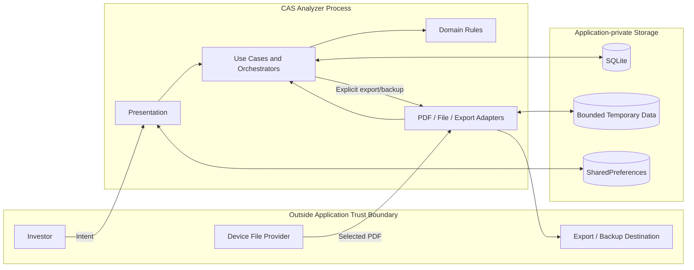

### 6.1 Boundary Rules

- Files crossing from the device file provider are untrusted until validated.
- SQLite, temporary data, and preferences must use application-private storage unless an explicit export is underway.
- A domain record is not trusted merely because parsing succeeded; domain validation is a separate boundary.
- Data crossing isolate boundaries must use bounded, serializable transfer objects without unnecessary sensitive fields.
- Export and optional backup cross the application trust boundary and require explicit user intent.
- No core flow crosses a network boundary in Version 1.

## 7. Canonical Data Lifecycle

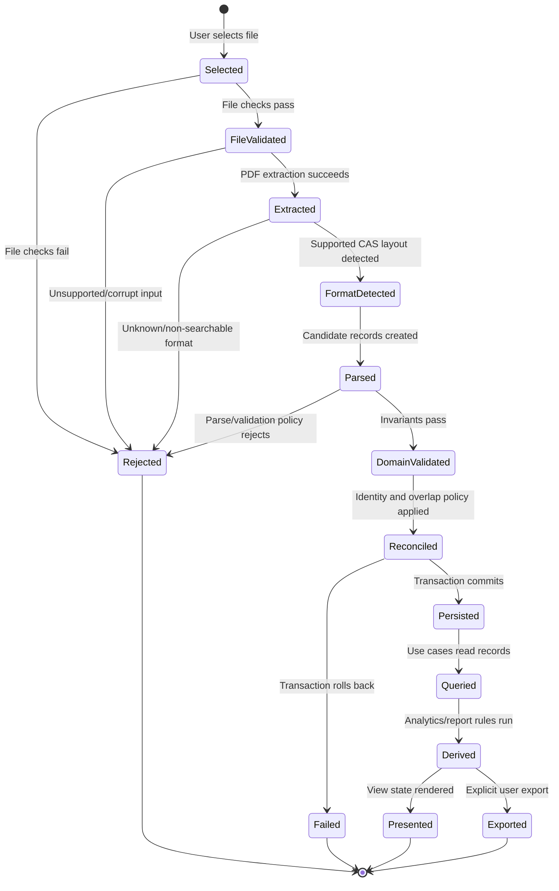

This lifecycle is conceptual. It does not decide whether an approved partial-import policy will permit a validated subset to reach `Reconciled`; that remains an ADR decision.

## 8. Data Representations and Ownership

| Representation | Owner | Mutable? | Durable? | Must Not Contain |
| --- | --- | --- | --- | --- |
| Selected file reference | PDF import infrastructure | No after selection | No | Parsed financial assumptions |
| File validation result | PDF import application/domain boundary | No | Import metadata may be durable | Raw PDF body in diagnostics |
| Extracted page/chunk | PDF extraction adapter | No | Normally no | Domain validity claims |
| Format detection result | CAS parser | No | Parser/version metadata may be durable | Arbitrary fallback parser choice |
| Parsed candidate DTO | Format-specific parser | Prefer immutable | No until validated | SQLite or UI concerns |
| Domain entity/value object | Domain feature | Prefer immutable | Through repository mapping | Flutter, Riverpod, SQLite types |
| Persistence model/row | Data layer | Controlled | Yes | Presentation state |
| Query result/read model | Owning use case/domain query contract | No | Recomputed unless explicitly designed otherwise | Widget instances or SQL handles |
| Recommendation result | Recommendation domain | No | Optional, design-dependent | Unexplained free-form advice |
| View state | Presentation feature | No | No | Database handles or raw source content |
| Export model | Reports application layer | No | Only at user-selected destination | Internal-only identifiers unless required |

Ownership means the named module defines the representation and its invariants. Consumers receive a public contract rather than reaching into the owner's internal model.

## 9. Flow Catalog

| Flow ID | Name | Type | Source | Final Sink |
| --- | --- | --- | --- | --- |
| DF-01 | CAS Statement import | Command | Device file provider | SQLite and import result |
| DF-02 | Import progress and diagnostics | Event/state | Import pipeline | Import UI |
| DF-03 | Dashboard summary | Query | SQLite | Dashboard view state |
| DF-04 | Holdings browse/search/filter | Query | SQLite | Holdings view state |
| DF-05 | Transactions browse/search/filter | Query | SQLite | Transaction view state |
| DF-06 | Analytics calculation | Query/derivation | Validated portfolio data | Analytics result/view state |
| DF-07 | Recommendation evaluation | Query/derivation | Portfolio and analytics results | Explainable observations |
| DF-08 | Report generation and export | Query plus explicit command | SQLite/domain results | User-selected destination |
| DF-09 | Settings read/write | Query/command | User intent | SharedPreferences or approved maintenance use case |
| DF-10 | Local backup/restore | Optional command | Private application data / selected file | Selected destination / SQLite |
| DF-11 | Data deletion or cleanup | Command | User/maintenance intent | SQLite and refreshed queries |

## 10. DF-01: CAS Statement Import

### 10.1 End-to-End Flow

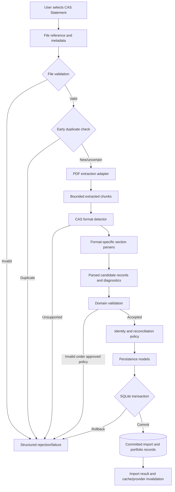

### 10.2 Stage Contracts

| Stage | Input | Output | Validation/Failure Boundary |
| --- | --- | --- | --- |
| Selection | User intent | Platform file reference | User cancellation is not an error. |
| File validation | File reference/metadata | Validated source descriptor | Access, content/type, safe size/resource limits. |
| Duplicate pre-check | Source descriptor and available fingerprint | New/duplicate/needs full identity | Must not treat filename alone as identity. |
| Extraction | Validated descriptor | Ordered extracted chunks plus extraction metadata | Corrupt, encrypted, scanned, or unsupported PDF conditions. |
| Format detection | Bounded extracted content | Issuer/layout/parser selection | Unknown format must not use arbitrary fallback. |
| Section parsing | Extracted chunks and parser version | Candidate records, provenance, diagnostics | Syntax/shape failures remain explicit. |
| Domain validation | Candidate records | Validated domain records or failures | Financial invariants and cross-record relationships. |
| Reconciliation | Validated records plus existing identities | Approved change set | Exact policy requires ADR. |
| Persistence mapping | Approved domain change set | Persistence models | Mapping must preserve precision and provenance. |
| Transaction commit | Persistence models | Durable import result | Constraints and rollback protect consistency. |
| Refresh | Import result | Updated dependent query state | Refresh occurs only after successful commit. |

### 10.3 Durable Write Boundary

No portfolio record is durable before an approved change set reaches the repository transaction. The transaction must include all records and metadata required to make the accepted import internally consistent.

At minimum, a successful commit must keep these concepts aligned:

- Import history/status.
- Source and parser-version metadata.
- Account and instrument identities.
- Holdings and/or balance snapshots represented by the statement.
- Transactions and corporate actions represented by the statement.
- Nominee relationships where available.
- Persisted warnings/provenance required by the approved policy.

The physical schema and exact aggregate transaction boundary are defined in database architecture documents.

### 10.4 Import Identity

The final identity algorithm is unresolved. Data flow must support layered identification:

1. A cheap pre-check may use available file metadata or a content hash to avoid unnecessary processing.
2. A canonical logical identity may require issuer, statement period, investor/account scope, and normalized content.
3. Database uniqueness and reconciliation must enforce the approved identity at commit time.

Filename, path, and modification time must not be the sole duplicate criteria.

## 11. DF-02: Progress, Cancellation, and Diagnostics

Import emits control data separately from financial payloads.

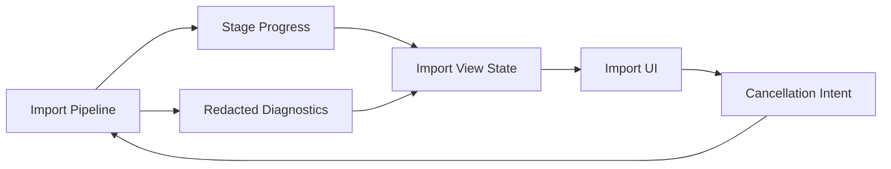

### 11.1 Progress Rules

- States should include at least idle, validating, extracting, detecting, parsing, validating data, reconciling, persisting, completed, cancelled, and failed.
- A stage may expose measured units such as pages or records when reliable.
- The UI must not display fabricated percentage precision.
- Progress messages must not contain investor names, account numbers, holdings, raw text, or file paths that reveal sensitive information.

### 11.2 Cancellation Rules

- Cancellation is cooperative and checked only at safe boundaries.
- Before persistence, cancellation releases resources and leaves no durable portfolio mutation.
- Once a non-interruptible commit begins, the UI must communicate that finalization is in progress rather than falsely claiming immediate cancellation.
- Cancellation and retry must not create duplicate import-history records.

### 11.3 Diagnostic Rules

A diagnostic may contain:

- Stable error/warning code.
- Pipeline stage.
- Parser/layout version.
- Safe page/section reference.
- Redacted field type or record reference.
- Retryability and user-facing action.

A diagnostic must not contain raw CAS text or sensitive values merely for developer convenience.

## 12. DF-03 to DF-05: Read Flows

Dashboard, holdings, and transaction screens use repository-backed queries over committed data. They never parse source PDFs.

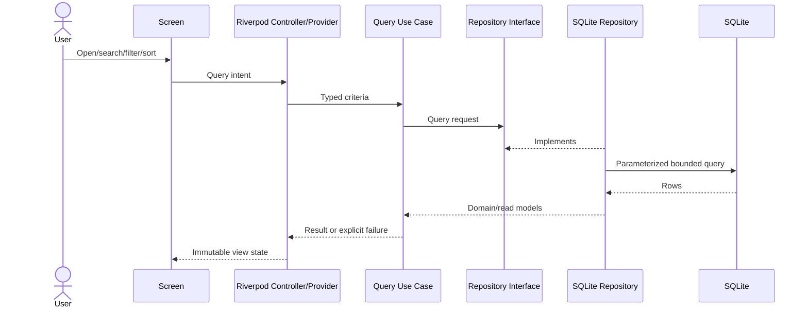

### 12.1 Query Rules

- Queries are read-only and cannot trigger implicit imports or repair writes.
- Search, filter, and sort criteria are typed and validated before repository use.
- SQL is parameterized inside the data layer.
- Large result sets use pagination, limits, or streaming designed for bounded memory.
- Stable sorting includes deterministic tie-breakers.
- Empty results are distinct from query failure.
- Query results are refreshed after relevant successful commands, not before commit.
- UI-specific formatting does not alter domain values.

### 12.2 Dashboard Flow

The dashboard combines portfolio summary, allocation, recent imports, and quick insights through application-level composition. It must not assemble financial totals independently in widgets.

Until valuation semantics are approved:

- A value requiring unavailable market/NAV data is marked unavailable or tied explicitly to statement-provided values and dates.
- The label "current value" must not imply real-time data.
- Different widgets and reports must use the same approved portfolio summary contract.

### 12.3 Holdings and Transaction Flow

- Holding and transaction details use stable domain identifiers, not list positions.
- Navigation passes an identifier or narrow argument, then queries the owning feature.
- Sensitive identifiers are masked in presentation where full display is unnecessary.
- Transaction ordering uses approved financial date semantics plus a stable tie-breaker.

## 13. DF-06: Analytics Flow

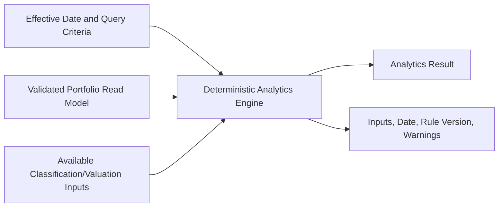

### 13.1 Analytics Rules

- Analytics consume committed, validated portfolio data.
- Time-dependent calculations receive an explicit effective date.
- Money, units, percentages, and rounding use approved precision rules.
- Results identify missing or stale inputs.
- Sector/category analytics do not fabricate classifications absent from CAS or an approved local reference source.
- Analytics are pure/deterministic where practical and do not write database state as a side effect of a query.
- If derived results are later cached, cache identity must include source-data version, effective date, and calculation version.

## 14. DF-07: Recommendation Flow

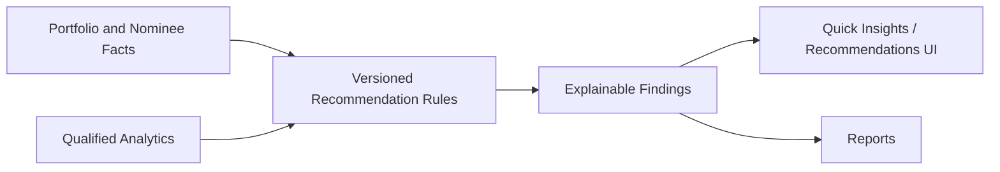

Each finding should carry:

- Stable rule ID and version.
- Severity or category defined by the business design.
- Relevant record references or aggregated inputs.
- Thresholds and effective date where applicable.
- User-facing explanation.
- Missing-data qualifications.
- Appropriate disclaimer classification.

Recommendation rules must not mutate holdings, transactions, or user settings. Exact thresholds and regulated-advice boundaries remain a business-rule and ADR decision.

## 15. DF-08: Report Generation and Export

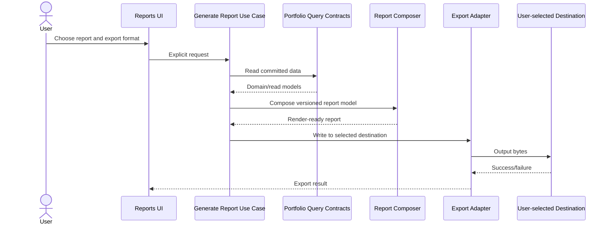

### 15.1 Export Rules

- Report generation is read-only with respect to portfolio data.
- The report composer consumes the same domain/query results used by the UI.
- The user selects or confirms report type, format, content scope, and destination.
- Export failures do not alter portfolio data.
- Existing destination files are not silently overwritten.
- Temporary render artifacts use private storage and are deleted promptly.
- Reports identify relevant statement/valuation dates and material assumptions.
- Export history, if introduced, stores minimal metadata and never a hidden second copy of the exported report.

Supported formats and their sensitive-file safeguards remain open decisions.

## 16. DF-09: Settings Flow

Settings are divided by data ownership:

| Setting/Action | Flow | Storage/Owner |
| --- | --- | --- |
| Theme and lightweight UI preference | UI -> settings controller -> preferences adapter | SharedPreferences |
| Import history view | UI -> import query use case -> repository | SQLite |
| Database maintenance | UI -> explicit maintenance use case -> repository | SQLite transaction |
| About/version information | Build metadata -> presentation | Application package metadata |
| Backup/restore | Explicit workflow, if implemented | Dedicated use case and adapters |

Widgets must not access SharedPreferences or SQLite directly. Portfolio/business state must not be moved into SharedPreferences for convenience.

## 17. DF-10: Optional Local Backup and Restore

Backup and restore is optional for Version 1 and requires a dedicated design before implementation.

At the solution boundary:

- Backup is an explicit export of a consistent application-data snapshot.
- Restore treats the selected backup as untrusted input.
- Restore validates format version, integrity, compatibility, and required migrations before replacing or merging data.
- Existing data must not be destroyed before the incoming backup is proven restorable.
- Replace versus merge behavior must be explicit and user-confirmed.
- A failed restore leaves the previous database usable.
- Backup files outside private storage may expose sensitive data; the UX must communicate this risk.

Encryption, backup format, merge behavior, and recovery mechanics remain open decisions.

## 18. DF-11: Deletion and Cleanup

Deletion and cleanup are commands with explicit scope.

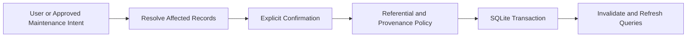

Rules:

- User-facing deletion previews what will be affected at an understandable level.
- Referential integrity and provenance determine cascade/recompute behavior.
- Cleanup must not delete valid records merely because they are currently unreferenced by a presentation query.
- A delete transaction either commits the approved scope or rolls back.
- Derived/cached data is invalidated or recomputed only after commit.
- Import deletion and re-import behavior requires explicit database and reconciliation design.

## 19. Provenance and Lineage

Provenance connects source input to user-visible output without retaining unnecessary raw content.

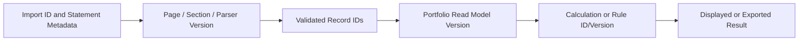

### 19.1 Minimum Lineage Expectations

| Output Type | Required Lineage |
| --- | --- |
| Holding/transaction detail | Stable record ID, import/source association, relevant statement date. |
| Portfolio total/allocation | Contributing record set or snapshot identity, effective date, valuation basis. |
| Analytic | Input snapshot, effective date, algorithm/rule version, missing-input warnings. |
| Recommendation | Rule ID/version, relevant inputs/thresholds, effective date, explanation. |
| Report | Report schema/version, query criteria, effective date, source/result versions. |

Raw source snippets should not be persisted by default. If a detailed parser design requires them, it must justify retention, minimization, lifecycle, and privacy controls.

## 20. Transaction and Consistency Boundaries

| Operation | Required Consistency Boundary |
| --- | --- |
| Import commit | All records and metadata needed for one accepted import/change set. |
| Schema migration | Entire migration step, with verified version transition. |
| Data deletion | Approved affected record graph and associated metadata. |
| Restore | Validated restore unit with safe replacement/merge strategy. |
| Preference update | Single preference or coherent preference group. |
| Report generation | Read-consistent snapshot where changing data could produce contradictory sections. |

Database architecture must define how read consistency is achieved for multi-query summaries and reports. The UI must not combine values from incompatible data versions and present them as one coherent result.

## 21. Cache and Refresh Policy

Version 1 should prefer repository queries and Riverpod-managed in-memory state over durable derived caches unless profiling demonstrates a need.

Rules:

- SQLite remains the source of truth after import.
- Cache entries identify their query criteria and source-data version.
- Successful commands invalidate affected providers/caches after commit.
- Failed or rolled-back commands do not publish optimistic financial state as durable truth.
- Stale-while-revalidate behavior must visibly avoid combining old and new financial totals.
- Durable analytics caches, if later introduced, require a schema, invalidation policy, calculation version, and tests.

## 22. Concurrency and Backpressure

- A clear policy must prevent conflicting imports from committing concurrently.
- Read queries may continue during extraction and parsing, but must not observe uncommitted import data.
- A commit followed by refresh creates the visibility boundary for new data.
- Extracted chunks and parser messages use bounded queues/batches where asynchronous stages are pipelined.
- Isolate messages contain only required data and avoid repeated copies of full PDFs or extracted documents.
- Database writes are serialized through the approved repository/database mechanism.
- Cancellation and app lifecycle interruption must be tested at each safe stage.
- The exact background-execution and import-serialization mechanism requires an ADR.

## 23. Failure Propagation

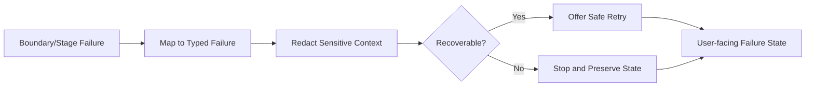

Rules:

- Empty data and failed data are different outcomes.
- Low-level exceptions are mapped once at the owning boundary.
- Failures preserve stable codes and safe context for testing and support.
- A failure must not be transformed into a successful zero value, empty portfolio, or omitted record.
- Persistence failures roll back before failure state is published.
- Retry repeats only safe/idempotent stages and rechecks durable state.

Detailed failure types and presentation mapping belong in `ErrorHandlingArchitecture.md`.

## 24. Logging and Observability Flow

Operational logging is a one-way, redacted flow and is not a substitute for provenance.

Permitted examples:

- Pipeline stage entered/completed.
- Safe duration and resource measurements.
- Parser implementation/version identifier.
- Anonymized failure/warning code.
- Aggregate record counts only after confirming they cannot identify or expose the portfolio in context.

Prohibited examples:

- Raw or extracted CAS content.
- Investor, nominee, demat, folio, or account identifiers.
- Instrument holdings, units, values, transactions, or report contents.
- Sensitive file names or full paths.
- SQL parameters containing financial/personal data.

Production logging must be minimized and configurable. No remote telemetry is part of the Version 1 data flow.

## 25. Prohibited Data Flows

The following flows violate the architecture:

- Widget -> SQLite, PDF library, file picker, or export writer.
- Domain -> Flutter, Riverpod, SQLite, platform, or PDF package.
- Feature -> another feature's internal data source or presentation provider.
- CAS content -> logs, analytics, crash reports, source control, or remote services.
- Parsed candidate -> SQLite without domain validation and approved reconciliation.
- Failed import -> partial durable records unless a documented partial-import policy explicitly accepts and identifies them.
- Query -> hidden mutation or repair of financial data.
- Recommendation -> automatic portfolio mutation or trading action.
- SharedPreferences -> holdings, transactions, portfolio totals, or source content.
- Export -> external destination without explicit user action.
- UI formatter -> alteration of the underlying financial value.

## 26. Data Flow Invariants

| ID | Invariant |
| --- | --- |
| DFI-01 | Core financial data never requires a network flow. |
| DFI-02 | Unvalidated external input cannot become durable portfolio data. |
| DFI-03 | Every accepted imported record is associated with source/import provenance. |
| DFI-04 | A failed database transaction publishes no successful import state. |
| DFI-05 | Repeating an accepted logical import does not duplicate portfolio data. |
| DFI-06 | Queries observe committed data only. |
| DFI-07 | Missing input cannot silently become zero, empty, current, or successful data. |
| DFI-08 | Derived results carry applicable effective-date and rule/version context. |
| DFI-09 | Sensitive payloads do not enter logs or remote telemetry. |
| DFI-10 | Export and destructive flows require explicit user intent. |
| DFI-11 | Heavy data movement is bounded and does not block the UI isolate. |
| DFI-12 | Domain and public contracts contain no infrastructure-specific representations. |

These invariants should be translated into automated tests and architecture checks as implementation proceeds.

## 27. Open Decisions

| Decision | Affected Flows | Required Follow-up |
| --- | --- | --- |
| Canonical import identity | DF-01 | ADR plus database uniqueness design. |
| Overlap and re-import reconciliation | DF-01, DF-11 | ADR plus business and database rules. |
| Atomic rejection versus explicit partial import | DF-01, DF-02 | ADR plus UX/error design. |
| Password-protected PDF behavior | DF-01 | Parser/import design and ADR if credentials are handled. |
| Money/unit precision and rounding | DF-01, DF-03-DF-08 | ADR plus domain/database design. |
| Portfolio valuation basis and date | DF-03, DF-06-DF-08 | Business rule and ADR. |
| Sector/category reference data | DF-06, DF-07 | ADR preserving offline boundary. |
| Background execution and import serialization | DF-01, DF-02 | ADR informed by profiling and plugin constraints. |
| Report/export formats and safeguards | DF-08 | Report architecture and ADR. |
| Backup format, encryption, and restore mode | DF-10 | Security/database architecture and ADR. |
| Data deletion/cascade semantics | DF-11 | Database and provenance design. |

No implementation should silently choose one of these policies merely to complete a flow.

## 28. Verification Strategy

### 28.1 Unit and Contract Tests

- Mapping between extraction, parser, domain, persistence, and view representations.
- Boundary validation and typed failures.
- Deterministic analytics/recommendations with effective dates and rule versions.
- Redaction of diagnostics and logging metadata.

### 28.2 Repository and Database Tests

- Transaction rollback and uniqueness enforcement.
- Import/retry idempotency after policies are approved.
- Query ordering, filtering, pagination, and read consistency.
- Migration and deletion/restore behavior.

### 28.3 Integration Tests

- File selection through committed import and refreshed dashboard.
- Duplicate, unsupported, corrupt, and cancelled imports.
- Import failure at each stage without durable corruption.
- Queries during an in-progress import and after commit.
- Report export success/failure without portfolio mutation.
- Application restart with persisted import history and portfolio state.

### 28.4 Privacy and Performance Tests

- Core workflows with network unavailable.
- Log inspection using representative synthetic sensitive data.
- Large-statement memory, isolate responsiveness, progress, and cancellation.
- Temporary artifact cleanup after success and failure.

All fixtures must be synthetic or irreversibly anonymized.

## 29. Traceability

This design primarily supports:

- Features FT-001 through FT-045; FT-046 has no material financial data flow beyond package metadata.
- Goals FG-01 through FG-13 and optional FG-14.
- Technical goals TG-02, TG-03, TG-05, TG-07, TG-08, and TG-09.
- Constraints BC-01, BC-02, FC-01 through FC-04, TC-03 through TC-07, PC-02 through PC-04, PERF-02 through PERF-04, and SEC-01 through SEC-03.
- Architecture principles AP-01 through AP-17, especially AP-02, AP-07 through AP-13.

## 30. Cross References

- `docs/project_context.md`
- `docs/01_Architecture/SolutionArchitecture.md`
- `docs/01_Architecture/ArchitecturePrinciples.md`
- `docs/01_Architecture/ModuleArchitecture.md`
- `docs/01_Architecture/ImportPipelineArchitecture.md`
- `docs/00_Project/02_ProjectScope.md`
- `docs/00_Project/03_FeatureCatalog.md`
- `docs/00_Project/04_ProjectConstraints.md`
- `docs/00_Project/05_TechnologyStack.md`
- `docs/02_Database/`
- `docs/03_Parser/`
- `docs/05_BusinessLogic/`
- `docs/06_Testing/`
- `docs/ADR/`

Planned companion documents:

- `docs/01_Architecture/ErrorHandlingArchitecture.md`
- `docs/01_Architecture/SecurityArchitecture.md`

## 31. AI Development Notes

When generating implementation from this document:

- Identify the flow ID and affected data classification before changing code.
- Name the input, output, owner, validation boundary, durable write boundary, and failure outcome.
- Preserve DFI-01 through DFI-12 and cite applicable AP principles in the implementation plan.
- Do not pass raw source text farther than required or include it in diagnostics.
- Do not let DTOs become shared models across all layers.
- Do not implement an open policy as an undocumented default.
- Request tests for failed boundaries, rollback, duplicate/retry behavior, provenance, redaction, and bounded resource use.
- Update this document when a new persistent store, external boundary, flow, or representation is introduced.

## 32. Revision History

| Version | Date | Author | Description |
| --- | --- | --- | --- |
| 0.1 | 2026-07-05 | Project Team | Initial draft of the data flow architecture. |
