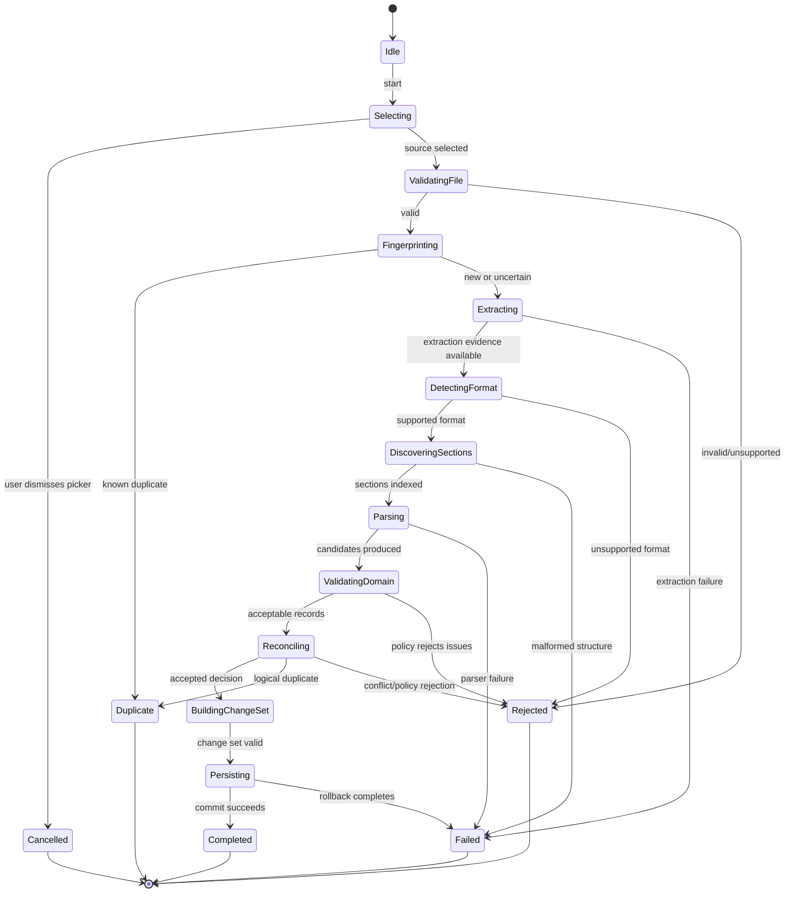
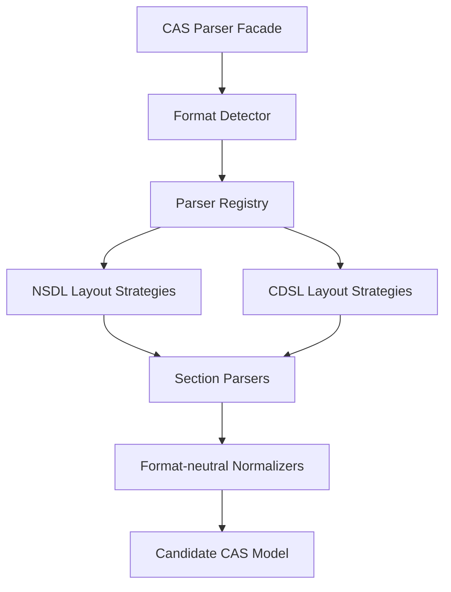
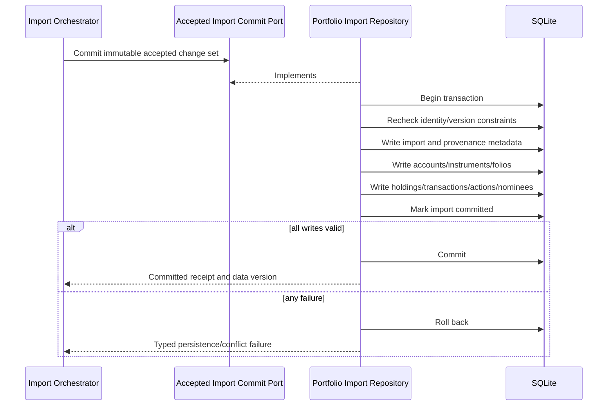

# CAS Analyzer Import Pipeline Architecture

**Document Version:** 0.1

**Status:** Draft

**Last Updated:** 2026-07-05

## 1. Purpose

This document defines the architecture of the CAS Statement import pipeline. It expands data flows DF-01 and DF-02 into staged contracts, lifecycle rules, module responsibilities, resource boundaries, persistence handoff, diagnostics, cancellation, retry, and verification requirements.

Import is the highest-risk workflow in CAS Analyzer because it accepts untrusted documents, interprets financial data, and changes durable portfolio state. The pipeline must make uncertainty and failure explicit.

## 2. Scope

This document covers:

- User-initiated selection of text-based NSDL/CDSL CAS PDFs.
- File and document validation.
- Duplicate pre-checks and canonical identity handoff.
- PDF text extraction.
- CAS issuer/layout detection.
- Section discovery and format-specific parsing.
- Domain validation and reconciliation handoff.
- Transactional persistence.
- Progress, cancellation, retry, warnings, and cleanup.
- Post-commit refresh and import-history behavior.

This document does not finalize:

- Password-protected PDF support.
- Canonical import identity.
- Overlapping-statement reconciliation.
- Atomic rejection versus explicit partial import.
- Physical database schema or exact SQL transaction implementation.
- The final Flutter background-execution mechanism.

Those decisions require ADRs before the affected implementation is considered complete.

## 3. Goals

The pipeline must:

1. Reject unsupported or unsafe input before durable mutation.
2. Parse supported statements deterministically and preserve provenance.
3. Prevent logical duplicate imports.
4. Leave SQLite internally consistent after success, failure, cancellation, or restart.
5. Keep the UI responsive for statements of approximately 200-300 pages.
6. Bound memory, temporary storage, and cross-isolate payloads.
7. Expose meaningful, privacy-safe progress and diagnostics.
8. Support modular NSDL/CDSL format evolution.
9. Produce accepted domain data independent of Flutter, SQLite, and PDF package types.
10. Make retries safe and testable.

## 4. Governing Architecture

The pipeline is governed by:

- AP-01, AP-07 through AP-10, and AP-12 through AP-14.
- Data flows DF-01 and DF-02.
- Data-flow invariants DFI-01 through DFI-12.
- Module invariants MI-01 through MI-12.
- MOD-IMPORT as workflow owner.
- MOD-PARSER as extraction/detection/parsing owner.
- MOD-PORTFOLIO as accepted-change-set and durable commit boundary.
- MOD-CORE as generic platform, database, logging, and execution infrastructure.

## 5. Pipeline Overview

The stages are conceptually sequential because each establishes trust required by the next. Implementations may pipeline bounded extraction/parsing work only when ordering, determinism, cancellation, and error behavior remain equivalent.

## 6. Stage Catalog

| Stage | Owner | Input | Output | Durable Mutation? |
| --- | --- | --- | --- | --- |
| IP-01 Select | MOD-IMPORT presentation/application | User intent | Selected source reference | No |
| IP-02 Validate File | MOD-IMPORT with platform adapter | Source reference | Validated source descriptor | No |
| IP-03 Fingerprint / Pre-check | MOD-IMPORT and portfolio identity port | Validated descriptor | Preliminary identity result | Import attempt metadata only if approved |
| IP-04 Extract | MOD-PARSER extraction adapter | Validated descriptor | Ordered bounded extracted chunks | No |
| IP-05 Detect Format | MOD-PARSER | Extracted evidence | Supported parser selection | No |
| IP-06 Discover Sections | MOD-PARSER | Extracted chunks and parser identity | Section index/stream | No |
| IP-07 Parse Candidates | MOD-PARSER | Section content | Candidate CAS model, diagnostics, provenance | No |
| IP-08 Validate Domain | MOD-PORTFOLIO/domain services | Candidate CAS model | Validated records or explicit issues | No |
| IP-09 Reconcile | MOD-PORTFOLIO/domain services | Validated records and existing identities | Reconciliation decision | No |
| IP-10 Build Change Set | MOD-PORTFOLIO application layer | Accepted reconciliation result | Immutable accepted change set | No |
| IP-11 Commit | MOD-PORTFOLIO data layer | Accepted change set | Committed import receipt | Yes, transactionally |
| IP-12 Finalize / Refresh | MOD-IMPORT application/presentation | Commit receipt | Completed state and invalidation signal | No portfolio mutation |

## 7. Pipeline State Model

### 7.1 Terminal Outcome Semantics

| Outcome | Meaning | Portfolio Changed? | Retry Guidance |
| --- | --- | --- | --- |
| Completed | Accepted change set committed | Yes | Re-import should resolve as duplicate/reconciled. |
| Cancelled | User cancelled at a safe boundary | No | May restart normally. |
| Duplicate | Existing logical import/data already covers input | No | Usually no retry; show existing import context safely. |
| Rejected | Input or content is unsupported/invalid under policy | No | Retry only with different/updated input or support. |
| Failed | Technical operation failed unexpectedly or transiently | No accepted mutation; commit rolled back | Retry if failure is classified retriable. |

`Rejected` and `Failed` are intentionally different: rejection is an understood outcome, while failure means the operation could not complete as designed.

## 8. Pipeline Orchestrator

MOD-IMPORT owns an application-level `ImportCasStatement` use case or equivalent orchestrator.

### Responsibilities

- Enforce one lifecycle and legal state transitions.
- Call stage contracts in order.
- Pass immutable, minimal outputs between stages.
- Publish progress and diagnostics.
- Check cancellation at safe boundaries.
- Ensure cleanup on every terminal path.
- Call the durable commit port exactly once per accepted attempt.
- Publish completion only after commit confirmation.

### Must Not Do

- Parse NSDL/CDSL text.
- Execute SQL.
- Define reconciliation or financial validation rules.
- Depend directly on Syncfusion, File Picker, or SQLite types.
- Convert warnings into success silently.
- Store the entire extracted statement in UI state.

### Conceptual Ports

The orchestrator depends on capability-oriented contracts such as:

- Source selector/reader.
- File validator.
- Fingerprint service.
- Import identity query.
- Parser facade.
- Candidate-to-domain validator.
- Reconciliation service.
- Accepted import commit repository.
- Progress sink.
- Cancellation token/signal.
- Temporary-resource scope.

Exact Dart interfaces belong in implementation planning after the open decisions are resolved. Avoid one broad `ImportService` containing all stages.

## 9. Pipeline Context and Correlation

Each import attempt has an in-memory correlation identifier that:

- Connects progress, safe diagnostics, resource cleanup, and the final outcome.
- Is generated by the application and contains no personal or financial data.
- Is not itself the canonical duplicate/import identity.
- May be persisted as import-attempt metadata only if the database design justifies it.
- Must not be derived from file name, investor identity, account number, or holdings.

Stage outputs must not rely on mutable global context. Required data is passed explicitly through stage contracts.

## 10. IP-01: Source Selection

### Input

- Explicit user action to select one or more CAS PDF files.

### Output

- Platform-neutral selected source reference(s) with only required metadata.

### Rules

- File Picker remains behind an adapter owned outside domain code.
- User dismissal returns `Cancelled`, not an error.
- A multi-file selection creates independent logical import attempts; batch-level UX must not weaken per-file atomicity.
- The pipeline does not assume persistent access to a platform URI beyond the adapter's documented lifetime.
- Selection order may be preserved for UX but must not determine financial ordering.

### Failure Cases

- Permission denied.
- Source no longer accessible.
- Platform adapter failure.

Sensitive full paths and file names must not enter logs.

## 11. IP-02: File Validation

File validation is cheap, defensive, and does not establish that the document is a supported CAS Statement.

### Validation Categories

| Category | Check |
| --- | --- |
| Access | Source can be opened/read using the selected platform reference. |
| Type | Content signature is consistent with PDF; extension alone is insufficient. |
| Size | File fits approved safety/resource limits. |
| Emptiness | Source contains data. |
| Stability | Source can be read consistently for the duration required by the adapter. |
| Policy | File count and any configured limits are satisfied. |

### Output

A validated source descriptor may include:

- Correlation ID.
- Safe source handle/reader factory.
- Byte length where available.
- Content type/signature result.
- Non-sensitive display label kept only where needed by the UI.

It must not expose platform handles to domain services.

### Rejection Behavior

Return a typed rejection explaining whether the file is inaccessible, empty, non-PDF, too large under policy, or otherwise unsupported. Do not proceed to extraction after rejection.

## 12. IP-03: Fingerprint and Duplicate Pre-check

This stage reduces unnecessary work; it is not the final integrity control.

### Candidate Inputs

- Validated file bytes/stream.
- Safe size and signature metadata.
- Approved fingerprint algorithm/version.

### Candidate Outputs

- Fingerprint plus algorithm/version.
- `KnownDuplicate`, `NotSeen`, or `NeedsCanonicalIdentity` result.

### Rules

- Filename, path, and modification time are not logical identity.
- A byte-level hash can identify exact content but may not identify semantically equivalent regenerated PDFs.
- Fingerprint calculation should stream bytes rather than load the entire file solely for hashing.
- A pre-check never overrides canonical identity and reconciliation at IP-09/IP-11.
- Hashes derived from sensitive source content are themselves sensitive operational metadata and remain local.
- Algorithm upgrades require compatibility/version handling.

The canonical identity algorithm remains an ADR decision.

## 13. IP-04: PDF Text Extraction

MOD-PARSER owns a project-defined extraction interface implemented by the Syncfusion adapter.

### Input

- Validated source descriptor/reader.
- Cancellation signal.
- Bounded resource policy.

### Output

An ordered stream or bounded sequence of extraction chunks containing only required information, such as:

- Page index.
- Text segment or normalized text block.
- Optional layout coordinates only if parser requirements justify them.
- Extraction warnings.
- End-of-document metadata.

### Rules

- Preserve source ordering and page association.
- Avoid returning one unbounded full-document string when incremental extraction is supported.
- Do not normalize away whitespace/layout signals before format-specific needs are understood.
- Separate library-specific objects from project-owned extraction models.
- Release PDF objects, byte buffers, and temporary artifacts deterministically.
- Never log extracted content.

### Classified Outcomes

- Searchable text extracted.
- Empty/non-searchable document.
- Corrupt document.
- Encrypted/password-protected document.
- Unsupported PDF capability.
- Resource limit exceeded.
- Cancelled.
- Unexpected adapter failure.

Password acquisition/storage must not be implemented until its policy and security design are approved.

## 14. IP-05: CAS Format Detection

Format detection selects a known parser strategy from evidence; it does not guess the nearest layout.

### Detection Output

- Issuer family: NSDL or CDSL where confidently supported.
- Layout/signature identifier.
- Detector version.
- Selected parser implementation identifier/version.
- Evidence references safe for internal provenance.
- Supported/unsupported outcome.

### Rules

- Detection precedes format-specific parsing.
- Signatures are explicit, versioned, and regression-tested.
- Ambiguous matches are rejected or surfaced as unsupported, not resolved arbitrarily.
- A parser cannot self-select solely because earlier parsers failed.
- Detection evidence must not be logged as raw source text.
- Adding a layout must not change existing detection results without regression review.

## 15. IP-06: Section Discovery

Section discovery builds a logical map of statement content for the selected format strategy.

### Expected Section Categories

- Statement metadata and period.
- Investor information.
- Demat accounts.
- Mutual fund accounts/folios and holdings.
- Equity/securities holdings.
- Transactions.
- Nominee information.
- Corporate actions where present.

### Output

A section index or bounded section stream containing:

- Section type.
- Ordered source range/page references.
- Parser/layout version.
- Presence/absence state.
- Structural diagnostics.

### Rules

- Required versus optional sections are format/version specific.
- Repeated sections are represented explicitly rather than overwritten.
- Unknown sections are not treated as known financial sections.
- Missing optional sections do not create fabricated empty business facts.
- Missing required sections produce a structured issue governed by the import policy.

## 16. IP-07: Candidate Parsing

Format-specific parsers convert discovered sections into typed candidate records.

### Candidate Model

The candidate CAS model may contain:

- Statement issuer, period, and source metadata.
- Candidate investor and account records.
- Candidate instruments, folios, and holdings/balances.
- Candidate transactions and corporate actions.
- Candidate nominee relationships.
- Field-level/source provenance.
- Parse warnings and errors.
- Parser and normalization versions.

Candidate types are neither SQLite models nor final domain entities.

### Parser Rules

- Parsing is deterministic for the same extracted input and parser version.
- Financial fields retain original presence/absence separately from parsed numeric value.
- Invalid numeric/date fields do not silently become zero or current date.
- Original ordering is preserved where transaction interpretation may depend on it.
- Normalization is explicit and versioned when it affects identity or meaning.
- Shared parsing utilities remain format-neutral.
- Candidate collections are bounded/streamed where practical.
- Parser diagnostics reference safe page/section/field locations without retaining unnecessary raw text.

### Parser Composition

The registry contains approved supported strategies only. Runtime plugin loading is not required.

## 17. IP-08: Domain Validation

Domain validation separates syntactically parsed candidates from acceptable business records.

### Validation Levels

| Level | Examples |
| --- | --- |
| Field | Required identifier, valid date, precision-safe units/amount. |
| Record | Holding has instrument/account context; transaction fields agree with type. |
| Relationship | Folio/account references resolve; nominee relation targets exist. |
| Statement | Period and account scope are coherent; expected totals reconcile where supported. |
| Policy | Missing/invalid sections are handled under approved import policy. |

### Output

- Validated domain records.
- Explicit validation issues grouped by severity/policy effect.
- Preserved provenance from candidate fields to domain facts.
- No persistence-specific representation.

### Rules

- Invalid state must be difficult or impossible to construct as a domain entity.
- Validation does not repair uncertain financial values by guesswork.
- Normalization and validation are separate when normalization changes representation but not meaning.
- Validation rules have stable identifiers and versions where results affect acceptance.
- Cross-record totals are checks, not replacement values, unless a business rule explicitly states otherwise.

## 18. IP-09: Reconciliation

Reconciliation compares validated incoming records with committed portfolio/import state.

### Responsibilities

- Resolve canonical import identity.
- Identify exact duplicates and logical overlap.
- Match stable account, instrument, folio, holding, and transaction identities.
- Determine insert, retain, replace, merge, conflict, or reject actions under approved policy.
- Preserve source lineage across accepted actions.

### Output

A reconciliation decision containing:

- Canonical source/import identity.
- Existing-data version used for comparison.
- Proposed actions and conflicts.
- Accepted/rejected record references.
- Policy/rule versions.
- Warnings requiring user visibility.

### Concurrency Rule

The persistence layer must verify that the existing-data version or uniqueness assumptions used during reconciliation are still valid at commit. Otherwise it must reject/retry safely rather than commit a stale decision.

The exact matching and overlap rules remain unresolved and must not be inferred from this structural contract.

## 19. IP-10: Accepted Change Set

The accepted change set is the only application-level payload permitted to reach the import commit port.

### Required Properties

- Immutable after construction.
- Internally validated.
- Contains canonical identities and provenance.
- Contains only approved insert/update/delete/retain actions.
- References reconciliation and validation rule versions.
- Declares the expected existing-data version/constraints where required.
- Contains no Flutter, Riverpod, Syncfusion, File Picker, or SQLite types.
- Does not contain raw extracted content unless a separately approved retention rule requires it.

### Guard

The commit repository must not accept parser candidates directly. This compile-time/API boundary enforces MI-06 and DFI-02.

## 20. IP-11: Transactional Commit

MOD-PORTFOLIO owns the commit contract; its data implementation maps the accepted change set into SQLite writes.

### Commit Rules

- The transaction contains all state required for one accepted change set.
- Database constraints provide defense in depth for identity and referential integrity.
- Import history must not claim success before commit.
- A rollback leaves no accepted portfolio mutation.
- Commit is idempotent under the approved import identity.
- Persistence failures are mapped to stable failure categories with no raw SQL/data leakage.
- Cancellation is not allowed to interrupt SQLite at an unsafe point; the orchestrator waits for commit/rollback outcome.
- The commit receipt contains a stable import ID, resulting source-data version, safe counts, warnings, and commit time from an injected clock where needed.

The precise table order and unit-of-work implementation belong in database architecture.

## 21. IP-12: Finalization and Refresh

Finalization occurs only after a committed receipt or terminal non-success outcome.

### On Success

- Release extraction/parser temporary resources.
- Publish `Completed` with safe import summary and warnings.
- Invalidate import history, portfolio, holdings, transaction, analytics, recommendation, and report query state as applicable.
- Let consumers re-query committed SQLite data.
- Do not pass the entire imported candidate/change set into UI providers.

### On Non-success

- Release all temporary resources.
- Preserve existing committed portfolio state.
- Publish a typed `Cancelled`, `Duplicate`, `Rejected`, or `Failed` outcome.
- Invalidate portfolio query state only if durable state actually changed.
- Retain only approved minimal attempt/diagnostic metadata.

### Refresh Rule

The import module emits a source-data version/change signal. It does not call dashboard widgets or mutate other features' internal providers directly.

## 22. Progress Model

Progress is control data and must remain separate from financial payloads.

### Minimum Progress Contract

| Field | Requirement |
| --- | --- |
| Correlation ID | Random/non-sensitive attempt correlation. |
| Stage | Stable IP stage/state identifier. |
| Status | Started, running, completed, cancelling, or terminal. |
| Completed units | Optional measured pages/sections/records/bytes. |
| Total units | Optional and present only when known reliably. |
| Safe message key | Presentation maps to localized/user text. |
| Warnings count | Optional safe aggregate; not warning payload. |

### Progress Rules

- Stage transitions are monotonic except explicit retry restarting the attempt.
- Percentages are shown only when numerator and denominator are meaningful.
- Persistence is shown as finalizing, not assigned a fabricated record-by-record percentage.
- High-frequency worker events are throttled/coalesced before reaching UI state.
- Progress state never contains raw extracted text, candidate records, holdings, accounts, or full paths.

## 23. Cancellation Model

Cancellation is cooperative.

| Stage Group | Expected Behavior |
| --- | --- |
| Selection | Dismiss immediately as `Cancelled`. |
| Validation/fingerprinting | Check between bounded reads; close source. |
| Extraction | Request adapter cancellation; release PDF resources. |
| Detection/section parsing | Check between pages/sections/chunks. |
| Candidate/domain processing | Check between bounded record batches where safe. |
| Reconciliation/change-set build | Cancel before commit call. |
| Commit | Do not claim cancellation until transaction returns; preserve atomicity. |
| Finalization | Completion already reflects durable result; cancellation is no longer applicable. |

### Cancellation Invariants

- Cancellation before commit causes no accepted portfolio mutation.
- Cleanup is identical in rigor to failure cleanup.
- A cancellation request cannot convert a successful commit into a displayed cancellation.
- Retrying a cancelled attempt starts from a clean pipeline context unless a future checkpoint design is explicitly approved.

## 24. Retry and Restart Semantics

### Same-process Retry

- Reopen/revalidate the source rather than trusting stale handles.
- Recalculate/revalidate identity as required.
- Do not reuse mutable parser state from the failed attempt.
- Repeat only stages that are safe under the failure classification.
- Recheck committed state before persistence.

### Application Restart

- An import is successful only if SQLite contains a committed import record and consistent associated data.
- In-memory states such as extracting/parsing disappear on restart.
- Orphaned temporary files are identified through safe lifecycle metadata and cleaned.
- An attempt marked in-progress without a committed transaction must not appear as a successful import.
- SQLite transaction recovery remains the final safeguard against partial writes.

Checkpoint/resume of extraction or parsing is not required for Version 1 and must not be added speculatively.

## 25. Execution and Isolate Model

### Logical Model

- UI isolate: selection intent, immutable view state, throttled progress, terminal outcomes.
- Import orchestrator: stage coordination and cancellation ownership.
- Worker execution: CPU-heavy extraction/parsing/validation where profiling and package behavior support isolation.
- SQLite execution: repository-controlled serialized transaction behavior.

### Rules

- No heavy PDF or parsing work runs synchronously in widget `build()` or event handlers.
- Data crossing isolates is minimal, immutable/serializable, and bounded.
- Do not repeatedly send the full PDF, full extracted text, or full candidate graph between isolates.
- Prefer a worker to own a large resource for the duration of the relevant stages.
- Third-party objects remain within the isolate/adapter that owns them.
- Worker crashes map to a typed pipeline failure and trigger cleanup.
- Background execution must not create a hidden network or long-lived service requirement.

The specific use of `Isolate.run`, long-lived isolates, plugin background support, or native workers requires profiling and an ADR because PDF/plugin constraints may affect the safe design.

## 26. Bounded Resource Strategy

| Resource | Bound/Strategy |
| --- | --- |
| PDF bytes | Stream/read through adapter where possible; avoid duplicate full copies. |
| Extracted text | Page/section chunks; discard after dependent parsing/provenance needs complete. |
| Candidate records | Bounded collections/batches where relationships permit. |
| Diagnostics | Cap per category/import with aggregate overflow counts; never retain raw source. |
| Progress events | Throttle/coalesce before UI. |
| Database writes | Batch inside one approved transaction. |
| Temporary files | Application-private, correlation-scoped, cleaned on every terminal path/startup. |
| Parser registry | Static approved strategies; no runtime package/plugin discovery. |

Hard limits and benchmark targets must be established using synthetic representative statements and supported-device testing.

## 27. Temporary Data Lifecycle

Temporary data may include copied source bytes, extraction buffers, and worker artifacts.

Rules:

- Prefer direct access/streaming when platform and library behavior are reliable.
- If copying is necessary, use application-private storage and a correlation-scoped name unrelated to user identity.
- Record only enough metadata to clean abandoned artifacts after restart.
- Delete artifacts after the last dependent stage, not merely after UI completion.
- Cleanup runs in `finally`-equivalent paths for success, rejection, failure, and cancellation.
- Cleanup failure is recorded as a redacted operational warning and retried safely at startup.
- Raw extracted text is not persisted as a debugging aid.

## 28. Diagnostics and Issue Model

### Issue Categories

- Input/file issue.
- Extraction issue.
- Format-detection issue.
- Structural/section issue.
- Field parsing issue.
- Domain validation issue.
- Reconciliation conflict.
- Persistence conflict/failure.
- Resource/cancellation issue.

### Issue Contract

An issue should contain:

- Stable issue code.
- Severity and pipeline stage.
- Safe page/section/record/field reference.
- Parser/rule version where relevant.
- Retryability and suggested user action category.
- Whether it blocks import under the approved policy.

It must not contain raw source text or sensitive values by default.

### Severity Versus Acceptance

Severity alone must not silently determine acceptance. The approved partial-import policy must define which issue classes reject the statement, permit an accepted subset, or allow completion with warnings.

## 29. Failure Mapping

| Failure | Terminal Outcome | Durable Effect | Example User Direction |
| --- | --- | --- | --- |
| User dismisses selection | Cancelled | None | No action required. |
| Invalid/non-PDF file | Rejected | None | Select a supported PDF. |
| Non-searchable/scanned PDF | Rejected | None | Use a text-based CAS Statement. |
| Encrypted PDF under unsupported policy | Rejected | None | Use an accessible supported statement. |
| Unknown CAS layout | Rejected | None | Update app/report unsupported format. |
| Candidate/domain issue | Policy-dependent rejection | None unless explicit accepted subset policy | Review structured issues. |
| Duplicate | Duplicate | None | View existing import. |
| Storage full/database error | Failed after rollback | None from attempt | Free storage/retry. |
| Worker/plugin exception | Failed | None | Retry or report safe failure code. |
| Cancellation before commit | Cancelled | None | Restart import if desired. |

Detailed error taxonomy and message mapping belong in `ErrorHandlingArchitecture.md`.

## 30. Privacy and Security Controls

- All stages execute locally.
- Source handles and temporary data remain application-private where copied.
- File content, extracted text, candidate values, and financial records are prohibited in logs.
- Correlation IDs contain no sensitive derivation.
- Passwords must not be requested, retained, or logged until a password-handling design is approved.
- External file metadata is untrusted and safely encoded for display.
- PDF embedded actions/content are not executed.
- Only minimum platform storage permissions are requested.
- Synthetic/anonymized statements are used for fixtures and benchmarks.
- Import diagnostics shown to users reveal only the context necessary to act.

## 31. Import History Semantics

Import history should distinguish:

- Committed imports.
- Duplicate attempts, if product design chooses to retain them.
- Rejected/failed attempts, if retained for troubleshooting.

Rules:

- A committed import cannot be represented as failed because post-commit UI refresh failed.
- An uncommitted attempt cannot be represented as successful.
- Attempt records, if persisted, remain separate from canonical committed import identity.
- History stores minimal sensitive metadata and uses masking where displayed.
- Retention/deletion policy for failed attempts requires database/privacy design.

## 32. Post-Import Consistency

After a successful commit:

1. The commit receipt identifies the new source-data version.
2. MOD-IMPORT publishes completion.
3. Relevant Riverpod query state is invalidated through public contracts/composition.
4. Dashboard, holdings, transactions, analytics, recommendations, and reports re-query committed data.
5. Derived results use the new data version and approved calculation versions.

No consumer may render parser candidates or accepted change-set data as if it were committed truth before step 1.

## 33. Multi-file Import

Version 1 permits selecting one or more files. The architecture treats each file as an independent logical attempt unless a future batch transaction is explicitly approved.

### Rules

- Each file has its own correlation ID, state, diagnostics, and commit result.
- One file's failure does not corrupt or roll back another already committed file.
- Concurrency is bounded and must not permit conflicting commits.
- Processing order is visible but must not silently define reconciliation priority.
- Summary UI distinguishes completed, duplicate, rejected, failed, and cancelled files.
- A batch-level cancel requests cancellation of each not-yet-committed attempt.

Whether attempts are processed sequentially or with bounded parallel extraction requires performance testing and must preserve reconciliation correctness.

## 34. Import Pipeline Invariants

| ID | Invariant |
| --- | --- |
| IPI-01 | No source file is trusted solely because it has a `.pdf` extension. |
| IPI-02 | No candidate record reaches persistence without domain validation and reconciliation. |
| IPI-03 | No successful state is published before SQLite commit confirmation. |
| IPI-04 | Any failed commit rolls back the accepted change set. |
| IPI-05 | Every committed record has approved source/import provenance. |
| IPI-06 | Duplicate controls are rechecked at the durable boundary. |
| IPI-07 | Cancellation before commit leaves no accepted portfolio mutation. |
| IPI-08 | Raw source and extracted content never enter logs or UI state. |
| IPI-09 | Parser selection is explicit and versioned; unsupported layouts do not use arbitrary fallback. |
| IPI-10 | Pipeline work and data transfer remain bounded for large statements. |
| IPI-11 | Retrying after failure/cancellation cannot duplicate committed data. |
| IPI-12 | Cleanup runs for every terminal outcome and abandoned artifacts are recoverable. |
| IPI-13 | Import history agrees with committed database state. |
| IPI-14 | Post-import consumers read committed data rather than pipeline intermediates. |

## 35. Test Strategy

### 35.1 Stage Contract Tests

- Selection cancellation and platform failure.
- PDF signature/type/size/access validation.
- Streaming fingerprint determinism and versioning.
- Extraction outcomes for searchable, empty, corrupt, encrypted, and scanned synthetic PDFs.
- Format detection for every supported and ambiguous layout fixture.
- Section discovery with missing, repeated, reordered, and unknown sections.
- Candidate parsing for valid, malformed, missing, and precision-edge fields.
- Domain validation and provenance preservation.

### 35.2 Orchestrator Tests

- Legal state sequence for success.
- Stop at every rejection/failure boundary.
- Cancellation at every safe stage.
- Cleanup on success, duplicate, rejection, failure, and cancellation.
- Exactly one commit call for an accepted attempt.
- No commit call for rejected/cancelled/duplicate pre-check outcomes.
- Progress throttling and redaction.
- Post-commit invalidation only after success.

### 35.3 Repository/Transaction Tests

- Accepted change-set mapping.
- Constraint and version recheck.
- Rollback after failures at different write points.
- Exact and logical duplicate handling after ADR approval.
- Concurrent/conflicting commit behavior.
- Restart consistency and import-history agreement.

### 35.4 End-to-End Tests

- Supported NSDL and CDSL synthetic statements from selection through dashboard refresh.
- Large 200-300 page synthetic statements.
- Same file, renamed same file, and semantically overlapping files after identity policy approval.
- Multiple selected files with mixed outcomes.
- Storage-full/write failure simulation.
- App interruption before and during commit.
- Network unavailable throughout the flow.

### 35.5 Privacy and Resource Tests

- Assert logs contain no seeded sensitive fixture values.
- Inspect temporary artifacts after every terminal outcome and restart.
- Measure main-isolate responsiveness, peak memory, duration, and message sizes.
- Verify diagnostic caps and bounded queues under malformed high-volume input.

## 36. Performance Measures

Benchmarks should record, by stage:

- Source bytes and page count.
- Extraction duration and throughput.
- Detection/section/parse duration.
- Candidate and accepted record counts.
- Validation/reconciliation duration.
- Commit duration.
- Peak memory and temporary storage.
- Main-isolate frame responsiveness.
- Cancellation latency at safe boundaries.

Measurements must contain no real user data. Target thresholds require representative-device baselines and should be added in a later revision rather than guessed here.

## 37. Observability

Permitted operational events include:

- Correlation ID.
- Stage started/completed/failed.
- Parser/detector version.
- Safe duration/resource measurements.
- Redacted issue/failure code.
- Safe aggregate counts where approved.

Prohibited event fields include:

- File name/path when sensitive.
- Extracted text or source snippets.
- Investor/account/folio/nominee details.
- Instrument names/identifiers, units, values, or transactions.
- PDF password.
- SQL and parameters.

Observability remains local and minimized in production.

## 38. Architecture Enforcement

Implementation should enforce the pipeline through:

- Separate stage contracts and project-owned adapter types.
- Type distinction between candidate records, validated domain records, and accepted change sets.
- A commit port that accepts only an accepted change set.
- Module dependency tests preventing MOD-IMPORT from importing parser/data internals.
- Repository integration tests against SQLite transactions.
- Static checks for sensitive logging where practical.
- CI execution of parser fixtures, orchestrator tests, and migration/commit tests.

Do not introduce a generic workflow framework solely to encode this pipeline; explicit application code is preferred while the process remains understandable.

## 39. Open Decisions and ADR Queue

| Priority | Decision | Blocks |
| --- | --- | --- |
| Critical | Canonical import and record identity | IP-03, IP-09, IP-11; duplicate feature |
| Critical | Overlap/re-import reconciliation | IP-09, IP-10, database design |
| Critical | Atomic rejection versus explicit partial import | IP-08-IP-11, issue severity, UX |
| Critical | Money/unit precision and normalization | IP-07-IP-11, database schema |
| High | Password-protected PDF handling | IP-04, security and UI |
| High | Background execution/isolate/plugin model | IP-04-IP-08, cancellation, performance |
| High | Import transaction/unit-of-work ownership | IP-11, repository ownership |
| High | Failed-attempt/import-history retention | IP-03, IP-12, privacy/database |
| Medium | Multi-file scheduling and concurrency limit | Orchestrator and performance |
| Medium | Hard file/resource/diagnostic limits | IP-02, IP-04-IP-07 |

## 40. Traceability

This architecture directly supports:

- FT-001 through FT-017 and FT-020.
- FG-01 through FG-06.
- UG-02 and UG-09.
- TG-02, TG-03, TG-05, TG-07, TG-08, and TG-09.
- FC-01 through FC-03, PC-02 through PC-04, PERF-02 through PERF-04, SEC-01 through SEC-03, and TC-04 through TC-07.
- AP-01, AP-02, AP-04 through AP-10, and AP-12 through AP-17.
- DF-01, DF-02, DFI-01 through DFI-12.
- MOD-IMPORT, MOD-PARSER, MOD-PORTFOLIO, MOD-CORE, and MI-01 through MI-12.

## 41. Cross References

- `docs/project_context.md`
- `docs/01_Architecture/SolutionArchitecture.md`
- `docs/01_Architecture/ArchitecturePrinciples.md`
- `docs/01_Architecture/ModuleArchitecture.md`
- `docs/01_Architecture/DataFlowArchitecture.md`
- `docs/00_Project/02_ProjectScope.md`
- `docs/00_Project/03_FeatureCatalog.md`
- `docs/00_Project/04_ProjectConstraints.md`
- `docs/00_Project/05_TechnologyStack.md`
- `docs/02_Database/`
- `docs/03_Parser/`
- `docs/06_Testing/`
- `docs/ADR/`

Planned companion documents:

- `docs/01_Architecture/ErrorHandlingArchitecture.md`
- `docs/01_Architecture/SecurityArchitecture.md`

## 42. AI Development Notes

When generating pipeline implementation:

- Name the IP stage, owning module, input type, output type, and terminal failures.
- Preserve distinct types for raw/extracted, candidate, validated, reconciled, and accepted-change-set data.
- Do not let MOD-IMPORT parse text or execute SQL.
- Do not expose Syncfusion, File Picker, SQLite, Riverpod, or Flutter types in domain contracts.
- Treat cancellation, retry, cleanup, progress, and failure tests as part of the feature, not polish.
- Never include source/financial content in logs, progress, exceptions, or test snapshots.
- Do not choose defaults for open identity, overlap, password, precision, or partial-import policies.
- Request an ADR before fixing the isolate/background mechanism or accepted-change-set transaction design.
- Update this document when a stage, durable boundary, parser selection mechanism, or terminal outcome changes.

## 43. Revision History

| Version | Date | Author | Description |
| --- | --- | --- | --- |
| 0.1 | 2026-07-05 | Project Team | Initial draft of the import pipeline architecture. |
