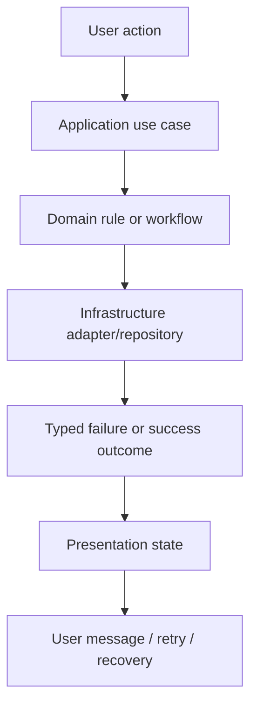

# CAS Analyzer Error Handling Architecture

**Document Version:** 0.1

**Status:** Draft

**Last Updated:** 2026-07-05

## 1. Purpose

This document defines how CAS Analyzer represents, propagates, classifies, and recovers from failures across the import pipeline, portfolio workflows, analytics, reporting, and user-facing interactions.

The goal is to make failure behavior explicit, safe, testable, and privacy-preserving. Errors must not silently degrade financial correctness, hide user intent, or leak sensitive portfolio content into logs or diagnostics.

This document complements the architecture principles and the data-flow and import-pipeline documents. It focuses specifically on failure semantics and the architecture required to handle them consistently.

## 2. Scope

This document covers Version 1 error handling for:

- CAS PDF selection and file validation.
- PDF extraction and CAS parsing.
- Domain validation, reconciliation, and import persistence.
- Portfolio queries, analytics, recommendations, and reports.
- Settings, local maintenance, and export actions.
- Progress, cancellation, and recovery flows.

This document does not define:

- Final UI copy for every screen.
- The exact database or parser implementation details.
- Specific financial rules beyond their effect on error classification.
- Third-party package-specific exception behavior.

## 3. Governing Principles

This architecture is governed primarily by:

- AP-01: Correctness before convenience.
- AP-02: Offline and private by default.
- AP-03: Explicit user control.
- AP-09: Validate at trust boundaries.
- AP-11: Deterministic and explainable insight.
- AP-12: Responsive, bounded work.
- AP-13: Explicit failures and safe recovery.
- AP-14: Testability by design.
- AP-17: Documentation and decisions evolve together.

The error-handling design must preserve these principles under both normal and exceptional conditions.

## 4. Error Handling Goals

CAS Analyzer must:

1. Make uncertainty explicit rather than silently converting it into a plausible result.
2. Preserve privacy by never logging raw CAS content, investor identifiers, holdings, or report content.
3. Keep the UI responsive and informed even when a lower layer fails.
4. Support safe retries and recovery for transient or recoverable failures.
5. Ensure atomic workflows leave the database in a consistent state.
6. Make every error traceable to a known cause, stage, and recovery action.

## 5. Error Model

Failures should be treated as first-class architecture concepts, not as incidental exceptions.

### 5.1 Error Categories

| Category | Typical Examples | Expected Handling |
| --- | --- | --- |
| User intent / cancellation | User dismisses picker, cancels import, aborts export | Treat as a normal terminal outcome, not a technical failure. |
| Input / validation errors | Non-PDF file, empty file, malformed statement section, invalid record shape | Reject early with a clear typed outcome and safe user guidance. |
| Domain rule errors | Invariant violation, unsupported transaction pattern, incompatible reconciliation result | Surface as an explicit domain failure and do not persist invalid data. |
| Infrastructure errors | File access failure, SQLite failure, PDF adapter failure, storage error | Classify as technical failure and preserve recoverability where possible. |
| Transient / retryable errors | Temporary resource contention, short-lived storage issue, interrupted extraction | Retry only when safe and idempotent. |
| Privacy / policy errors | Unexpected exposure of sensitive content, disallowed export destination, unauthorized action | Block the operation and surface a policy failure. |

### 5.2 Error Semantics

Every error should carry enough information for safe handling:

- A stable error code or type.
- A category such as user, validation, domain, infrastructure, or policy.
- A severity such as warning, recoverable failure, or terminal failure.
- A safe diagnostic payload that excludes sensitive content.
- A suggested recovery action, where applicable.
- A correlation identifier for tracing the operation across layers.

The application must not rely on raw exception messages alone to decide behavior.

## 6. Architectural Approach

### 6.1 Explicit Outcomes at Boundaries

Use explicit outcome types at application and infrastructure boundaries rather than relying on ad-hoc thrown exceptions for control flow.

A boundary should be able to return one of the following concepts:

- Success with data.
- Success with warnings.
- Recoverable failure.
- Terminal failure.
- Cancelled / user-aborted.

The exact implementation may use a result object, sealed type, or equivalent pattern. The important architectural rule is that the caller can reason about the outcome without guessing from a generic exception.

### 6.2 Layered Error Responsibility

| Layer | Responsibility |
| --- | --- |
| Presentation | Translate an outcome into user-visible state, progress, and recovery actions. |
| Application | Coordinate workflows, preserve correlation, and decide whether a failure is terminal or retriable. |
| Domain | Define business-meaningful failures and enforce invariants before persistence. |
| Infrastructure | Wrap platform, file, database, and library failures into project-owned failure types. |

Each layer must classify and handle errors at the boundary that owns the relevant decision.

### 6.3 No Silent Fallbacks

When a layer cannot produce a reliable result, it must surface that uncertainty explicitly.

Examples:

- A parser that cannot confidently map a statement section must return a parse warning or a typed rejection.
- A repository that cannot commit an import transaction must surface a database failure and avoid partial state.
- A calculation that cannot determine a value due to missing assumptions must return an explicit calculation failure rather than a guessed number.

## 7. Error Flow

### 7.1 Propagation Rules

- Errors are propagated as typed outcomes through the call chain.
- The application layer must preserve the original cause category and attach workflow context.
- Presentation must not inspect infrastructure internals or raw exceptions.
- Recovery decisions are made at the layer that owns the workflow, not in the UI alone.

### 7.2 Failure Context

A failure should retain:

- The current workflow stage.
- A correlation ID.
- The relevant record or import identity when safe.
- The stage that first observed the failure.
- Whether the operation can be retried safely.

Context is important for debugging and for ensuring that generic UI messages can still be tied to a correct recovery action.

## 8. Privacy and Diagnostics

### 8.1 Safe Diagnostics

Diagnostics must be structured and privacy-safe. They may include:

- Error code.
- Failure stage.
- Count of affected records.
- Parser version or rule version.
- Non-sensitive operational context.

They must not include:

- Raw CAS content.
- Investor names or account numbers.
- Holdings, transactions, or report contents.
- Full file paths when they could reveal sensitive context.

### 8.2 Logging Policy

Logging is allowed only for operational metadata that cannot reveal a user’s portfolio or identity. When in doubt, the system should record a generic failure event and a safe code rather than the underlying content.

## 9. Handling Patterns by Workflow

### 9.1 Import Workflow

Import must distinguish between:

- Cancelled import.
- Unsupported or invalid input.
- Duplicate input.
- Parsing failure.
- Validation failure.
- Reconciliation failure.
- Persistence failure.

The pipeline must not commit a partially accepted import unless an approved partial-import policy exists and is explicitly implemented.

### 9.2 Query and Report Workflows

Read-only workflows should fail gracefully and return an empty or partial view state rather than crashing the UI.

Examples:

- A dashboard query may return a degraded state with a visible warning.
- A report generation workflow may fail without corrupting previously persisted data.
- A malformed persisted row should be surfaced as a data-integrity issue rather than causing a full crash.

### 9.3 Settings and Maintenance Workflows

Maintenance actions such as backup, restore, cleanup, and export should require clear user intent and must fail with explicit consequences.

A destructive action must never proceed silently when a lower layer reports uncertainty.

## 10. Recovery and Retry Strategy

### 10.1 Retryability

Retries should be allowed only when the failure is classified as transient and the operation remains safe and idempotent.

Examples of safe retry candidates:

- Temporary file read interruption.
- Transient SQLite contention.
- A short-lived resource exhaustion during extraction.

Examples of unsafe retry candidates:

- A parsed financial record that violates domain invariants.
- An import that already committed a change set.
- A destructive export or delete action without explicit confirmation.

### 10.2 Recovery Boundaries

A workflow may recover by:

- Re-running a stage with the same correlation context.
- Returning a degraded but explainable result.
- Asking the user to fix input or confirm a destructive action.
- Rolling back the transaction and leaving the system unchanged.

## 11. Module Responsibilities

| Module | Error Handling Responsibility |
| --- | --- |
| MOD-IMPORT | Coordinate workflow outcomes, cancellation, and user-visible import status. |
| MOD-PARSER | Return parse warnings and typed parsing failures without claiming successful interpretation. |
| MOD-PORTFOLIO | Enforce domain invariants and reject invalid change sets before persistence. |
| MOD-CORE | Define generic failure types, correlation identifiers, and safe logging utilities. |
| Presentation | Convert outcomes into user-facing messages, progress state, and recovery actions. |

## 12. Verification Expectations

The architecture is considered implemented when:

- Critical workflows have explicit success and failure tests.
- Invalid input and malformed records are rejected with typed outcomes.
- Import transactions rollback correctly on failure.
- Diagnostics exclude sensitive content.
- User-facing messages distinguish cancellation, rejection, and technical failure.
- Retry logic is limited to safe, idempotent cases.

## 13. Open Design Decisions

The following items remain design choices and should be resolved in implementation plans or ADRs if they materially affect behavior:

1. The exact failure-type implementation pattern in Dart.
2. Whether a single global error envelope or feature-specific errors are preferred.
3. The final retry policy for import and export workflows.
4. The form of user-visible error messages for validation versus infrastructure failure.

## Revision History

| Version | Date       | Author       | Description |
| ------- | ---------- | ------------ | ----------- |
| 0.1     | 2026-07-05 | Project Team | Initial draft of the error handling architecture. |
