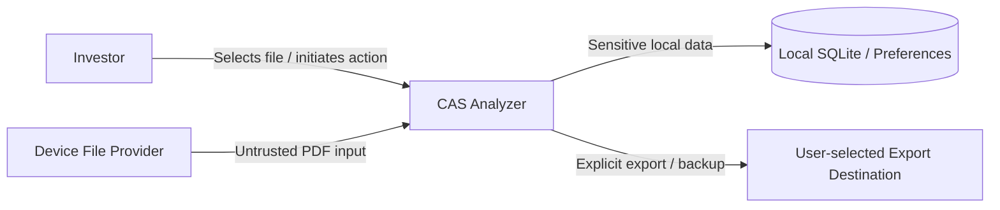

# CAS Analyzer Security Architecture

**Document Version:** 0.1

**Status:** Draft

**Last Updated:** 2026-07-05

## 1. Purpose

This document defines the security architecture for CAS Analyzer. It describes the security objectives, trust boundaries, data protections, access controls, threat considerations, and implementation expectations for the application.

The architecture is driven by the product’s privacy-first and offline-first requirements. The application must protect sensitive financial and personal information while remaining local-first and usable without internet access.

## 2. Scope

This document covers Version 1 security considerations for:

- Local storage of CAS data and portfolio information.
- User-selected PDF files and extracted content.
- Application preferences and local maintenance actions.
- Report export and backup/restore boundaries.
- Logging, diagnostics, and error reporting.
- Platform permission usage and dependency review.

This document does not define:

- Final UI authentication flows.
- Encryption implementation details for future features.
- Network security controls, since Version 1 does not depend on remote services.
- Complete threat modeling for all future platform releases.

## 3. Security Goals

CAS Analyzer must:

1. Keep investor and portfolio data on-device by default.
2. Minimize the exposure of sensitive financial data in memory, logs, and exports.
3. Validate all untrusted input before it enters domain processing.
4. Prevent accidental or silent data loss or corruption.
5. Make security-sensitive actions explicit and user-initiated.
6. Preserve confidentiality and integrity of imported statement data.
7. Support future hardening without forcing a redesign.

## 4. Security Principles

The architecture is guided by the following principles:

- Privacy by default: personal and financial data remain local unless the user explicitly exports or backs up data.
- Least privilege: only the minimum required permissions and capabilities are used.
- Defense in depth: validation, invariants, and persistence safeguards all contribute to protection.
- Explicit user intent: export, backup, deletion, and destructive operations require clear action.
- No silent trust: file input, parsed content, and persisted state must be validated before use.
- Traceability without exposure: diagnostics may support debugging without revealing sensitive content.

## 5. Security Boundaries

### 5.1 Trust Boundaries

- Files selected from the device are untrusted until validated.
- Parsed content and imported records are not trusted simply because they were extracted successfully.
- Local storage remains inside the application’s private trust boundary.
- Export and backup destinations are outside the application trust boundary and require explicit user action.
- No core Version 1 flow depends on a network request or remote service.

## 6. Data Classification

| Data Class | Examples | Protection Requirement |
| --- | --- | --- |
| Restricted personal data | Investor name, identifiers, contact details, nominee details | Keep local; never log; export only through explicit user action. |
| Restricted financial data | Holdings, balances, transactions, portfolio values | Keep local; avoid logging; protect from accidental disclosure. |
| Source content | PDF bytes, extracted text, parse snippets | Handle transiently; never log; avoid unnecessary persistence. |
| Operational metadata | Import stage, counts, warnings, failure codes | May be logged only when safe and non-sensitive. |
| Non-sensitive configuration | Theme preferences, UI settings | Standard local storage is acceptable. |

## 7. Security Controls

### 7.1 Input Validation

All untrusted input must be validated before it is used in domain logic or persisted.

Required controls:

- Validate file accessibility and file type before processing.
- Reject empty, corrupted, unsupported, or suspicious files early.
- Validate parsed record structure before domain construction.
- Enforce domain invariants before persistence.
- Reject unsupported or ambiguous content rather than guessing.

### 7.2 Local Data Protection

The application should:

- Store sensitive data only in application-controlled local storage.
- Avoid exposing data through global state or shared debug output.
- Keep database access through repositories and use controlled transactions.
- Preserve data integrity by using validation and transaction boundaries.

### 7.3 Access and Permissions

The application should request only the permissions required for file import and local storage.

Rules:

- Avoid unnecessary Android permissions.
- Request permissions at the point of use when practical.
- Handle permission denial gracefully and explain the consequence.
- Do not request broader access than required for Version 1 features.

### 7.4 Export and Backup Boundaries

Export and backup actions are security-sensitive because they move data outside the application boundary.

Controls:

- Require explicit user action.
- Expose the destination clearly.
- Avoid silently overwriting existing files.
- Prefer safe, user-readable formats and explicit warnings.
- Validate the output destination before writing.

### 7.5 Logging and Diagnostics

Logging must not expose sensitive content.

Safe logging practices:

- Record failure codes and stage names rather than raw content.
- Redact or omit investor identity and holdings data.
- Avoid logging file bytes, extracted text, or report payloads.
- Use structured diagnostics that can be reviewed without exposing portfolio detail.

## 8. Threat Considerations

The following are relevant concerns for Version 1:

- Malicious or malformed PDF files.
- Unexpected or incomplete parsed data.
- Accidental overwrite or destructive user actions.
- Exposure of sensitive financial data through logs or exports.
- Corrupt or partially imported statements affecting downstream calculations.
- Insecure use of temporary files or cached content.

The architecture should treat these as design constraints rather than edge cases.

## 9. Security Responsibilities by Layer

| Layer | Security Responsibility |
| --- | --- |
| Presentation | Avoid exposing sensitive content in UI state and show safe recovery guidance. |
| Application | Enforce user-intent decisions, workflow boundaries, and safe error handling. |
| Domain | Validate business invariants and reject unsafe or malformed financial state. |
| Infrastructure | Handle file access, SQLite, exports, prefs, and platform APIs safely and defensively. |

## 10. Recommended Implementation Expectations

The implementation should:

- Use typed outcomes and explicit failure handling instead of relying on undefined exceptions.
- Keep all sensitive data inside application-controlled storage unless the user explicitly exports it.
- Protect database transactions so a failed import cannot leave partial portfolio state.
- Ensure that imported data cannot be treated as trusted simply because the parser succeeded.
- Treat every new dependency as a potential security and privacy liability until reviewed.

## 11. Security Verification

Security expectations should be checked through:

- Unit and integration tests for invalid input and malformed data.
- Tests that confirm sensitive content does not appear in logs or diagnostics.
- Review of permissions and export flows.
- Review of repository and persistence boundaries.
- Manual validation of destructive actions and confirmation prompts.

## 12. Open Security Decisions

The following decisions may require further design work or ADRs:

1. Whether database encryption is implemented in an early release or deferred.
2. The exact protection model for exported files and backup archives.
3. The level of protection required for temporary files and extracted content caches.
4. Whether additional local authentication or device-lock protection is required in a future release.

## Revision History

| Version | Date       | Author       | Description |
| ------- | ---------- | ------------ | ----------- |
| 0.1     | 2026-07-05 | Project Team | Initial draft of the security architecture. |
