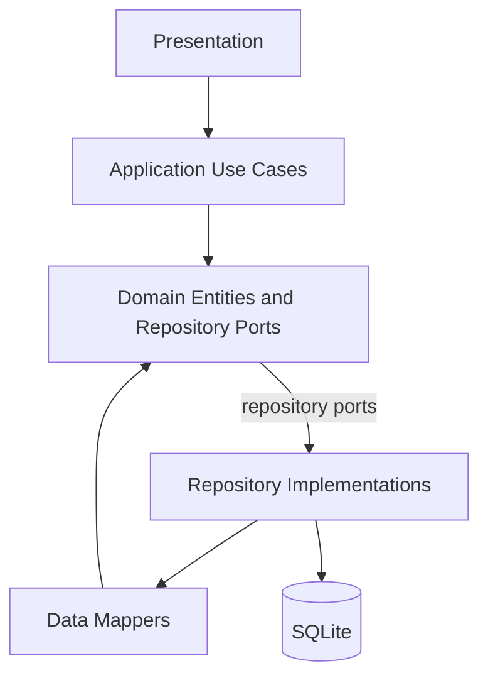
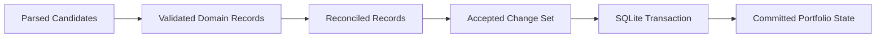

# CAS Analyzer Database Architecture

**Document Version:** 0.1

**Status:** Draft

**Last Updated:** 2026-07-05

## 1. Purpose

This document defines the database architecture for CAS Analyzer Version 1. It explains how SQLite is used, which data the database owns, how repositories and transactions protect financial correctness, and what later schema documents must specify.

This document is intentionally not the physical schema. Table columns, indexes, migrations, and SQL details belong in companion documents under `docs/02_Database/`.

## 2. Scope

This document covers:

- SQLite as the local source of truth after successful import.
- Persistent data ownership and module boundaries.
- Import transaction and rollback expectations.
- Provenance, import history, duplicate controls, and data integrity.
- Query architecture for dashboard, holdings, transactions, analytics, recommendations, and reports.
- Migration, backup/restore, cleanup, privacy, and test expectations.

This document does not define:

- Final table definitions.
- Exact import identity and duplicate algorithm.
- Exact overlap/re-import reconciliation policy.
- Exact money, unit, price, and rounding representation.
- Backup archive format or encryption.
- Parser-specific extraction rules.

Those decisions are captured as open decisions and must be resolved in later database design documents or ADRs before implementation depends on them.

## 3. Database Goals

The database architecture must:

1. Preserve financial correctness and historical records.
2. Keep all portfolio data local and offline.
3. Support idempotent imports and safe retries.
4. Prevent partially committed imports.
5. Preserve enough provenance to explain important values.
6. Support efficient read queries for core screens and exports.
7. Evolve safely through ordered, tested migrations.
8. Keep domain logic independent of SQLite implementation details.

## 4. Architecture Position

SQLite belongs to the infrastructure/data layer. Domain entities, value objects, use cases, and widgets must not depend on SQLite row shapes, SQL APIs, database connections, or migration tools.

Repository interfaces express project concepts such as imports, holdings, transactions, nominees, portfolio summaries, and reports. Repository implementations translate those concepts into SQLite reads and writes.

## 5. SQLite Role

SQLite is the durable local store for Version 1. After a successful import, user-facing portfolio state must be derived from committed SQLite data, not from parser intermediates or cached UI state.

SQLite stores:

- Import attempts and successful import metadata.
- Statement/account/investor references needed for portfolio interpretation.
- Demat account and folio/account structures.
- Securities, schemes, and instruments discovered from CAS Statements.
- Holdings, balances, and position-like records.
- Transactions and available corporate actions.
- Nominee information extracted from supported statements.
- Validation, parse, and import diagnostics that are approved for persistence.
- Schema version and migration metadata.
- Optional backup/restore metadata if Version 1 implements that feature.

SQLite must not store by default:

- Raw PDF bytes.
- Full extracted CAS text.
- Raw source snippets.
- PDF passwords.
- Temporary parser buffers.
- Report files after export.

If a later parser design requires source snippets or extracted text for explainability, it must justify retention, minimization, lifecycle, privacy controls, and cleanup behavior before implementation.

## 6. Data Ownership

| Data Area | Owning Module | Stored In SQLite | Notes |
| --- | --- | --- | --- |
| Import history and status | MOD-IMPORT | Yes | Tracks attempts, terminal outcome, safe diagnostics, and successful import references. |
| Parser diagnostics | MOD-PARSER / MOD-IMPORT | Limited | Persist only safe, redacted, bounded diagnostics needed for user support and import history. |
| Portfolio aggregate data | MOD-PORTFOLIO | Yes | Owns validated portfolio concepts and repository ports. |
| Holdings | MOD-HOLDINGS / MOD-PORTFOLIO | Yes | Queried from committed records; may use read models or views after schema design. |
| Transactions | MOD-TRANSACTIONS / MOD-PORTFOLIO | Yes | Historical transaction data must be preserved. |
| Nominees | MOD-NOMINEE / MOD-PORTFOLIO | Yes | Sensitive; never logged and exported only by explicit user action. |
| Analytics inputs | MOD-ANALYTICS | Read-only | Analytics read committed data and do not mutate portfolio state as a query side effect. |
| Recommendations inputs | MOD-RECOMMENDATIONS | Read-only | Recommendation observations are deterministic and explainable. Durable caching requires justification. |
| Reports | MOD-REPORTS | Read-only plus export metadata if approved | Report files leave app storage only by explicit user action. |
| Settings | MOD-SETTINGS | Usually no | Lightweight preferences use SharedPreferences; financial data must not be moved there. |

## 7. Core Persistent Data Groups

The physical schema should be designed around these groups:

1. Database metadata and migrations.
2. Import attempts, import batches, and successful statement imports.
3. Source provenance and parser version references.
4. Investors and account relationships.
5. Demat accounts, folios, and statement account identifiers.
6. Instruments, mutual fund schemes, and security identifiers.
7. Holdings and balances as reported by CAS Statements.
8. Transactions and available corporate actions.
9. Nominees and nomination status.
10. Safe diagnostics and validation issues.
11. Optional read models or views for dashboard/report performance.

The schema should prefer normalized durable records first. Derived read models should be introduced only when query performance or UI needs justify them.

## 8. Source of Truth Rules

| Rule | Requirement |
| --- | --- |
| DBR-01 | A successful import becomes visible only after the database transaction commits. |
| DBR-02 | Dashboard, holdings, transactions, analytics, recommendations, and reports read committed data. |
| DBR-03 | Parser candidates are not durable portfolio data. |
| DBR-04 | Domain validation and reconciliation occur before portfolio records are committed. |
| DBR-05 | Database constraints reinforce, but do not replace, domain validation. |
| DBR-06 | Import history must agree with committed portfolio records. |
| DBR-07 | Durable records retain approved provenance back to import/source metadata. |
| DBR-08 | Failed or cancelled imports must not create accepted portfolio mutations. |

## 9. Import Persistence Boundary

The import pipeline produces an accepted change set after extraction, parsing, validation, and reconciliation. Only that accepted change set may enter the durable commit boundary.

The database commit must include all records required to make the import internally consistent:

- Import metadata.
- Source/provenance records.
- Investor/account/instrument references needed by accepted records.
- Holdings, balances, transactions, nominees, and corporate-action records.
- Approved validation or import diagnostics.
- Any derived read-model refreshes that must remain synchronized with the import.

If any part of the commit fails, the entire transaction rolls back.

## 10. Transaction Strategy

### 10.1 Import Transaction

Each accepted import change set must be persisted in a single logical transaction unless an ADR explicitly approves a different unit-of-work boundary.

The transaction must:

- Recheck durable duplicate constraints before writing accepted records.
- Insert or update records in a deterministic order.
- Enforce foreign keys and uniqueness constraints.
- Commit import metadata and portfolio records consistently.
- Roll back on write failure, constraint failure, cancellation during unsafe stages, or unexpected exception.

### 10.2 Query Transactions

Read workflows should use consistent snapshots where needed, especially for dashboard, report, and analytics queries that combine multiple tables.

Simple list/detail queries may use ordinary read operations, but they must not expose partially refreshed derived state.

### 10.3 Maintenance Transactions

Deletion, cleanup, restore, and migration operations require explicit transaction boundaries. A failed maintenance operation must leave the previous usable database state intact wherever technically possible.

## 11. Identity and Idempotency

The database must support duplicate detection and safe retry. However, the exact canonical import identity remains open.

The schema must be prepared to represent:

- File-level fingerprint metadata where approved.
- Content-level statement identity where approved.
- Statement issuer and statement period.
- Account, folio, and investor references.
- Parser/detector version used for the import.
- Record-level identities for holdings, transactions, nominees, and corporate actions.

Duplicate prevention should occur in two places:

1. Early in the import flow for user experience and efficiency.
2. At the database boundary through durable uniqueness or conflict checks.

Do not rely only on in-memory duplicate checks.

## 12. Reconciliation and Overlapping Statements

Overlapping statements are expected in real user workflows. The database must not assume that every new CAS Statement is disjoint from previous imports.

Before physical schema implementation, an ADR or reconciliation design must define:

- Whether overlapping records replace, merge with, or coexist beside earlier records.
- How transaction duplicates are identified.
- How holdings reported for the same account and statement date are handled.
- How corrections, reissued statements, and parser-version changes are represented.
- How users can understand what changed after re-import.

Until that policy is approved, the database design should preserve enough import/source provenance to support future reconciliation without data loss.

## 13. Provenance

Every important durable financial record must be traceable to approved source metadata.

Provenance should allow the application to explain:

- Which import created or last affected the record.
- Which statement issuer and parser version produced it.
- Which statement period/date was involved.
- Which logical account, folio, or source grouping it came from.
- Whether the value is source-reported or derived.

Provenance must be useful without storing raw CAS text by default.

## 14. Data Integrity Constraints

The physical schema should use database constraints as defense in depth:

- Primary keys for stable local identity.
- Foreign keys for ownership and relationship integrity.
- Unique constraints for approved identities and duplicate controls.
- Not-null constraints for required fields.
- Check constraints for simple invariant ranges where SQLite support is practical.
- Indexes that align with common query and uniqueness paths.

Domain-level validation remains required because many financial rules are more expressive than database constraints.

## 15. Data Types and Precision

Financial data requires explicit precision rules. The database must not use imprecise floating-point storage for money, units, NAV, prices, or percentage values unless an ADR explicitly approves a representation and its rounding behavior.

The later physical schema must define:

- Decimal storage representation.
- Scale for money, units, NAV/prices, and percentages.
- Rounding policy.
- Currency handling for Version 1.
- Date and time representation.
- Nullability for missing or unsupported values.

Until this is resolved, implementation must not guess table column types for financial amounts.

## 16. Query Architecture

Queries should be shaped around use cases rather than exposing arbitrary SQL to the application.

| Consumer | Query Expectation |
| --- | --- |
| Dashboard | Fast summary of committed portfolio state, latest import status, allocations, and warnings. |
| Holdings | Searchable, sortable, filterable holding lists with stable record identifiers. |
| Transactions | Paginated transaction history with date/type/account/instrument filters. |
| Analytics | Deterministic reads over holdings, transactions, and classification/reference data. |
| Recommendations | Read-only access to approved portfolio and analytics inputs. |
| Reports | Consistent read snapshot for exportable summaries and transaction details. |

Large lists must use bounded queries and pagination. Widgets must not execute SQL directly.

## 17. Derived Data and Read Models

Version 1 should prefer calculating derived values from committed normalized data through repositories and use cases.

Durable derived data or read models may be introduced when:

- A documented query cannot meet responsiveness goals without precomputation.
- The derived data can be invalidated or refreshed deterministically.
- The source records and calculation/rule version remain traceable.
- Tests prove refresh consistency across import, delete, restore, and migration.

Do not persist derived analytics or recommendation results merely for convenience.

## 18. Migration Architecture

The database must maintain a clear schema version and run ordered migrations.

Migration rules:

- Every schema change has an explicit version transition.
- Migrations are deterministic and tested against representative prior schemas.
- Destructive migration is not an acceptable default.
- Migration failure must not silently delete user data.
- The app must detect unsupported future database versions.
- Migrations must preserve provenance and import history.

Migration scripts and tests should be documented in `docs/02_Database/03_MigrationStrategy.md` when that file is created.

## 19. Privacy and Security

The database contains sensitive financial and personal data. Version 1 defers encrypted database support, so the design must reduce accidental exposure.

Required safeguards:

- Store the database in application-private storage.
- Do not log SQL parameters containing financial or personal data.
- Do not log row contents, CAS content, holdings, transactions, nominee details, or report contents.
- Avoid persisting raw source content.
- Keep temporary import artifacts outside durable tables and clean them up.
- Require explicit user intent for export, backup, restore, and deletion.
- Treat restored backup files as untrusted input.

Database encryption and backup protection remain open future/security decisions.

## 20. Backup, Restore, and Deletion

Backup and restore are optional for Version 1. If implemented, they require a dedicated design before coding.

Backup/restore design must define:

- Backup archive contents.
- Backup format versioning.
- Integrity checks.
- Encryption or warning model.
- Restore compatibility and migration behavior.
- Replace versus merge behavior.
- Failure rollback behavior.

Deletion and cleanup must be explicit, scoped, and transactional. Deleting an import must not leave orphan records or inconsistent summaries.

## 21. Error Handling

Database operations must map SQLite, storage, migration, and transaction failures to project-owned typed failures.

Expected failure groups:

- Database unavailable or cannot open.
- Migration failed or unsupported version.
- Constraint violation.
- Duplicate import or duplicate record.
- Storage full or write failure.
- Transaction rollback.
- Data integrity violation.
- Backup/restore validation failure.

User-facing messages must be friendly and non-sensitive. Logs and diagnostics must use safe codes and aggregate context only.

## 22. Performance Guidelines

The schema and repositories should support:

- Statements of roughly 200-300 pages.
- Batch writes inside transactions.
- Indexed duplicate checks.
- Indexed dashboard, holdings, and transaction queries.
- Pagination for long transaction and holdings lists.
- Bounded memory during mapping and reads.
- Avoiding expensive work in widgets or UI build methods.

Performance thresholds should be established after representative device and fixture baselines are available.

## 23. Repository and Data Source Responsibilities

Repository implementations:

- Satisfy domain repository interfaces.
- Own mapping between SQLite rows and domain/data models.
- Hide SQL and database library details from callers.
- Return typed outcomes or typed failures.
- Keep transaction behavior explicit.
- Avoid leaking raw database exceptions outside the data layer.

Database data sources:

- Own SQL statements, connection access, migrations, and low-level queries.
- Use parameterized statements.
- Enforce foreign keys and other SQLite settings required by the chosen package.
- Keep SQL close to the data module, not in widgets or use cases.

## 24. Testing Strategy

Database implementation must include:

- Migration tests for each version transition.
- Repository tests against a real test SQLite database.
- Import transaction rollback tests.
- Duplicate constraint tests.
- Foreign-key and integrity tests.
- Query tests for dashboard, holdings, transactions, analytics inputs, and reports.
- Privacy tests that seeded sensitive values do not appear in logs or diagnostics.
- Backup/restore tests if that feature is implemented.
- Performance tests or benchmarks for large synthetic imports and long transaction lists.

Mocked repository tests are useful for use cases, but they do not replace real SQLite tests for repository and migration behavior.

## 25. Database Architecture Invariants

| ID | Invariant |
| --- | --- |
| DBAI-01 | SQLite is the source of truth only after a successful commit. |
| DBAI-02 | No widget, controller, or domain rule executes SQL directly. |
| DBAI-03 | Parser candidates never bypass domain validation and reconciliation into durable tables. |
| DBAI-04 | Accepted import records and import metadata commit or roll back together. |
| DBAI-05 | Failed and cancelled imports do not create accepted portfolio mutations. |
| DBAI-06 | Duplicate controls are enforced at the durable boundary. |
| DBAI-07 | Important financial records retain approved provenance. |
| DBAI-08 | Raw PDF bytes, extracted text, passwords, and raw snippets are not persisted by default. |
| DBAI-09 | Financial decimals use an approved exact representation before implementation. |
| DBAI-10 | Schema changes use ordered, tested migrations. |
| DBAI-11 | Read workflows use committed data, not parser intermediates. |
| DBAI-12 | Backup, restore, delete, and cleanup operations are explicit, scoped, and recoverable. |
| DBAI-13 | Repository implementations hide SQLite details from application and domain callers. |
| DBAI-14 | Sensitive values never appear in database logs, diagnostics, or test output. |

## 26. Open Decisions and ADR Queue

| Priority | Decision | Blocks |
| --- | --- | --- |
| Critical | Canonical import identity and duplicate algorithm | Unique constraints, import tables, retry behavior. |
| Critical | Overlapping statement reconciliation policy | Transactions, holdings, re-import, deletion behavior. |
| Critical | Money/unit/date precision and storage representation | Physical schema, calculations, reports. |
| Critical | Atomic rejection versus explicit partial import | Import transaction boundary and diagnostics tables. |
| High | Database package selection and migration tooling | Implementation structure and tests. |
| High | Import transaction/unit-of-work ownership | Repository APIs and commit orchestration. |
| High | Failed-attempt and diagnostic retention policy | Import history tables and privacy controls. |
| High | Local-data protection while encryption is deferred | Storage, backup, restore, deletion safeguards. |
| Medium | Durable derived read models versus on-demand queries | Dashboard/report schema and invalidation. |
| Medium | Backup/restore archive format and encryption | Optional FT-045 implementation. |

## 27. Planned Companion Documents

The database documentation set should continue with:

- `docs/02_Database/01_ConceptualDataModel.md`
- `docs/02_Database/02_PhysicalSchema.md`
- `docs/02_Database/03_MigrationStrategy.md`
- `docs/02_Database/04_RepositoryDesign.md`
- `docs/02_Database/05_BackupRestoreAndCleanup.md`

## 28. Traceability

This architecture supports:

- FG-06: Store Data in SQLite.
- FT-014: SQLite Storage.
- FT-015: Database Schema.
- FT-016: Data Validation.
- FT-017: Data Persistence.
- FT-018 through FT-042 for dashboard, holdings, transactions, analytics, recommendations, and reports.
- FT-045 if local backup and restoration is implemented in Version 1.
- AP-01, AP-02, AP-05, AP-07, AP-08, AP-09, AP-13, AP-14, AP-16, and AP-17.
- DF-01, DF-03 through DF-11.
- IP-09, IP-10, IP-11, and IP-12.
- DBAI-01 through DBAI-14.

## 29. Cross References

- `docs/project_context.md`
- `docs/01_Architecture/00_SolutionArchitecture.md`
- `docs/01_Architecture/01_ArchitecturePrinciples.md`
- `docs/01_Architecture/02_ModuleArchitecture.md`
- `docs/01_Architecture/03_DataFlowArchitecture.md`
- `docs/01_Architecture/04_ImportPipelineArchitecture.md`
- `docs/01_Architecture/05_ErrorHandlingArchitecture.md`
- `docs/01_Architecture/06_SecurityArchitecture.md`
- `docs/00_Project/02_ProjectScope.md`
- `docs/00_Project/03_FeatureCatalog.md`
- `docs/00_Project/04_ProjectConstraints.md`
- `docs/00_Project/05_TechnologyStack.md`
- `docs/ADR/`

## 30. AI Development Notes

When generating database implementation:

- Read this document before creating schema, repositories, or migrations.
- Do not invent answers for open identity, overlap, precision, partial import, or encryption decisions.
- Keep SQL and SQLite package types inside the data/infrastructure layer.
- Keep repository interfaces domain-owned and implementation-free.
- Use transactions for accepted import commits and destructive maintenance operations.
- Add real SQLite tests for repositories, migrations, constraints, and rollback.
- Never include real or fixture sensitive financial values in logs, diagnostics, snapshots, or generated documentation.
- Update this document and `docs/project_context.md` when a database decision changes.

## 31. Revision History

| Version | Date | Author | Description |
| --- | --- | --- | --- |
| 0.1 | 2026-07-05 | Project Team | Initial draft of the database architecture. |
