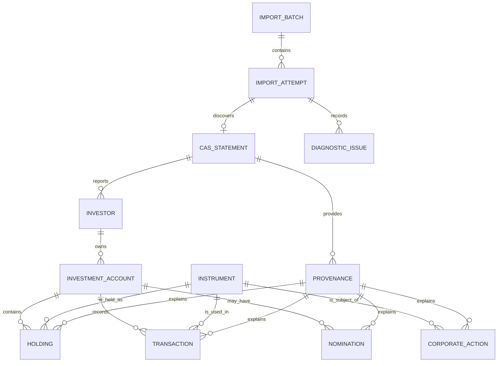

# CAS Analyzer Conceptual Data Model

**Document Version:** 0.1

**Status:** Draft

**Last Updated:** 2026-07-05

## 1. Purpose

This document defines the conceptual data model for CAS Analyzer Version 1. It names the business entities that the application needs to persist or derive, explains their relationships, and identifies the major invariants that the later physical SQLite schema must protect.

This document is not a table design. It does not define column names, primary-key formats, indexes, or SQL. Those details belong in `docs/02_Database/02_PhysicalSchema.md`.

## 2. Scope

This model covers:

- CAS Statement import metadata.
- Source provenance.
- Investors, demat accounts, folios, and account relationships.
- Instruments, mutual fund schemes, equities, holdings, transactions, nominees, and corporate actions.
- Import diagnostics and validation issues.
- Read needs for dashboard, holdings, transactions, analytics, recommendations, and reports.

This model does not decide:

- Canonical import identity or duplicate algorithm.
- Overlap/re-import reconciliation behavior.
- Partial import policy.
- Exact decimal, date, and money storage representation.
- Sector/category reference data source.
- Backup/restore archive model.

## 3. Modeling Goals

The conceptual model must:

1. Represent data from both NSDL and CDSL CAS Statements.
2. Preserve historical transactions.
3. Support current holdings and allocation views.
4. Preserve enough provenance to explain important values.
5. Enable idempotent import and future reconciliation.
6. Avoid storing raw CAS text by default.
7. Keep source-reported data distinct from derived application values.
8. Support a normalized SQLite design without leaking SQLite details into domain concepts.

## 4. Core Concepts

| Concept | Meaning |
| --- | --- |
| Import Batch | One user-initiated import operation that may include one or more selected files. |
| Import Attempt | The processing attempt for one selected file or logical statement input. |
| CAS Statement | A supported NSDL/CDSL statement discovered from an import attempt. |
| Source Provenance | Safe metadata linking durable records to the import and parser/rule versions that produced them. |
| Investor | The person whose investments appear in the CAS Statement. |
| Account | A logical investment account container, such as a demat account or mutual fund folio. |
| Instrument | A financial asset represented in the portfolio, such as an equity or mutual fund scheme. |
| Holding | A source-reported or reconciled ownership position at a statement date. |
| Transaction | A historical investment activity such as purchase, redemption, switch, transfer, or corporate action entry. |
| Nominee | A person or nomination status associated with an account, folio, or holding where available. |
| Corporate Action | A source-reported action such as bonus, split, merger, dividend, or similar event where available. |
| Diagnostic Issue | A safe, bounded import, parse, validation, or reconciliation issue retained for user support and traceability. |

## 5. Conceptual Overview

This diagram expresses business relationships only. It does not prescribe table names, foreign-key names, or cardinality implementation.

## 6. Entity Groups

### 6.1 Import and Source Entities

#### Import Batch

Represents one explicit user import action.

Responsibilities:

- Group one or more selected files.
- Provide a user-visible import history entry.
- Track aggregate outcome such as completed, partially completed, cancelled, duplicate, or failed.
- Preserve safe timing and count metadata.

Notes:

- Multi-file import sequencing and concurrency limits remain implementation decisions.
- If only one file is selected, the batch still gives a stable parent concept for future multi-file support.

#### Import Attempt

Represents an attempt to process one selected file or logical input.

Responsibilities:

- Track import pipeline state and terminal outcome.
- Hold safe fingerprint/identity metadata once the identity policy is approved.
- Link diagnostics and successful CAS Statement metadata.
- Distinguish cancellation, duplicate, rejection, and technical failure.

Notes:

- Failed attempts may be retained only according to the approved diagnostic retention policy.
- Raw file path, raw file name, and CAS content must not be retained unless explicitly approved.

#### CAS Statement

Represents a supported statement recognized from an import attempt.

Responsibilities:

- Identify statement issuer type, such as NSDL or CDSL.
- Represent statement period/date information where available.
- Link reported investors, accounts, holdings, transactions, nominees, and corporate actions.
- Preserve parser/detector version context.

Notes:

- A selected PDF may fail before a CAS Statement is recognized.
- A selected PDF may contain multiple logical statement sections; the parser design must define how those map to this concept.

#### Source Provenance

Represents safe metadata used to explain where a durable record came from.

Responsibilities:

- Link records to import attempt, CAS Statement, parser version, and validation/reconciliation version.
- Distinguish source-reported records from derived records.
- Support user explanations and future reconciliation.

Notes:

- Provenance should not require raw source snippets by default.
- If page/section references are kept, they must be safe and useful without exposing raw content.

### 6.2 Party and Account Entities

#### Investor

Represents the investor reported in the CAS Statement.

Responsibilities:

- Group accounts and portfolio records belonging to the same reported investor.
- Support dashboard and report identity context where appropriate.

Notes:

- Version 1 is single-user, but imported CAS data may still report one or more holders or account relationships.
- The exact matching policy for investor identity across imports remains part of the import identity/reconciliation decision.

#### Investment Account

Represents an account container for holdings and transactions.

Account types include:

- Demat account.
- Mutual fund folio.
- Other statement-specific account grouping if needed for NSDL/CDSL structure.

Responsibilities:

- Link an investor to holdings, transactions, nominee information, and source statement context.
- Preserve account type and source identifiers in a privacy-safe way.
- Support filtering and reporting by account or folio.

Notes:

- Demat account and folio may require specialized subtypes or type-specific attributes in the physical schema.
- Account identifiers are sensitive and must not be logged.

#### Nomination

Represents nominee information or nominee status reported for an account, folio, or holding.

Responsibilities:

- Support missing nominee detection.
- Preserve source-reported nominee status where available.
- Link to provenance.

Notes:

- Nominee details are sensitive personal information.
- Some statements may provide only status, while others may include nominee details.

### 6.3 Instrument Entities

#### Instrument

Represents a financial asset that can appear in a holding or transaction.

Common attributes conceptually include:

- Instrument name.
- Asset class.
- Identifier such as ISIN where available.
- Issuer/AMC/company context where available.

Instrument categories include:

- Mutual fund scheme.
- Equity.
- Other supported security types that may appear in Version 1 CAS data.

Notes:

- Instrument identity must be stable enough for duplicate detection, search, aggregation, and reports.
- Missing or inconsistent identifiers must be handled explicitly during validation/reconciliation.

#### Mutual Fund Scheme

Represents mutual-fund-specific instrument information.

Responsibilities:

- Support folio-linked holdings and transactions.
- Support scheme-level search, grouping, and duplicate-investment analysis.

Notes:

- The exact source for scheme category, AMC, and sector/category classification remains open where CAS does not provide it.

#### Equity Security

Represents equity-specific instrument information.

Responsibilities:

- Support demat-linked equity holdings.
- Support ISIN/name search and allocation views.

Notes:

- Live price lookup is excluded from Version 1.
- Current value must not be invented when source valuation data is absent.

### 6.4 Portfolio Record Entities

#### Holding

Represents an ownership position reported or accepted for a statement date.

Responsibilities:

- Link an investment account to an instrument.
- Preserve units/quantity and other source-reported position data.
- Support current portfolio views, holdings detail, allocation, reports, and recommendations.
- Link to provenance.

Notes:

- A holding is not necessarily a live market position; it reflects accepted data from one or more CAS Statements and reconciliation rules.
- The definition of current portfolio value without live NAV/prices remains open.

#### Transaction

Represents a historical investment activity.

Responsibilities:

- Preserve transaction history.
- Link account, instrument, amount/units/date/type where available.
- Support transaction lists, filters, details, reports, analytics, and reconciliation.
- Link to provenance.

Notes:

- Transaction duplicate identity is a critical open decision.
- Transaction types must be normalized carefully without losing source meaning.

#### Corporate Action

Represents source-reported corporate actions where available.

Examples:

- Bonus.
- Split.
- Dividend.
- Merger.
- Other statement-supported action.

Responsibilities:

- Preserve available action information.
- Link to instrument, account, transaction, or holding context where applicable.
- Support historical explanation and future analytics.

Notes:

- CAS Statements may not provide complete corporate action details.
- Corporate action handling should be permissive in capture but strict in validation of financial effects.

### 6.5 Diagnostic and Metadata Entities

#### Diagnostic Issue

Represents a safe retained issue from import, parsing, validation, reconciliation, persistence, migration, or restore.

Responsibilities:

- Support import history and user-friendly problem explanation.
- Preserve issue code, stage, severity, and safe aggregate context.
- Avoid raw CAS content and sensitive values.

Notes:

- Diagnostic retention policy remains open.
- High-volume parse issues must be bounded and summarized.

#### Schema Metadata

Represents database version and migration metadata.

Responsibilities:

- Track current schema version.
- Support ordered migrations.
- Detect unsupported future versions.
- Provide safe migration diagnostics.

#### Optional Backup Metadata

Represents backup/restore events if FT-045 is implemented.

Responsibilities:

- Track safe backup or restore status.
- Preserve format/version compatibility information.
- Avoid storing exported file contents.

Notes:

- Backup archive format and encryption remain open decisions.

## 7. Key Relationships

| Relationship | Cardinality | Meaning |
| --- | --- | --- |
| Import Batch to Import Attempt | One to many | A user import action may process multiple selected inputs. |
| Import Attempt to CAS Statement | Zero or one initially | An attempt may fail before a statement is recognized. |
| CAS Statement to Investor | One to many | A statement can report one or more investor/holder contexts. |
| Investor to Investment Account | One to many | An investor can have many demat accounts or folios. |
| Investment Account to Holding | One to many | An account can contain many holdings. |
| Investment Account to Transaction | One to many | An account can have many transactions. |
| Instrument to Holding | One to many | The same instrument can be held across accounts/imports. |
| Instrument to Transaction | One to many | Transactions reference the instrument involved. |
| Investment Account to Nomination | Zero to many | Nominee information may be absent, status-only, or detailed. |
| Import Attempt to Diagnostic Issue | Zero to many | Each attempt may record safe issues. |
| Provenance to Financial Record | One to many | Accepted holdings, transactions, nominees, and actions retain source context. |

Cardinality may be refined in the physical schema once parser realities and reconciliation policy are known.

## 8. Aggregate Boundaries

Conceptual aggregate boundaries guide repository design and transaction consistency.

| Aggregate | Root Concept | Main Members | Notes |
| --- | --- | --- | --- |
| Import Aggregate | Import Batch / Import Attempt | attempt state, terminal outcome, diagnostics, statement link | Coordinates pipeline status and history. |
| Statement Source Aggregate | CAS Statement | issuer, period, source provenance, parser versions | Provides traceability for imported records. |
| Portfolio Aggregate | Investor / Portfolio | accounts, holdings, transactions, nominees | Represents accepted financial state. |
| Instrument Catalog Aggregate | Instrument | scheme/equity metadata and identifiers | Supports search, grouping, and analytics. |
| Maintenance Aggregate | Schema/backup/delete operation | migration state, restore status, cleanup status | Must be explicit and recoverable. |

Physical repositories do not need to mirror these exactly, but they should not break the consistency assumptions of these aggregates.

## 9. Source-Reported vs Derived Data

The model distinguishes between:

- Source-reported data: values extracted from a CAS Statement and accepted after validation.
- Reconciled data: accepted records after duplicate and overlap rules are applied.
- Derived data: values calculated by CAS Analyzer from committed records.
- User preference data: lightweight local settings that do not represent portfolio state.

Examples:

| Data | Classification |
| --- | --- |
| Statement date | Source-reported |
| Reported holding quantity | Source-reported or reconciled |
| Transaction amount | Source-reported or reconciled |
| Portfolio asset allocation | Derived |
| Concentration warning | Derived |
| Missing nominee observation | Derived from source-reported nomination state |
| Theme preference | User preference |

Derived data must retain enough rule/calculation context to be explainable when persisted or exported.

## 10. Data Classification

| Data Class | Examples | Handling |
| --- | --- | --- |
| Sensitive personal data | Investor names, nominee details, account identifiers | Persist only when needed; never log; export only by explicit action. |
| Restricted financial data | Holdings, units, balances, transaction history, valuations | Store in app-private SQLite; never log; protect in exports. |
| Source metadata | Statement issuer, period, parser version, safe import identity metadata | Persist for provenance and reconciliation. |
| Sensitive source content | PDF bytes, extracted text, raw snippets, passwords | Do not persist by default; never log. |
| Derived analytical data | Allocation, concentration, duplicate-investment observations | Prefer on-demand calculation unless durable cache is justified. |
| Operational metadata | schema version, safe timings, issue codes | Persist when useful and privacy-safe. |

## 11. Invariants

| ID | Invariant |
| --- | --- |
| CDMI-01 | Every accepted holding has an investment account, instrument, and provenance reference. |
| CDMI-02 | Every accepted transaction has an investment account, instrument where applicable, and provenance reference. |
| CDMI-03 | Import attempts distinguish success, duplicate, rejection, failure, and cancellation. |
| CDMI-04 | A CAS Statement cannot create durable portfolio records without an accepted import attempt. |
| CDMI-05 | Source-reported values and derived values are not mixed without explicit classification. |
| CDMI-06 | Sensitive source content is not part of the default conceptual model. |
| CDMI-07 | Nominee data is treated as sensitive personal data. |
| CDMI-08 | Holdings and transactions are stable enough for detail screens and reports to reference them by identifier. |
| CDMI-09 | Overlap and re-import behavior must be explicit before duplicate-sensitive schema implementation. |
| CDMI-10 | Money, unit, and date semantics must be explicit before physical schema implementation. |
| CDMI-11 | Diagnostics contain issue codes and safe context, not raw financial or personal content. |
| CDMI-12 | Analytics and recommendations read accepted records and do not mutate source records as a side effect. |

## 12. Query Support Expectations

The conceptual model must support these read paths:

| Read Path | Required Concepts |
| --- | --- |
| Recent imports | Import Batch, Import Attempt, CAS Statement, Diagnostic Issue |
| Dashboard summary | Investor, Investment Account, Holding, Instrument, Transaction, Provenance |
| Asset allocation | Holding, Instrument, asset class/category, valuation source if available |
| Holdings list/detail | Holding, Investment Account, Instrument, Provenance |
| Holdings search/filter | Holding, Instrument identifiers/names, account/folio context, asset class |
| Transaction history | Transaction, Investment Account, Instrument, Provenance |
| Transaction search/filter | Transaction type/date/account/instrument/source context |
| Missing nominee detection | Investment Account, Nomination, Holding |
| Duplicate investment detection | Instrument, Holding, account/folio context |
| Reports | Consistent snapshot across imports, accounts, holdings, transactions, nominees, diagnostics |

If a read path cannot meet performance goals from normalized records, a later physical schema may add views or read models with explicit invalidation rules.

## 13. Validation Expectations

Before records enter the accepted conceptual model:

- Required relationships must be present or explicitly classified as unsupported/incomplete.
- Account and instrument references must be resolvable.
- Transaction types must be normalized or safely retained as unsupported.
- Date, amount, unit, and quantity fields must pass approved precision and range rules.
- Nominee status must be preserved accurately when available.
- Diagnostic issues must be created for rejected or uncertain records without leaking sensitive content.

Validation failures must not be silently converted into successful records.

## 14. Conceptual Model to Physical Schema Guidance

The physical schema should:

- Preserve the conceptual separation between import/source, party/account, instrument, financial record, and diagnostics.
- Use stable local identifiers.
- Use foreign keys to enforce required relationships.
- Use unique constraints for approved import and record identity decisions.
- Use exact storage representations for financial values once approved.
- Use indexes aligned to the query support expectations in this document.
- Avoid storing raw source content by default.

The physical schema may choose different table boundaries from the conceptual entities where practical, but it must preserve the conceptual invariants.

## 15. Open Decisions and ADR Queue

| Priority | Decision | Impact |
| --- | --- | --- |
| Critical | Canonical import identity and duplicate algorithm | Import Attempt, CAS Statement, Provenance, uniqueness rules. |
| Critical | Overlap and re-import reconciliation | Holding, Transaction, provenance, history, deletion behavior. |
| Critical | Partial import policy | Import Attempt outcomes, diagnostics, accepted record boundaries. |
| Critical | Money, unit, price, and date representation | Holding, Transaction, valuation, analytics, reports. |
| High | Current portfolio value definition without live prices | Dashboard, holding detail, allocation, reports. |
| High | Password-protected CAS PDF support | Import Attempt, diagnostics, security handling. |
| High | Diagnostic retention policy | Import history, privacy, cleanup. |
| Medium | Sector/category reference source | Instrument, analytics, recommendations. |
| Medium | Backup/restore model | Backup metadata, schema compatibility, restore behavior. |

## 16. Traceability

This model supports:

- FT-003: Import History.
- FT-004: Duplicate Import Detection.
- FT-007 through FT-013: Parsed CAS data.
- FT-014: SQLite Storage.
- FT-015: Database Migration.
- FT-016: Data Validation.
- FT-017: Data Cleanup.
- FT-018 through FT-042: dashboard, holdings, transactions, analytics, recommendations, and reports.
- FT-045 if local backup and restoration is implemented.
- DBAI-01 through DBAI-14 from `docs/02_Database/00_DatabaseArchitecture.md`.
- CDMI-01 through CDMI-12.

## 17. Cross References

- `docs/project_context.md`
- `docs/02_Database/00_DatabaseArchitecture.md`
- `docs/02_Database/02_PhysicalSchema.md`
- `docs/02_Database/03_MigrationStrategy.md`
- `docs/01_Architecture/00_SolutionArchitecture.md`
- `docs/01_Architecture/03_DataFlowArchitecture.md`
- `docs/01_Architecture/04_ImportPipelineArchitecture.md`
- `docs/01_Architecture/05_ErrorHandlingArchitecture.md`
- `docs/01_Architecture/06_SecurityArchitecture.md`
- `docs/00_Project/02_ProjectScope.md`
- `docs/00_Project/03_FeatureCatalog.md`
- `docs/00_Project/10_Glossary.md`
- `docs/ADR/`

## 18. AI Development Notes

When generating schema or repository code from this model:

- Treat this file as conceptual guidance, not a table specification.
- Do not invent answers for identity, overlap, precision, valuation, partial import, or backup decisions.
- Preserve provenance relationships for accepted financial records.
- Keep source-reported and derived values distinct.
- Avoid storing raw PDF content, extracted text, passwords, or raw snippets by default.
- Keep sensitive personal and financial data out of logs, diagnostics, snapshots, and generated examples.
- Update this file when a new persistent business concept is introduced.

## 19. Revision History

| Version | Date | Author | Description |
| --- | --- | --- | --- |
| 0.1 | 2026-07-05 | Project Team | Initial draft of the conceptual data model. |
