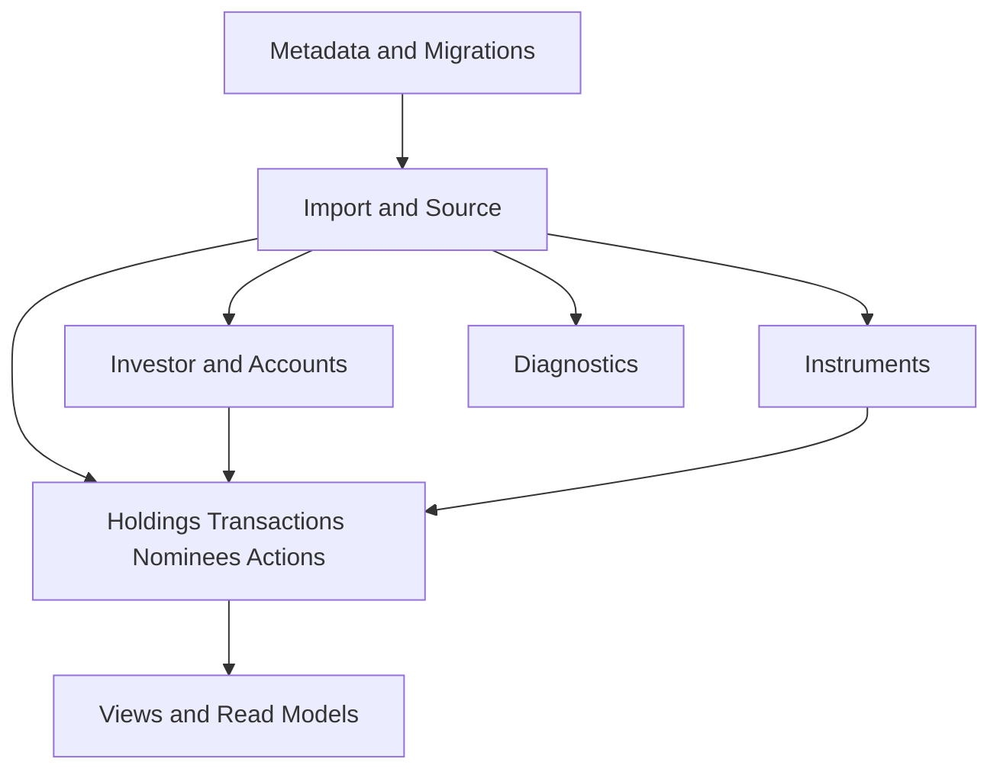
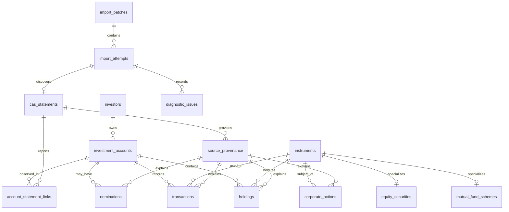

# CAS Analyzer Physical Schema

**Document Version:** 0.1

**Status:** Draft

**Last Updated:** 2026-07-05

## 1. Purpose

This document defines the draft physical SQLite schema for CAS Analyzer Version 1. It translates the conceptual data model into table groups, column responsibilities, relationships, constraints, indexes, and view/read-model expectations.

This document is a schema blueprint, not executable migration SQL. Final `CREATE TABLE` statements belong with implementation migrations and must be kept aligned with this document.

## 2. Scope

This schema covers:

- Database metadata and migrations.
- Import batches, import attempts, CAS Statements, provenance, and diagnostics.
- Investors, investment accounts, instruments, holdings, transactions, nominees, and corporate actions.
- Read support for dashboard, holdings, transactions, analytics, recommendations, and reports.
- Optional backup/restore metadata shape if FT-045 is implemented.

This schema does not finalize:

- Import identity and duplicate rules.
- Overlap/re-import reconciliation behavior.
- Partial import acceptance.
- Exact decimal scale and rounding.
- Current value and valuation source rules.
- Backup archive format or encryption.

Where those choices affect columns or uniqueness rules, this document marks them as pending ADR/design approval.

## 3. Schema Principles

1. Prefer normalized durable records over convenience caches.
2. Use foreign keys to protect required relationships.
3. Use indexes for duplicate checks, search, filtering, and common summaries.
4. Store financial decimals exactly; never use floating point for money, units, NAV, prices, or percentages.
5. Keep source-reported and derived values distinguishable.
6. Preserve approved provenance for accepted financial records.
7. Avoid raw PDF bytes, extracted text, passwords, and raw source snippets.
8. Keep SQLite implementation details inside repositories and data sources.

## 4. Naming Conventions

| Item | Convention | Example |
| --- | --- | --- |
| Tables | plural `snake_case` nouns | `import_attempts` |
| Primary keys | `id` local stable identifier | `id TEXT PRIMARY KEY` |
| Foreign keys | singular referenced concept plus `_id` | `import_attempt_id` |
| Timestamps | UTC ISO-8601 text unless implementation ADR changes this | `created_at TEXT NOT NULL` |
| Dates | ISO-8601 calendar date text | `statement_date TEXT` |
| Booleans | integer 0/1 with check constraint | `is_deleted INTEGER NOT NULL DEFAULT 0` |
| Enums | lowercase text with check constraint or lookup table | `status TEXT NOT NULL` |
| Exact decimals | text or scaled integer after precision ADR | `quantity_value TEXT` |
| Soft lifecycle fields | explicit status fields, not silent deletion | `status`, `deleted_at` |

All schema names must remain implementation-friendly for Dart data mappers and SQLite migrations.

## 5. Standard Columns

Most durable tables should include:

| Column | Purpose |
| --- | --- |
| `id` | Stable local identifier generated by the application. |
| `created_at` | UTC creation timestamp. |
| `updated_at` | UTC update timestamp where updates are expected. |
| `source_provenance_id` | Link to source context for accepted financial records. |

Not every table needs every standard column. Join tables, lookup tables, and migration metadata may use a smaller shape.

## 6. Type Policy

| Logical Type | Draft SQLite Representation | Notes |
| --- | --- | --- |
| Local ID | `TEXT` | UUID/ULID choice remains implementation detail unless an ADR is needed. |
| Timestamp | `TEXT` | UTC ISO-8601 string. |
| Date | `TEXT` | ISO-8601 calendar date. |
| Enum/code | `TEXT` | Use check constraints for stable finite sets where practical. |
| Boolean | `INTEGER` | Use `CHECK(value IN (0, 1))`. |
| Count | `INTEGER` | Non-negative where applicable. |
| Exact decimal | Pending ADR: `TEXT` decimal string or scaled `INTEGER` | Must not be `REAL`. |
| Sensitive text | `TEXT` | Store only when required; never log. |
| JSON metadata | `TEXT` only for bounded safe metadata | Avoid hiding core query fields in JSON. |

The precision ADR must decide exact decimal representation before financial columns are implemented.

## 7. Table Groups

## 8. Metadata Tables

### 8.1 `schema_migrations`

Tracks applied migration versions.

| Column | Required | Notes |
| --- | --- | --- |
| `version` | Yes | Integer schema version. |
| `name` | Yes | Migration name. |
| `applied_at` | Yes | UTC timestamp. |
| `checksum` | Optional | Migration checksum if tooling supports it. |

Constraints:

- Primary key: `version`.
- `version` must be positive.

### 8.2 `database_metadata`

Stores singleton database-level metadata.

| Column | Required | Notes |
| --- | --- | --- |
| `key` | Yes | Metadata key. |
| `value` | Yes | Metadata value as text. |
| `updated_at` | Yes | UTC timestamp. |

Constraints:

- Primary key: `key`.
- Values must contain no sensitive portfolio content.

## 9. Import and Source Tables

### 9.1 `import_batches`

Represents one user-initiated import operation.

| Column | Required | Notes |
| --- | --- | --- |
| `id` | Yes | Local batch ID. |
| `status` | Yes | `running`, `completed`, `completed_with_warnings`, `cancelled`, `failed`. |
| `selected_file_count` | Yes | Safe aggregate count. |
| `started_at` | Yes | UTC timestamp. |
| `completed_at` | Optional | UTC timestamp. |
| `created_at` | Yes | UTC timestamp. |

Indexes:

- `idx_import_batches_started_at` on `started_at`.
- `idx_import_batches_status` on `status`.

### 9.2 `import_attempts`

Represents processing for one selected file or logical statement input.

| Column | Required | Notes |
| --- | --- | --- |
| `id` | Yes | Local attempt ID. |
| `import_batch_id` | Yes | Parent batch. |
| `status` | Yes | `pending`, `validating`, `extracting`, `parsing`, `reconciling`, `persisting`, `completed`, `duplicate`, `rejected`, `cancelled`, `failed`. |
| `issuer_type` | Optional | `nsdl`, `cdsl`, `unknown`. |
| `file_fingerprint` | Pending | Safe file/content fingerprint if approved. |
| `content_fingerprint` | Pending | Safe logical fingerprint if approved. |
| `parser_version` | Optional | Parser version used if detection succeeded. |
| `detector_version` | Optional | Detector version used if detection succeeded. |
| `failure_code` | Optional | Safe error code. |
| `started_at` | Yes | UTC timestamp. |
| `completed_at` | Optional | UTC timestamp. |
| `created_at` | Yes | UTC timestamp. |

Relationships:

- Many attempts belong to one import batch.
- Zero or one successful CAS Statement may be linked initially.

Indexes:

- `idx_import_attempts_batch_id` on `import_batch_id`.
- `idx_import_attempts_status` on `status`.
- Pending unique index on approved fingerprint/identity fields.

Privacy:

- Do not store raw file path, raw file name, password, or extracted text by default.

### 9.3 `cas_statements`

Represents a recognized supported CAS Statement.

| Column | Required | Notes |
| --- | --- | --- |
| `id` | Yes | Local statement ID. |
| `import_attempt_id` | Yes | Source attempt. |
| `issuer_type` | Yes | `nsdl` or `cdsl`. |
| `statement_period_start` | Optional | Date if available. |
| `statement_period_end` | Optional | Date if available. |
| `statement_date` | Optional | Date if available. |
| `source_identity` | Pending | Approved logical statement identity. |
| `created_at` | Yes | UTC timestamp. |

Constraints:

- Foreign key to `import_attempts`.
- Pending unique constraint on approved statement identity.

Indexes:

- `idx_cas_statements_attempt_id` on `import_attempt_id`.
- `idx_cas_statements_issuer_date` on `issuer_type`, `statement_date`.

### 9.4 `source_provenance`

Links accepted records to safe source context.

| Column | Required | Notes |
| --- | --- | --- |
| `id` | Yes | Local provenance ID. |
| `cas_statement_id` | Yes | Source statement. |
| `import_attempt_id` | Yes | Source attempt. |
| `parser_version` | Yes | Parser/rule version context. |
| `validation_version` | Optional | Validation version if tracked separately. |
| `reconciliation_version` | Optional | Reconciliation version if tracked separately. |
| `source_record_type` | Yes | `holding`, `transaction`, `nomination`, `corporate_action`, `account`, `instrument`. |
| `source_record_key` | Pending | Safe source-local key if approved. |
| `is_source_reported` | Yes | 1 for source-reported, 0 for derived. |
| `created_at` | Yes | UTC timestamp. |

Indexes:

- `idx_source_provenance_statement_id` on `cas_statement_id`.
- `idx_source_provenance_attempt_id` on `import_attempt_id`.
- Pending index on approved `source_record_key`.

Privacy:

- Do not store raw source snippets by default.

## 10. Party and Account Tables

### 10.1 `investors`

Represents an investor/holder context reported by CAS data.

| Column | Required | Notes |
| --- | --- | --- |
| `id` | Yes | Local investor ID. |
| `display_name` | Optional | Sensitive; store only if required for user value. |
| `normalized_name_key` | Pending | Matching key if approved. |
| `source_provenance_id` | Optional | Source for investor details. |
| `created_at` | Yes | UTC timestamp. |
| `updated_at` | Yes | UTC timestamp. |

Indexes:

- Pending index on approved investor matching key.

Privacy:

- Investor names must never appear in logs or diagnostics.

### 10.2 `investment_accounts`

Represents a demat account, mutual fund folio, or other supported statement account grouping.

| Column | Required | Notes |
| --- | --- | --- |
| `id` | Yes | Local account ID. |
| `investor_id` | Yes | Owning investor. |
| `account_type` | Yes | `demat`, `mutual_fund_folio`, `other`. |
| `display_label` | Optional | User-safe label; may still be sensitive. |
| `masked_identifier` | Optional | Masked source identifier if useful. |
| `identity_key` | Pending | Approved account identity key. |
| `source_provenance_id` | Optional | Source for account details. |
| `created_at` | Yes | UTC timestamp. |
| `updated_at` | Yes | UTC timestamp. |

Indexes:

- `idx_investment_accounts_investor_id` on `investor_id`.
- `idx_investment_accounts_type` on `account_type`.
- Pending unique/index on approved account identity.

### 10.3 `account_statement_links`

Links accounts to the CAS Statements where they were observed.

| Column | Required | Notes |
| --- | --- | --- |
| `investment_account_id` | Yes | Account observed. |
| `cas_statement_id` | Yes | Statement that reported it. |
| `source_provenance_id` | Optional | Source context. |
| `created_at` | Yes | UTC timestamp. |

Constraints:

- Composite primary key: `investment_account_id`, `cas_statement_id`.

## 11. Instrument Tables

### 11.1 `instruments`

Represents a financial instrument.

| Column | Required | Notes |
| --- | --- | --- |
| `id` | Yes | Local instrument ID. |
| `instrument_type` | Yes | `mutual_fund_scheme`, `equity`, `other_security`. |
| `name` | Yes | Sensitive financial data; do not log. |
| `normalized_name` | Optional | Search/matching support. |
| `isin` | Optional | Sensitive financial identifier; useful for matching/search. |
| `asset_class` | Optional | `mutual_fund`, `equity`, `debt`, `other`, pending taxonomy. |
| `category` | Optional | Category/sector if source or approved reference provides it. |
| `source_provenance_id` | Optional | Source for first accepted instrument details. |
| `created_at` | Yes | UTC timestamp. |
| `updated_at` | Yes | UTC timestamp. |

Indexes:

- `idx_instruments_type` on `instrument_type`.
- `idx_instruments_isin` on `isin`.
- `idx_instruments_normalized_name` on `normalized_name`.

Constraints:

- Exact uniqueness depends on instrument identity policy.

### 11.2 `mutual_fund_schemes`

Stores mutual-fund-specific details for instruments.

| Column | Required | Notes |
| --- | --- | --- |
| `instrument_id` | Yes | Also primary key and FK to `instruments`. |
| `amc_name` | Optional | If available. |
| `scheme_code` | Optional | If available/approved. |
| `scheme_plan` | Optional | If available. |
| `scheme_option` | Optional | If available. |

Indexes:

- `idx_mutual_fund_schemes_amc_name` on `amc_name`.

### 11.3 `equity_securities`

Stores equity-specific details for instruments.

| Column | Required | Notes |
| --- | --- | --- |
| `instrument_id` | Yes | Also primary key and FK to `instruments`. |
| `company_name` | Optional | If distinct from instrument name. |
| `ticker_symbol` | Optional | Not expected from all CAS Statements. |
| `exchange_code` | Optional | If available. |

## 12. Financial Record Tables

### 12.1 `holdings`

Represents an accepted holding/position record.

| Column | Required | Notes |
| --- | --- | --- |
| `id` | Yes | Local holding ID. |
| `investment_account_id` | Yes | Account containing the holding. |
| `instrument_id` | Yes | Held instrument. |
| `source_provenance_id` | Yes | Source context. |
| `statement_date` | Optional | Date the holding was reported. |
| `quantity_value` | Pending | Exact decimal; must not be REAL. |
| `quantity_scale` | Pending | If scaled-integer representation is approved. |
| `market_value` | Pending | Source-reported value only; not invented. |
| `market_value_currency` | Optional | Likely INR for V1, but policy must confirm. |
| `valuation_date` | Optional | Required if value is present and available. |
| `holding_status` | Yes | `active`, `closed`, `reported`, pending policy. |
| `created_at` | Yes | UTC timestamp. |
| `updated_at` | Yes | UTC timestamp. |

Indexes:

- `idx_holdings_account_id` on `investment_account_id`.
- `idx_holdings_instrument_id` on `instrument_id`.
- `idx_holdings_statement_date` on `statement_date`.
- `idx_holdings_account_instrument` on `investment_account_id`, `instrument_id`.
- Pending unique index based on reconciliation policy.

### 12.2 `transactions`

Represents an accepted historical transaction.

| Column | Required | Notes |
| --- | --- | --- |
| `id` | Yes | Local transaction ID. |
| `investment_account_id` | Yes | Account where transaction occurred. |
| `instrument_id` | Optional | Required when identifiable; nullable only for explicitly unsupported cases. |
| `source_provenance_id` | Yes | Source context. |
| `transaction_date` | Yes | Source-reported transaction date. |
| `transaction_type` | Yes | Normalized type. |
| `source_transaction_type` | Optional | Original type text only if safe and required; avoid raw snippets. |
| `quantity_value` | Pending | Exact decimal. |
| `amount_value` | Pending | Exact decimal. |
| `amount_currency` | Optional | Likely INR for V1, but policy must confirm. |
| `price_or_nav_value` | Pending | Exact decimal if available. |
| `transaction_status` | Yes | `accepted`, `reconciled`, `superseded`, pending policy. |
| `created_at` | Yes | UTC timestamp. |
| `updated_at` | Yes | UTC timestamp. |

Indexes:

- `idx_transactions_account_date` on `investment_account_id`, `transaction_date`.
- `idx_transactions_instrument_date` on `instrument_id`, `transaction_date`.
- `idx_transactions_type` on `transaction_type`.
- Pending unique index based on transaction identity policy.

### 12.3 `nominations`

Represents nominee details or nomination status.

| Column | Required | Notes |
| --- | --- | --- |
| `id` | Yes | Local nomination ID. |
| `investment_account_id` | Yes | Account/folio context. |
| `source_provenance_id` | Yes | Source context. |
| `nomination_status` | Yes | `registered`, `not_registered`, `not_available`, `unknown`. |
| `nominee_name` | Optional | Sensitive; store only when required. |
| `nominee_relationship` | Optional | Sensitive. |
| `allocation_percent_value` | Pending | Exact decimal if available. |
| `created_at` | Yes | UTC timestamp. |
| `updated_at` | Yes | UTC timestamp. |

Indexes:

- `idx_nominations_account_id` on `investment_account_id`.
- `idx_nominations_status` on `nomination_status`.

Privacy:

- Nominee details must never appear in logs, diagnostics, or snapshots.

### 12.4 `corporate_actions`

Represents available source-reported corporate actions.

| Column | Required | Notes |
| --- | --- | --- |
| `id` | Yes | Local corporate action ID. |
| `investment_account_id` | Optional | Present when account context is known. |
| `instrument_id` | Yes | Subject instrument. |
| `source_provenance_id` | Yes | Source context. |
| `action_type` | Yes | `bonus`, `split`, `dividend`, `merger`, `other`. |
| `action_date` | Optional | If available. |
| `quantity_value` | Pending | Exact decimal if applicable. |
| `amount_value` | Pending | Exact decimal if applicable. |
| `amount_currency` | Optional | If amount is present. |
| `created_at` | Yes | UTC timestamp. |

Indexes:

- `idx_corporate_actions_instrument_date` on `instrument_id`, `action_date`.
- `idx_corporate_actions_account_id` on `investment_account_id`.

## 13. Diagnostic Tables

### 13.1 `diagnostic_issues`

Stores safe bounded issues from import, parsing, validation, reconciliation, persistence, migration, backup, or restore.

| Column | Required | Notes |
| --- | --- | --- |
| `id` | Yes | Local issue ID. |
| `import_attempt_id` | Optional | Attempt context when applicable. |
| `cas_statement_id` | Optional | Statement context when applicable. |
| `stage` | Yes | Import/database stage. |
| `code` | Yes | Stable safe issue/error code. |
| `severity` | Yes | `info`, `warning`, `blocking`, `critical`. |
| `safe_message_key` | Optional | UI localization/message key. |
| `safe_context_json` | Optional | Bounded, non-sensitive context. |
| `created_at` | Yes | UTC timestamp. |

Indexes:

- `idx_diagnostic_issues_attempt_id` on `import_attempt_id`.
- `idx_diagnostic_issues_code` on `code`.
- `idx_diagnostic_issues_severity` on `severity`.

Privacy:

- `safe_context_json` must not include raw source content, investor identity, account identifiers, holdings, quantities, values, transaction details, nominee details, SQL, or parameters.

## 14. Optional Maintenance Tables

### 14.1 `backup_restore_events`

Use only if FT-045 is implemented.

| Column | Required | Notes |
| --- | --- | --- |
| `id` | Yes | Local event ID. |
| `event_type` | Yes | `backup` or `restore`. |
| `status` | Yes | `started`, `completed`, `failed`, `cancelled`. |
| `format_version` | Optional | Backup format version. |
| `safe_destination_label` | Optional | Avoid full paths if sensitive. |
| `failure_code` | Optional | Safe error code. |
| `started_at` | Yes | UTC timestamp. |
| `completed_at` | Optional | UTC timestamp. |

Privacy:

- Do not store backup contents in this table.
- Do not store sensitive destination paths by default.

## 15. Relationship Summary

## 16. Constraint Strategy

Required constraints:

- Enable SQLite foreign-key enforcement.
- Foreign keys from financial records to accounts, instruments, and provenance.
- Check constraints for known statuses and booleans.
- Non-negative count checks.
- Not-null constraints for required relationships and statuses.
- Composite primary key for `account_statement_links`.

Pending constraints:

- Unique import identity.
- Unique statement identity.
- Unique account identity.
- Unique instrument identity.
- Unique holding identity.
- Unique transaction identity.

These are pending because they depend on approved identity and reconciliation rules.

## 17. Index Strategy

Initial indexes should support:

- Import history by start/completion time and status.
- Duplicate checks by approved identity/fingerprint fields.
- Statement lookup by issuer and date.
- Account lookup by investor and type.
- Instrument search by ISIN and normalized name.
- Holdings by account, instrument, and statement date.
- Transactions by account/date, instrument/date, and type.
- Nominee checks by account and nomination status.
- Diagnostics by attempt, code, and severity.

Do not create broad speculative indexes. Add performance indexes based on documented query paths and profiling.

## 18. View and Read-Model Strategy

Version 1 should begin with repository queries over normalized tables.

Approved read views may include:

| View/Read Model | Purpose | Notes |
| --- | --- | --- |
| `vw_latest_holdings` | Current holding browse/dashboard input | Requires approved current/reconciliation policy. |
| `vw_transaction_history` | Transaction list/report input | Can simplify joins across accounts and instruments. |
| `vw_import_history` | Recent imports screen | Safe import metadata and diagnostics summary only. |
| `vw_nominee_status` | Missing nominee detection | Must avoid leaking nominee details unnecessarily. |

Durable materialized read models require explicit invalidation rules and tests. SQLite views are preferred over denormalized tables unless profiling proves otherwise.

## 19. Import Commit Order

An accepted import transaction should write in deterministic order:

1. Import batch/attempt terminal state preparation.
2. CAS Statement.
3. Source provenance.
4. Investors.
5. Investment accounts and account-statement links.
6. Instruments and instrument subtype details.
7. Holdings.
8. Transactions.
9. Nominations.
10. Corporate actions.
11. Diagnostic issues approved for retention.
12. Import attempt final success state.
13. Any approved view/read-model refresh metadata.

The final success state must not be visible before all accepted records commit.

## 20. Deletion and Cleanup

Deletion behavior must be explicit and transactional.

Draft rules:

- Deleting failed/cancelled attempts may delete only safe import metadata and diagnostics according to retention policy.
- Deleting an accepted import requires reconciliation/deletion design before implementation.
- Cleanup must not orphan holdings, transactions, nominees, corporate actions, or provenance records.
- Physical cascading deletes must be used carefully; application-level delete use cases must remain explicit.
- Soft delete may be required for accepted records if audit/reconciliation needs demand it.

No destructive cleanup should be implemented until import deletion and re-import behavior are approved.

## 21. Migration Notes

Initial schema version should include all core tables needed for import, portfolio reads, and migration metadata.

Migration requirements:

- Every schema change must have an ordered migration.
- Migrations must preserve user data.
- Migration tests must cover empty DB, populated DB, and failed migration behavior.
- Unsupported future schema versions must stop safely.
- Destructive migration requires explicit ADR approval.

Detailed migration process belongs in `docs/02_Database/03_MigrationStrategy.md`.

## 22. Security and Privacy Notes

The schema contains sensitive personal and financial data.

Rules:

- Do not store raw CAS PDF bytes.
- Do not store full extracted text.
- Do not store PDF passwords.
- Do not store raw source snippets by default.
- Do not log SQL statements with parameters.
- Do not expose database rows directly in diagnostics or test failures.
- Keep exported reports and backups outside these tables unless explicitly represented by safe metadata.

Database encryption is deferred from Version 1, so minimization matters.

## 23. Physical Schema Invariants

| ID | Invariant |
| --- | --- |
| PHSI-01 | Every accepted holding references an account, instrument, and provenance row. |
| PHSI-02 | Every accepted transaction references provenance and an account; it references an instrument when identifiable. |
| PHSI-03 | No accepted financial record exists without a successful import path. |
| PHSI-04 | Import attempt success is committed atomically with accepted records. |
| PHSI-05 | Financial decimals are not stored as SQLite `REAL`. |
| PHSI-06 | Raw source content and passwords are not part of the default schema. |
| PHSI-07 | Diagnostic context is bounded and non-sensitive. |
| PHSI-08 | All required foreign keys are enforced by SQLite. |
| PHSI-09 | Unique constraints for duplicate prevention are added only after identity policy approval. |
| PHSI-10 | Read models do not become a second source of truth. |
| PHSI-11 | Schema changes are introduced only through ordered migrations. |
| PHSI-12 | Backup, restore, delete, and cleanup metadata never stores exported file contents. |

## 24. Open Decisions and ADR Queue

| Priority | Decision | Schema Impact |
| --- | --- | --- |
| Critical | Decimal representation and scale | Financial columns on holdings, transactions, nominations, corporate actions. |
| Critical | Canonical import identity | Fingerprint columns and unique indexes on import attempts/statements. |
| Critical | Record identity and overlap reconciliation | Unique indexes, supersession fields, delete/re-import behavior. |
| Critical | Partial import policy | Import statuses, diagnostic retention, accepted/rejected record boundaries. |
| High | Current value definition | Holding value fields, valuation source/date, dashboard views. |
| High | Database package and migration tool | Generated schema shape, migration metadata, test harness. |
| High | Sensitive data minimization for investor/nominee names | Nullable fields, masking, export/report behavior. |
| Medium | Sector/category reference data | Instrument category fields and reference tables. |
| Medium | Backup/restore support | Optional maintenance tables and compatibility metadata. |

## 25. Traceability

This schema supports:

- FT-003: Import History.
- FT-004: Duplicate Import Detection.
- FT-014: SQLite Storage.
- FT-015: Database Migration.
- FT-016: Data Validation.
- FT-017: Data Cleanup.
- FT-018 through FT-042 for portfolio reads, analytics, recommendations, and reports.
- FT-045 if local backup and restoration is implemented.
- DBAI-01 through DBAI-14.
- CDMI-01 through CDMI-12.
- PHSI-01 through PHSI-12.

## 26. Cross References

- `docs/project_context.md`
- `docs/02_Database/00_DatabaseArchitecture.md`
- `docs/02_Database/01_ConceptualDataModel.md`
- `docs/02_Database/03_MigrationStrategy.md`
- `docs/02_Database/04_RepositoryDesign.md`
- `docs/01_Architecture/00_SolutionArchitecture.md`
- `docs/01_Architecture/03_DataFlowArchitecture.md`
- `docs/01_Architecture/04_ImportPipelineArchitecture.md`
- `docs/01_Architecture/05_ErrorHandlingArchitecture.md`
- `docs/01_Architecture/06_SecurityArchitecture.md`
- `docs/00_Project/03_FeatureCatalog.md`
- `docs/ADR/`

## 27. AI Development Notes

When generating implementation from this document:

- Treat this file as the draft schema contract, not final migration SQL.
- Do not create financial `REAL` columns.
- Do not finalize unique identity indexes until the identity/reconciliation ADRs are approved.
- Keep raw PDF bytes, extracted text, source snippets, and passwords out of the schema.
- Ensure foreign keys are enabled in SQLite tests and runtime.
- Add migration and repository tests for every table that reaches implementation.
- Update this document whenever a table, column, index, view, or migration rule changes.

## 28. Revision History

| Version | Date | Author | Description |
| --- | --- | --- | --- |
| 0.1 | 2026-07-05 | Project Team | Initial draft of the physical schema blueprint. |
