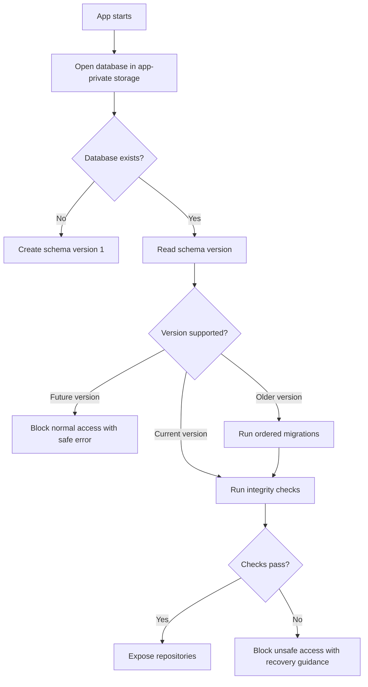

# CAS Analyzer Migration Strategy

**Document Version:** 0.1

**Status:** Draft

**Last Updated:** 2026-07-05

## 1. Purpose

This document defines how CAS Analyzer evolves its local SQLite database safely over time. It describes schema versioning, migration execution, validation, rollback expectations, tests, and operational rules for protecting sensitive financial data during database changes.

Migrations are part of the product architecture, not a maintenance afterthought. A broken migration can make the offline app unusable or corrupt a user's portfolio history, so migration behavior must be explicit and tested.

## 2. Scope

This document covers:

- SQLite schema versioning.
- Initial database creation.
- Ordered migration execution.
- Migration transaction boundaries.
- Pre-migration and post-migration validation.
- Failure handling and recovery behavior.
- Migration testing requirements.
- Privacy and logging constraints during migration.
- Backup/restore and future compatibility considerations.

This document does not define:

- Final executable migration SQL.
- Final database package or migration framework.
- Backup archive format.
- Encrypted database migration behavior.
- Cloud sync or multi-device migration behavior.

## 3. Migration Goals

The migration strategy must:

1. Preserve user data by default.
2. Keep schema changes deterministic and ordered.
3. Prevent partial schema upgrades.
4. Detect unsupported database versions safely.
5. Preserve import history, provenance, holdings, transactions, nominees, and diagnostics.
6. Keep sensitive values out of logs, diagnostics, and test output.
7. Make every schema change testable from previous supported versions.
8. Avoid destructive migrations unless explicitly approved by ADR.

## 4. Versioning Model

CAS Analyzer uses an integer schema version.

Rules:

- Version numbers increase by one for every persisted schema change.
- Every version transition has exactly one migration path from `N` to `N + 1`.
- The app opens only databases with versions less than or equal to the app-supported latest version.
- A database with a future version must not be opened for normal writes.
- Schema version metadata must agree with migration history metadata.

The initial production schema is version `1`.

## 5. Migration Metadata

The physical schema defines:

- `schema_migrations`
- `database_metadata`

Migration metadata should record:

| Field | Purpose |
| --- | --- |
| Version | Applied schema version. |
| Name | Human-readable migration name. |
| Applied timestamp | Safe operational timestamp. |
| Checksum | Optional integrity check for migration definition. |

Migration metadata must not include row contents, SQL parameters, investor data, holdings, transactions, nominee details, or raw CAS content.

## 6. Startup Database Flow

Repositories must not be exposed before required migrations and integrity checks complete.

## 7. Initial Database Creation

Initial creation is not a migration from user data, but it still follows migration discipline.

Initial creation must:

- Create all version 1 tables, indexes, constraints, and views.
- Enable required SQLite settings such as foreign-key enforcement.
- Insert schema metadata.
- Run basic integrity validation.
- Fail safely if any step fails.

The implementation should avoid building version 1 by replaying many development-only migration drafts. Development migration churn should be squashed before the first production release.

## 8. Migration Execution Rules

Each migration must:

- Have a stable version number and name.
- Run only from the expected previous version.
- Be deterministic.
- Be idempotency-aware at the orchestration level, even if individual SQL statements are not repeated.
- Run inside a transaction whenever SQLite supports the operations transactionally.
- Update migration metadata only after successful completion.
- Run post-migration validation before the database is released for normal use.

Migration code must not:

- Depend on network access.
- Parse CAS PDFs.
- Recalculate complex business outputs unless explicitly required and tested.
- Log sensitive values.
- Silently drop tables or columns containing user data.
- Continue after a failed step as though the database were healthy.

## 9. Transaction and Rollback Strategy

Preferred behavior:

- A migration either fully applies and advances the schema version, or it rolls back and leaves the previous version usable.

When SQLite cannot fully roll back a specific operation, the migration design must provide an equivalent safe strategy, such as:

- Create a new table.
- Copy and validate transformed data.
- Create indexes/constraints.
- Swap names only after validation.
- Preserve the old table until the new table is proven usable.

Any migration that cannot provide safe rollback requires explicit review and may require an ADR.

## 10. Migration Types

| Type | Examples | Default Policy |
| --- | --- | --- |
| Additive | Add nullable column, table, index, view | Allowed with tests. |
| Constraint strengthening | Add not-null, unique, foreign key, check | Requires data backfill/validation tests. |
| Data transformation | Normalize values, split table, change representation | Requires before/after fixture tests. |
| Backfill | Populate new column/table from existing data | Requires deterministic rules and counts. |
| Destructive | Drop table, drop column, delete rows | Not allowed without ADR. |
| Sensitive-data reduction | Remove raw/sensitive data previously stored | Allowed with explicit privacy and validation tests. |
| Precision change | Change money/unit/date representation | Requires ADR and focused financial correctness tests. |

## 11. Pre-Migration Checks

Before running migrations, the app should verify:

- Database file can be opened.
- Current schema version is known.
- Current version is not newer than the app supports.
- Required SQLite settings can be enabled.
- Basic metadata tables are readable, when present.
- There is enough safe context to report a migration failure without exposing data.

Optional checks after implementation maturity:

- Available storage threshold.
- Database integrity check.
- Backup availability before high-risk migration, if backup support exists.

## 12. Post-Migration Checks

After each migration or migration batch:

- Schema version matches expected target.
- Migration metadata row exists for the applied version.
- Required tables and indexes exist.
- Foreign-key validation passes.
- Basic repository smoke queries pass.
- Critical counts are preserved where expected.
- No orphan holdings, transactions, nominees, corporate actions, or provenance rows exist.
- Sensitive data minimization rules remain satisfied.

Post-migration checks must use safe aggregate counts and issue codes only.

## 13. Data Preservation Rules

Migrations must preserve:

- Import history needed by the app.
- Source provenance for accepted financial records.
- Investors and accounts.
- Instruments.
- Holdings.
- Transactions.
- Nominee information.
- Corporate actions.
- Safe diagnostics that are within retention policy.
- User settings when they are part of the migration scope.

Any migration that intentionally removes user data requires:

- A documented reason.
- User-impact analysis.
- ADR approval if data is financial, personal, or needed for audit/provenance.
- Tests proving only intended data is removed.

## 14. Handling Failed Migrations

Migration failure is a blocking database error.

Expected behavior:

- Stop normal repository access.
- Surface a user-friendly, non-sensitive error.
- Preserve the previous database state when possible.
- Record only safe failure code, migration version, and stage.
- Do not retry indefinitely on every app launch without control.
- Provide a safe recovery path once product UX is designed.

The app must not silently create a fresh empty database over an existing failed user database.

## 15. Unsupported Future Versions

If a user opens a database created by a newer app version:

- The app must not run old migrations against it.
- The app must not write to it.
- The app should show a safe "database version not supported" outcome.
- The app should avoid destructive recovery options unless explicitly confirmed by the user and designed.

This protects users who downgrade the app or restore a database from a newer release.

## 16. Downgrade Policy

Automatic database downgrade is not supported in Version 1.

If downgrade support is ever required, it must be designed separately because it may require:

- Reversible migrations.
- Compatibility views.
- Data-loss disclosures.
- Export/backup safeguards.

## 17. Backup and Restore Interaction

Backup and restore are optional for Version 1. If implemented:

- Backup format version must record database schema version.
- Restore must treat incoming files as untrusted input.
- Restore must validate schema version compatibility before replacing or merging data.
- Restore may require migrations before the restored database becomes active.
- A failed restore must leave the previous usable database intact.
- Backup/restore metadata must not store exported file contents or sensitive paths.

Backup before high-risk migrations is desirable, but its exact UX and storage model require a backup/restore design.

## 18. Privacy and Logging During Migration

Migration diagnostics may include:

- Migration version.
- Migration name.
- Stage.
- Safe issue/error code.
- Safe aggregate counts.
- Duration.

Migration diagnostics must not include:

- Investor names.
- Account identifiers.
- Nominee details.
- Instrument names or ISINs.
- Holdings, quantities, values, or transactions.
- Raw CAS content.
- SQL statements with parameters.
- Full database path if it may reveal sensitive information.

## 19. Testing Strategy

Migration implementation requires real SQLite tests.

Required tests:

- Create latest schema from empty database.
- Migrate from every supported prior version to latest.
- Verify schema version and migration metadata.
- Verify foreign keys are enforced after migration.
- Verify required indexes/views exist.
- Verify representative imported portfolio data survives migration.
- Verify provenance links survive migration.
- Verify failed migration rolls back or blocks safely.
- Verify unsupported future version is rejected safely.
- Verify seeded sensitive values do not appear in logs or diagnostics.

For each migration from `N` to `N + 1`, include fixtures for:

- Empty database at version `N`.
- Minimal valid portfolio database at version `N`.
- Representative populated database at version `N`.
- Edge-case database relevant to the migration.

## 20. Test Fixture Policy

Migration fixtures must be synthetic.

Rules:

- Do not use real personal CAS data.
- Use fake investor names and account identifiers.
- Keep fixture values realistic enough to catch financial and relationship errors.
- Include nominee, transaction, holding, provenance, and diagnostic examples where relevant.
- Keep expected outputs deterministic.
- Avoid snapshots that expose sensitive-like full rows unless they are intentionally synthetic and reviewed.

## 21. Performance Considerations

Migrations should be fast enough for local mobile use, but correctness comes first.

Migration design should:

- Avoid loading all rows into memory.
- Use set-based SQL where safe.
- Batch large transformations.
- Create indexes after bulk copy where appropriate.
- Report progress only if migrations can be long-running and UX is designed.
- Avoid blocking app startup longer than necessary once representative baselines exist.

Performance thresholds should be added after real schema and fixture baselines exist.

## 22. Release Process for Schema Changes

Every schema change should follow this checklist:

1. Update database design docs.
2. Add or update ADR if the change affects identity, precision, reconciliation, security, or destructive behavior.
3. Create migration from current version to next version.
4. Update latest schema creation path.
5. Add migration tests and repository regression tests.
6. Run privacy/logging checks.
7. Update `docs/project_context.md` if the change affects project-level context.

Do not merge schema changes that lack migration tests.

## 23. Migration Review Checklist

Reviewers should verify:

- [ ] Version number advances exactly once.
- [ ] Migration runs only from expected previous version.
- [ ] User data is preserved or removal is approved.
- [ ] Financial decimal behavior is not changed without ADR.
- [ ] Identity/reconciliation behavior is not changed silently.
- [ ] Foreign keys and constraints remain valid.
- [ ] Failure leaves database safe.
- [ ] Logs and diagnostics are privacy-safe.
- [ ] Tests cover empty, minimal, representative, and edge-case databases.
- [ ] Documentation and revision histories are updated.

## 24. Migration Strategy Invariants

| ID | Invariant |
| --- | --- |
| MIGI-01 | Every persisted schema change has an ordered version transition. |
| MIGI-02 | Normal repositories are not exposed until required migrations finish successfully. |
| MIGI-03 | A failed migration must not silently replace the user's database with an empty one. |
| MIGI-04 | Destructive migration requires explicit ADR approval. |
| MIGI-05 | Migration metadata is written only after successful migration completion. |
| MIGI-06 | Financial precision changes require ADR and focused tests. |
| MIGI-07 | Import history and provenance are preserved unless explicit approved retention rules say otherwise. |
| MIGI-08 | Migration logs and diagnostics contain no sensitive personal or financial values. |
| MIGI-09 | Future database versions are rejected safely and are not downgraded automatically. |
| MIGI-10 | Migration tests run against real SQLite, not only mocks. |
| MIGI-11 | Post-migration integrity checks verify foreign keys and critical relationships. |
| MIGI-12 | Backup/restore migrations treat restored files as untrusted input. |

## 25. Open Decisions and ADR Queue

| Priority | Decision | Migration Impact |
| --- | --- | --- |
| High | Database package and migration tooling | Determines exact implementation mechanism and generated code strategy. |
| High | Decimal representation and scale | Required before financial column migrations. |
| High | Backup/restore format and protection | Determines migration behavior for restored databases. |
| High | Local data protection while encryption is deferred | Affects database path, backup, and future encryption migration. |
| Medium | Diagnostic retention policy | Affects cleanup migrations and safe metadata retention. |
| Medium | Destructive cleanup/delete policy | Affects accepted import deletion and orphan cleanup migrations. |

## 26. Traceability

This strategy supports:

- FT-014: SQLite Storage.
- FT-015: Database Migration.
- FT-016: Data Validation.
- FT-017: Data Cleanup.
- FT-045 if local backup and restoration is implemented.
- DBAI-10: Schema changes use ordered, tested migrations.
- PHSI-11: Schema changes are introduced only through ordered migrations.
- MIGI-01 through MIGI-12.

## 27. Cross References

- `docs/project_context.md`
- `docs/02_Database/00_DatabaseArchitecture.md`
- `docs/02_Database/01_ConceptualDataModel.md`
- `docs/02_Database/02_PhysicalSchema.md`
- `docs/02_Database/04_RepositoryDesign.md`
- `docs/01_Architecture/03_DataFlowArchitecture.md`
- `docs/01_Architecture/05_ErrorHandlingArchitecture.md`
- `docs/01_Architecture/06_SecurityArchitecture.md`
- `docs/00_Project/03_FeatureCatalog.md`
- `docs/ADR/`

## 28. AI Development Notes

When generating migration implementation:

- Do not invent the database package or migration tool if no ADR/implementation decision exists.
- Do not create destructive migrations without explicit approval.
- Do not change financial decimal representation without ADR.
- Keep migration code independent of parser and UI concerns.
- Ensure repositories are unavailable until migrations succeed.
- Use real SQLite tests for migration behavior.
- Keep migration logs and diagnostics privacy-safe.
- Update this document whenever migration process, tooling, schema versioning, or recovery behavior changes.

## 29. Revision History

| Version | Date | Author | Description |
| --- | --- | --- | --- |
| 0.1 | 2026-07-05 | Project Team | Initial draft of the migration strategy. |
