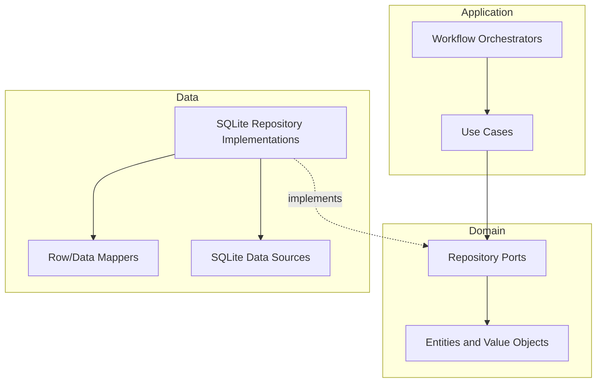

# CAS Analyzer Repository Design

**Document Version:** 0.1

**Status:** Draft

**Last Updated:** 2026-07-05

## 1. Purpose

This document defines the repository design for CAS Analyzer Version 1. It explains how domain/application code accesses persisted data without depending on SQLite, how repository interfaces are shaped around use cases, and how repository implementations protect correctness, privacy, and transaction consistency.

Repositories are not generic CRUD wrappers. They are intentional boundaries between business workflows and persistence details.

## 2. Scope

This document covers:

- Repository interface ownership.
- Repository implementation responsibilities.
- Query and command repository patterns.
- Import transaction and unit-of-work behavior.
- Data mapping between domain concepts and SQLite rows.
- Failure handling, diagnostics, privacy, and testing.
- Read paths for imports, dashboard, holdings, transactions, analytics, recommendations, reports, and maintenance.

This document does not define:

- Final Dart class names.
- Exact method signatures.
- The final SQLite package or generated data-access tooling.
- Final identity/reconciliation/precision policies.
- UI state-management providers.

## 3. Design Goals

Repository design must:

1. Keep domain and application code independent of SQLite.
2. Express meaningful use-case needs rather than table-level CRUD.
3. Preserve transaction consistency for accepted imports and maintenance actions.
4. Support efficient bounded reads for large local datasets.
5. Return typed results and typed failures.
6. Preserve provenance and avoid sensitive logging.
7. Be testable with both contract tests and real SQLite integration tests.
8. Avoid cross-feature data-layer coupling.

## 4. Repository Position in Architecture



Repository interfaces belong at the domain/application boundary that owns the business capability. Implementations live in the data layer and may depend on SQLite data sources, generated query helpers, and row models.

## 5. Ownership Rules

| Rule | Requirement |
| --- | --- |
| RDR-01 | Repository ports express domain/application needs, not database table operations. |
| RDR-02 | Repository implementations hide SQLite APIs, row types, SQL strings, and generated data-access details. |
| RDR-03 | Widgets and controllers do not call SQLite data sources directly. |
| RDR-04 | Domain entities are not database row objects. |
| RDR-05 | Cross-feature access uses public repository/query contracts, not internal data implementations. |
| RDR-06 | Import commit behavior is coordinated through an explicit transaction boundary. |
| RDR-07 | Repository failures are project-owned typed failures, not raw SQLite exceptions. |
| RDR-08 | Repositories do not log sensitive row values, SQL parameters, or financial data. |

## 6. Repository Categories

| Category | Purpose | Examples |
| --- | --- | --- |
| Command repository | Mutates durable state through explicit use-case operations. | Commit accepted import, delete scoped data, record backup event. |
| Query repository | Reads committed state for screens, reports, analytics, and recommendations. | Fetch holdings page, dashboard summary, transaction history. |
| Metadata repository | Reads/writes operational metadata. | Schema metadata, import history, diagnostics. |
| Maintenance repository | Performs explicit local maintenance operations. | Cleanup, restore validation, delete attempts. |

Command and query responsibilities may be implemented by the same class when practical, but the public contracts should keep mutation semantics clear.

## 7. Planned Repository Ports

The following ports describe expected responsibilities. Final source ownership may be refined during implementation, but any change must preserve module boundaries.

| Port | Owner | Main Consumers | Responsibility |
| --- | --- | --- | --- |
| `ImportRepository` | MOD-IMPORT | Import use cases, recent import UI | Create/update import batches and attempts, record safe outcomes and diagnostics. |
| `ImportCommitRepository` | MOD-IMPORT / MOD-PORTFOLIO boundary | Import orchestrator | Persist an accepted import change set atomically. |
| `PortfolioRepository` | MOD-PORTFOLIO | Dashboard, analytics, reports | Read portfolio-level aggregates and source-aware portfolio state. |
| `HoldingRepository` | MOD-HOLDINGS / MOD-PORTFOLIO | Holdings UI, reports, analytics | Read holding lists/details with filters and pagination. |
| `TransactionRepository` | MOD-TRANSACTIONS / MOD-PORTFOLIO | Transactions UI, reports, analytics | Read transaction lists/details with filters and pagination. |
| `NomineeRepository` | MOD-NOMINEE / MOD-PORTFOLIO | Recommendations, nominee views | Read nomination status and nominee-related observations. |
| `InstrumentRepository` | MOD-PORTFOLIO | Parser commit, holdings, analytics | Resolve accepted instruments and support search/matching after policy approval. |
| `DiagnosticRepository` | MOD-IMPORT / MOD-CORE | Import history, support views | Persist and query safe bounded diagnostics. |
| `DatabaseMaintenanceRepository` | MOD-SETTINGS / MOD-CORE | Settings/maintenance use cases | Cleanup, delete, integrity checks, backup/restore metadata if approved. |

Open ownership decisions must be resolved before implementation if they materially affect module dependencies.

## 8. Repository Contract Shape

Repository contracts should use project concepts:

- Accepted import change set.
- Import attempt ID.
- Holding query/filter.
- Transaction query/filter.
- Portfolio summary request.
- Report snapshot request.
- Maintenance operation request.

Repository contracts should not expose:

- SQL strings.
- Table names.
- Database connections.
- Cursor objects.
- Generated row classes.
- Flutter/Riverpod types.
- Raw exceptions from SQLite or platform plugins.

## 9. Query Contract Guidelines

Queries must be explicit and bounded.

Expected query inputs:

- Stable local identifier.
- Page/limit cursor or offset where appropriate.
- Sort field from an approved enum.
- Filter object with typed fields.
- Optional date range.
- Optional account, instrument, asset-class, transaction-type, or import-status criteria.

Queries must avoid:

- Unbounded "get all" calls for holdings or transactions.
- Free-form SQL from callers.
- UI-specific formatting in repositories.
- Business calculations that belong in domain/application rules.

## 10. Command Contract Guidelines

Commands must express intent and expected consistency boundary.

Examples:

- Start import batch.
- Record attempt stage.
- Mark attempt cancelled.
- Commit accepted import change set.
- Record safe diagnostic issue.
- Delete failed import attempt diagnostics.
- Run database integrity check.

Commands should return:

- Success outcome with relevant stable IDs.
- Duplicate/rejected outcome where applicable.
- Typed failure for database, migration, constraint, storage, or integrity errors.

Commands must not silently ignore constraint violations or partial writes.

## 11. Import Commit Repository

The accepted import commit is the most important write boundary.

The commit repository accepts only an accepted change set produced after parsing, validation, and reconciliation.

Commit responsibilities:

1. Open a SQLite transaction.
2. Recheck durable duplicate constraints.
3. Write import/source/provenance metadata.
4. Resolve or insert investors, accounts, instruments, and links.
5. Write holdings, transactions, nominations, corporate actions, and safe diagnostics.
6. Update import attempt terminal state.
7. Refresh approved read metadata or views if needed.
8. Commit only after every accepted record is persisted.
9. Roll back on any failure.

The parser must never write directly through this repository. It provides candidate data to application/domain validation; only accepted records reach the commit boundary.

## 12. Unit of Work and Transactions

Transactions should be owned by application-level operations, not by individual table helper methods.

| Operation | Transaction Boundary |
| --- | --- |
| Accepted import commit | Single logical transaction. |
| Failed/cancelled attempt status update | Small explicit transaction. |
| Diagnostic retention cleanup | Explicit scoped transaction. |
| Delete import or accepted data | Requires approved deletion/reconciliation design. |
| Restore database | Dedicated restore transaction or safe replacement strategy. |
| Migration | Ordered migration transaction as defined by migration strategy. |

Nested or hidden transactions should be avoided unless the chosen SQLite package requires an implementation detail that remains invisible to repository callers.

## 13. Mapping Strategy

Repositories map between:

- Domain/application request types.
- Data transfer types used by data sources.
- SQLite row shapes.

Mapping rules:

- Domain entities do not contain SQLite annotations or generated row helpers.
- Row models do not cross repository boundaries.
- Financial decimal values use approved value objects and exact storage representation.
- Nullable database fields map to explicit domain states, not careless `null` propagation.
- Enum/code mapping must reject unknown values safely or classify them as unsupported.
- Provenance links must be preserved when mapping accepted financial records.

## 14. Read Model Strategy

Repositories may read from:

- Normalized tables.
- SQLite views.
- Approved derived/read-model tables.

Rules:

- Read models do not become a second source of truth.
- Repositories expose domain-friendly snapshots, not view rows.
- Durable read-model refresh must be tested with import, migration, cleanup, and restore flows.
- Dashboard/report queries that combine many tables should use consistent snapshots where practical.

## 15. Pagination, Sorting, and Filtering

Holdings and transactions can grow large. Repositories must support bounded reads.

Guidelines:

- Use explicit page size limits.
- Provide deterministic default sorting.
- Keep sorting fields limited to indexed or approved fields.
- Validate filter ranges before executing queries.
- Prefer stable cursor/keyset pagination where list consistency matters.
- Avoid loading large record sets into memory for UI lists.

Default page sizes and maximum limits should be chosen during implementation after representative fixture testing.

## 16. Error Handling

Repository implementations catch infrastructure-specific failures and convert them into project-owned failures.

Expected failure categories:

- Database unavailable.
- Migration required or failed.
- Unsupported database version.
- Constraint violation.
- Duplicate import or duplicate record.
- Transaction rollback.
- Storage full or write failure.
- Data integrity violation.
- Query unavailable or malformed filter.

Repository callers must not need to inspect SQLite exception messages.

## 17. Privacy and Logging

Repositories sit near sensitive data and must be boringly disciplined.

Allowed diagnostic fields:

- Repository operation name.
- Safe failure code.
- Stage.
- Duration.
- Aggregate count.
- Correlation ID.

Forbidden diagnostic fields:

- Investor names.
- Account identifiers.
- Nominee details.
- Instrument names or ISINs.
- Holdings, units, quantities, values, prices, NAVs, or transaction details.
- Raw CAS content.
- SQL statements with parameters.
- Full database path if it may reveal sensitive user context.

## 18. Dependency Injection

Repository implementations are wired through Riverpod at the composition/application boundary.

Rules:

- Domain code receives repository ports through constructors or use-case dependencies.
- Riverpod provider types do not appear in domain entities or domain rules.
- Data sources receive database connection abstractions from core database infrastructure.
- Tests can replace repository ports with fakes or mock implementations.
- Repository integration tests use real SQLite data sources.

Avoid service locators and mutable global database access.

## 19. Data Source Responsibilities

SQLite data sources are lower-level than repositories.

They own:

- SQL statements or generated query calls.
- Table-specific row reads/writes.
- Parameter binding.
- Low-level transaction handles as instructed by repository/unit-of-work code.
- SQLite pragma/setup details delegated by core database infrastructure.

They do not own:

- Business decisions.
- Import reconciliation policy.
- User-facing messages.
- Domain validation.
- Cross-feature orchestration.
- Logging of sensitive row contents.

## 20. Repository Implementation Layout

The exact source tree will be finalized during project scaffolding, but implementation should follow feature ownership.

Example shape:

```text
app/lib/
  core/database/
    database_connection.dart
    database_migrations.dart
    transaction_runner.dart
  features/
    portfolio/
      domain/
        repositories/
      data/
        repositories/
        data_sources/
        mappers/
    pdf_import/
      domain/
        repositories/
      data/
        repositories/
        data_sources/
        mappers/
```

Do not create global business `models/` or `repositories/` folders just to avoid choosing feature ownership.

## 21. Testing Strategy

Repository testing has three layers.

| Test Type | Purpose |
| --- | --- |
| Port/use-case tests with fakes | Verify application/domain behavior without SQLite. |
| Repository contract tests | Verify repository semantics, outcomes, and edge cases against the port contract. |
| Real SQLite integration tests | Verify mappings, constraints, transactions, indexes, migrations, and query behavior. |

Required repository tests:

- Import commit success writes all required records.
- Import commit failure rolls back all accepted records.
- Duplicate constraint maps to duplicate outcome/failure.
- Holdings query supports pagination, filtering, and deterministic sort.
- Transactions query supports pagination, filtering, and deterministic sort.
- Nominee query supports missing nominee detection inputs.
- Dashboard/report snapshot reads committed data consistently.
- Diagnostics exclude seeded sensitive values.
- Unknown enum/code values map safely.
- Foreign-key constraints are enabled and enforced.

## 22. Test Data Policy

Repository tests must use synthetic data.

Rules:

- Use fake investor/account/nominee/instrument data.
- Avoid real CAS extracts.
- Keep financial examples realistic enough to test precision and relationships.
- Seed edge cases: missing instrument ID, unsupported transaction type, duplicate import candidate, overlapping statement candidate, no nominee, zero quantity, and large transaction history.
- Do not snapshot full sensitive-like rows unless the fixture is reviewed and safe.

## 23. Performance Expectations

Repositories should support:

- Batch writes during import commits.
- Indexed duplicate checks.
- Bounded holdings and transaction queries.
- Avoiding UI-thread heavy mapping for large result sets.
- Avoiding unbounded in-memory joins.
- Streaming or chunking where the implementation package supports it.

Performance thresholds require representative test devices and synthetic 200-300 page CAS fixtures. Do not invent numeric targets in repository code before baselines exist.

## 24. Repository Design Invariants

| ID | Invariant |
| --- | --- |
| RDI-01 | Repository ports expose business operations, not table CRUD. |
| RDI-02 | Domain and application contracts do not expose SQLite, SQL, row, cursor, Flutter, or Riverpod types. |
| RDI-03 | Repository implementations map raw SQLite failures to project-owned failures. |
| RDI-04 | Accepted import commit is atomic and rolls back on failure. |
| RDI-05 | Parser candidates cannot be persisted through repositories before validation and reconciliation. |
| RDI-06 | Repository queries over large data are bounded by filters, pagination, or explicit limits. |
| RDI-07 | Repository diagnostics contain no personal or financial values. |
| RDI-08 | Financial values map through exact approved representations, never SQLite `REAL`. |
| RDI-09 | Row models and data-source types do not cross repository boundaries. |
| RDI-10 | Repositories are tested against real SQLite for persistence behavior. |
| RDI-11 | Cross-feature data access uses public contracts, not internal data implementations. |
| RDI-12 | Maintenance operations are explicit, scoped, and transactional. |

## 25. Open Decisions and ADR Queue

| Priority | Decision | Repository Impact |
| --- | --- | --- |
| Critical | Import identity and duplicate algorithm | Duplicate checks and commit repository outcomes. |
| Critical | Overlap/re-import reconciliation policy | Accepted change set shape and import commit behavior. |
| Critical | Partial import policy | Commit boundary, diagnostics, and user-visible import outcomes. |
| Critical | Decimal representation and value objects | Mapper behavior and query filters. |
| High | Database package and migration tooling | Data-source structure, transaction runner, generated code strategy. |
| High | Exact ownership of holding/transaction/nominee repository ports | Feature boundaries and public contracts. |
| High | Current portfolio value definition | Portfolio/dashboard/report query contracts. |
| Medium | Durable read models versus on-demand queries | Repository query implementation and invalidation tests. |
| Medium | Backup/restore support | Maintenance repository responsibilities. |

## 26. Traceability

This design supports:

- FT-003: Import History.
- FT-004: Duplicate Import Detection.
- FT-014: SQLite Storage.
- FT-015: Database Migration.
- FT-016: Data Validation.
- FT-017: Data Cleanup.
- FT-018 through FT-042 for dashboard, holdings, transactions, analytics, recommendations, and reports.
- FT-045 if local backup and restoration is implemented.
- MI-08: Repository interfaces express domain/application needs, not generic storage CRUD.
- DBAI-13: Repository implementations hide SQLite details from application and domain callers.
- RDR-01 through RDR-08.
- RDI-01 through RDI-12.

## 27. Cross References

- `docs/project_context.md`
- `docs/02_Database/00_DatabaseArchitecture.md`
- `docs/02_Database/01_ConceptualDataModel.md`
- `docs/02_Database/02_PhysicalSchema.md`
- `docs/02_Database/03_MigrationStrategy.md`
- `docs/02_Database/05_BackupRestoreAndCleanup.md`
- `docs/01_Architecture/00_SolutionArchitecture.md`
- `docs/01_Architecture/02_ModuleArchitecture.md`
- `docs/01_Architecture/03_DataFlowArchitecture.md`
- `docs/01_Architecture/04_ImportPipelineArchitecture.md`
- `docs/01_Architecture/05_ErrorHandlingArchitecture.md`
- `docs/01_Architecture/06_SecurityArchitecture.md`
- `docs/00_Project/03_FeatureCatalog.md`
- `docs/ADR/`

## 28. AI Development Notes

When generating repository implementation:

- Name the owning feature and layer before proposing files.
- Create repository ports around use cases, not tables.
- Keep SQLite, SQL, generated rows, and transaction handles in the data layer.
- Do not expose Riverpod providers through domain contracts.
- Do not persist parser candidates directly.
- Do not finalize duplicate/reconciliation behavior without ADR approval.
- Do not use SQLite `REAL` for financial values.
- Add real SQLite tests for repositories, mappings, constraints, transactions, and privacy-safe diagnostics.
- Update this document when repository ownership, contracts, transaction behavior, or data-source structure changes.

## 29. Revision History

| Version | Date | Author | Description |
| --- | --- | --- | --- |
| 0.1 | 2026-07-05 | Project Team | Initial draft of the repository design. |
