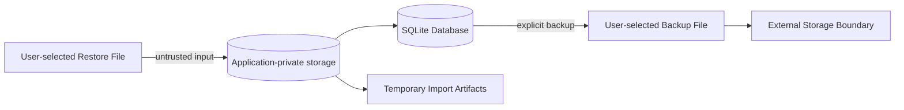

# CAS Analyzer Backup, Restore, and Cleanup

**Document Version:** 0.1

**Status:** Draft

**Last Updated:** 2026-07-05

## 1. Purpose

This document defines the database-level architecture for backup, restore, cleanup, and deletion workflows in CAS Analyzer. These workflows are safety-sensitive because they can copy, replace, remove, or expose the user's financial and personal data.

Backup and restore are optional for Version 1. Cleanup and deletion rules are required because imports can fail, users may need local data-management actions, and temporary or diagnostic data must not accumulate without policy.

## 2. Scope

This document covers:

- Local backup expectations if FT-045 is implemented.
- Restore validation and safe replacement/merge behavior.
- Cleanup of temporary, failed, cancelled, duplicate, and diagnostic data.
- Deletion of local data and import-related records.
- User intent, transaction boundaries, privacy, diagnostics, and tests.

This document does not define:

- Final backup archive format.
- Final encryption/password model for backups.
- Cloud backup or sync.
- Multi-device merge behavior.
- Final UI copy and confirmation screens.
- Import overlap/reconciliation policy.

## 3. Design Goals

Backup, restore, and cleanup workflows must:

1. Require explicit user intent for any data leaving or being removed from app storage.
2. Preserve the current usable database if backup, restore, cleanup, or deletion fails.
3. Treat restored files as untrusted input.
4. Avoid exposing sensitive data in logs, diagnostics, or metadata.
5. Keep operations offline and local by default.
6. Use transactions or safe replacement strategies for database-changing operations.
7. Never silently overwrite, delete, or replace user data.
8. Remain compatible with database migrations and schema version checks.

## 4. Workflow Status

| Workflow | Version 1 Status | Notes |
| --- | --- | --- |
| Cleanup of temporary import artifacts | Required | Must run after terminal import outcomes and on restart where needed. |
| Cleanup of failed/cancelled import attempts | Required with retention policy | Safe diagnostics may be retained according to policy. |
| Delete all local application data | Recommended | Requires explicit destructive confirmation. |
| Delete one failed/cancelled attempt | Recommended | Lower risk than deleting accepted imports. |
| Delete one accepted import | Requires ADR/design | Depends on reconciliation and provenance behavior. |
| Local backup | Optional | FT-045; needs archive/protection decision. |
| Local restore | Optional | FT-045; must validate and avoid data loss. |
| Cloud backup/sync | Excluded | Outside Version 1 scope. |

## 5. Security Boundary

Backup and exported files cross the application trust boundary. Restore files cross into the application trust boundary and must be validated before use.

## 6. Data Classification

| Data | Sensitivity | Backup Eligible | Cleanup Eligible |
| --- | --- | --- | --- |
| SQLite portfolio database | Restricted financial/personal | Yes, if FT-045 approved | Only by explicit delete/reset or restore replacement. |
| SharedPreferences settings | Low to sensitive depending on contents | Maybe | Yes, according to reset scope. |
| Temporary PDF/import artifacts | Sensitive source content | No by default | Yes, aggressively after use. |
| Raw PDF bytes | Sensitive source content | No by default | Yes, after import attempt. |
| Extracted text/cache | Sensitive source content | No by default | Yes, after import attempt. |
| Safe import diagnostics | Operational metadata | Maybe | Yes, by retention policy. |
| Exported reports | Restricted financial/personal | Not database backup content | Outside app control after export. |

## 7. Backup Architecture

Backup is a user-initiated operation that copies selected local application data to a user-selected destination.

If implemented, backup must:

- Require explicit user action.
- Show that sensitive financial data will leave application-private storage.
- Validate the destination before writing.
- Avoid silent overwrite unless the user explicitly confirms.
- Include schema version and backup format version.
- Include integrity metadata.
- Exclude temporary import artifacts and raw source content by default.
- Record only safe backup metadata in SQLite.

Backup must not:

- Run automatically in the background in Version 1.
- Upload to cloud storage directly.
- Include raw CAS PDFs unless a future design explicitly adds that capability.
- Log backup contents or destination paths that may be sensitive.

## 8. Backup Contents

The backup content decision remains open, but the approved design must choose one of these approaches:

| Option | Description | Trade-off |
| --- | --- | --- |
| Database-file backup | Copy the SQLite database and required sidecar files. | Simple but tightly coupled to SQLite/package behavior. |
| Logical export backup | Export normalized app data into a versioned archive format. | More portable but requires more design and validation. |
| Hybrid backup | Include database plus manifest/metadata. | Useful for restore validation but still coupled to database format. |

No implementation should begin until the backup format, integrity checks, and protection model are approved.

## 9. Backup Manifest

If a backup archive is implemented, it should include a manifest with safe metadata:

| Field | Purpose |
| --- | --- |
| App backup format version | Determines restore compatibility. |
| Database schema version | Determines migration requirements. |
| Created timestamp | User-visible backup age. |
| App version | Diagnostic compatibility only. |
| Integrity checksum | Detects corruption/tampering. |
| Content summary counts | Optional safe aggregate counts. |

Manifest must not include investor names, account identifiers, holdings, transactions, nominee details, raw CAS content, or full sensitive file paths.

## 10. Backup Protection

Backup protection is an open security decision.

Possible models:

- Plain local file with explicit warning.
- Password-protected archive.
- Encrypted archive.
- Platform-protected app-managed backup.

Because Version 1 defers encrypted database support, the backup design must not imply stronger protection than it actually provides. If backups are unencrypted, the UI and documentation must make that clear.

## 11. Restore Architecture

Restore imports data from a user-selected backup file into the application.

Restore must treat the selected file as untrusted until all validation passes.

Restore stages:

1. Select backup file.
2. Validate file accessibility and expected format.
3. Validate manifest and integrity metadata.
4. Validate schema/format compatibility.
5. Decide restore mode.
6. Prepare safe replacement or merge workspace.
7. Run required migrations on restored data if supported.
8. Validate restored database integrity.
9. Replace or merge active data only after validation succeeds.
10. Publish success and refresh read queries.

## 12. Restore Modes

Restore mode is an open decision.

| Mode | Description | Risk |
| --- | --- | --- |
| Replace | Existing app data is replaced by backup data after validation. | Clear semantics, but destructive if user misunderstands. |
| Merge | Backup data is merged with existing data. | Complex; depends on import identity and reconciliation rules. |
| Preview then replace | User sees safe summary before replacement. | Safer UX, more implementation work. |

Version 1 should prefer replace or preview-then-replace if backup/restore is implemented. Merge should not be implemented until import identity and reconciliation behavior are mature.

## 13. Restore Safety Rules

Restore must:

- Never destroy the current active database before the incoming backup is proven restorable.
- Validate schema version compatibility before activation.
- Run migrations in an isolated candidate location where practical.
- Validate foreign keys, required tables, and key counts.
- Reject unsupported future backup/database versions safely.
- Use explicit user confirmation before replacing current data.
- Roll back or abandon candidate data if restore fails.

Restore must not:

- Trust manifest fields without integrity validation.
- Open unsupported databases for normal writes.
- Import raw SQL or arbitrary file contents into active storage.
- Silently merge records using guessed identity rules.

## 14. Cleanup Architecture

Cleanup removes data that should not remain durable or should be retained only for a bounded period.

Cleanup categories:

| Category | Examples | Trigger |
| --- | --- | --- |
| Temporary artifacts | PDF bytes, extracted text, parser buffers | Import terminal outcome, restart recovery. |
| Failed/cancelled attempt metadata | Attempt rows, safe diagnostics | Retention policy or user action. |
| Duplicate attempt metadata | Duplicate detection records | Retention policy or user action. |
| Diagnostic compaction | Many parse warnings summarized | End of import or retention job. |
| Orphan repair | Inconsistent safe metadata after crash | Startup integrity/maintenance checks. |
| User-requested data reset | Entire local app database/settings | Explicit destructive action. |

Cleanup must be conservative around accepted financial data.

## 15. Cleanup Triggers

Cleanup may run:

- After import success, failure, cancellation, duplicate, or rejection.
- On app startup after detecting abandoned temporary artifacts.
- After migration if old safe artifacts are no longer needed.
- When the user explicitly requests cleanup/reset.
- During backup/restore failure recovery.

Cleanup must not run as an invisible destructive operation against accepted portfolio records.

## 16. Deletion Rules

| Deletion Scope | Allowed Without ADR | Notes |
| --- | --- | --- |
| Temporary import artifacts | Yes | Required privacy cleanup. |
| Failed/cancelled attempt diagnostics | Yes, with retention policy | Must not affect accepted records. |
| Duplicate attempt metadata | Yes, with retention policy | Safe if no portfolio records were committed. |
| All local app data reset | Yes, with explicit user confirmation | Destructive but simple scope. |
| One accepted import | No | Requires reconciliation/provenance design. |
| One account/holding/transaction | No | Requires business rules and user-facing consequences. |

Deleting accepted financial data must not be implemented by convenience cascade alone. The application needs explicit business semantics.

## 17. Transaction and Replacement Strategy

| Operation | Required Safety Strategy |
| --- | --- |
| Temporary cleanup | Best-effort file deletion plus safe retry on restart. |
| Failed attempt cleanup | SQLite transaction for metadata rows. |
| Diagnostics retention cleanup | SQLite transaction with bounded delete criteria. |
| Full data reset | Close database, remove scoped storage, recreate clean schema; require confirmation. |
| Backup creation | Consistent database snapshot or locked safe copy strategy. |
| Restore replace | Validate candidate first, then atomic/safe replacement where platform supports it. |
| Restore merge | Not approved until identity/reconciliation design exists. |

## 18. Error Handling

Expected failure categories:

- Backup destination unavailable.
- Backup write failed.
- Backup integrity creation failed.
- Restore file inaccessible.
- Restore format unsupported.
- Restore integrity validation failed.
- Restore schema version unsupported.
- Restore migration failed.
- Cleanup file deletion failed.
- Cleanup database transaction failed.
- User cancelled operation.

Failures must produce typed outcomes and safe user messages. They must not expose file contents, database rows, SQL parameters, or sensitive paths.

## 19. Diagnostics and Metadata

The optional `backup_restore_events` table may record:

- Event type.
- Status.
- Format version.
- Safe destination label.
- Failure code.
- Start/completion timestamps.

It must not record:

- Backup contents.
- Investor names.
- Account identifiers.
- Holdings or transactions.
- Nominee details.
- Full sensitive file paths.
- Raw exception messages containing sensitive content.

## 20. User Intent and UX Requirements

Every backup, restore, reset, and accepted-data deletion flow must make consequences clear.

Required UX properties:

- Explicit user action starts the operation.
- Destination/source is visible enough for informed consent.
- Destructive operations require confirmation.
- Cancellation is distinct from failure.
- Success explains what changed.
- Failure explains safe recovery without exposing sensitive internals.

Detailed screen copy belongs in UI documentation.

## 21. Testing Strategy

Required tests:

- Temporary artifacts are cleaned after success, failure, cancellation, rejection, and duplicate outcomes.
- Startup cleanup handles abandoned temporary artifacts.
- Failed/cancelled attempt cleanup does not affect accepted records.
- Full reset removes scoped local data and recreates a usable empty database.
- Backup excludes temporary artifacts and raw source content.
- Backup failure leaves active database unchanged.
- Restore rejects corrupt, unsupported, and future-version backups.
- Restore failure leaves previous active database usable.
- Restore migration uses migration strategy and validates integrity.
- Logs and diagnostics exclude seeded sensitive values.

Backup/restore tests are required only if FT-045 is implemented, but cleanup tests are required for Version 1 import work.

## 22. Backup, Restore, and Cleanup Invariants

| ID | Invariant |
| --- | --- |
| BRCI-01 | Backup, restore, reset, and accepted-data deletion require explicit user intent. |
| BRCI-02 | Temporary source artifacts are not retained after terminal import outcomes except where explicitly approved. |
| BRCI-03 | Restore treats selected backup files as untrusted input. |
| BRCI-04 | Failed backup or cleanup does not corrupt accepted portfolio data. |
| BRCI-05 | Failed restore leaves the previous active database usable. |
| BRCI-06 | Merge restore is not implemented without identity and reconciliation approval. |
| BRCI-07 | Backup metadata and diagnostics contain no personal or financial values. |
| BRCI-08 | Accepted import deletion requires explicit business design before implementation. |
| BRCI-09 | Cleanup of diagnostics is bounded by an approved retention policy. |
| BRCI-10 | Backup protection claims match the actual implemented protection model. |
| BRCI-11 | Backup/restore behavior remains compatible with schema migrations. |
| BRCI-12 | No cleanup path silently replaces an existing user database with an empty database. |

## 23. Open Decisions and ADR Queue

| Priority | Decision | Impact |
| --- | --- | --- |
| High | Whether FT-045 is implemented in Version 1 | Determines backup/restore implementation scope. |
| High | Backup archive format | Backup contents, restore validation, compatibility. |
| High | Backup encryption/protection model | Security UX, dependencies, restore flow. |
| High | Restore mode: replace, preview-replace, or merge | Data-loss risk and reconciliation complexity. |
| High | Diagnostic and failed-attempt retention policy | Cleanup schedules and metadata tables. |
| Critical | Import identity and reconciliation | Accepted import deletion and merge restore. |
| Medium | Full reset scope | Whether settings/preferences are reset with portfolio data. |

## 24. Traceability

This design supports:

- FT-017: Data Cleanup.
- FT-045: Backup and Restore, if implemented.
- DBAI-12: Backup, restore, delete, and cleanup operations are explicit, scoped, and recoverable.
- MIGI-12: Backup/restore migrations treat restored files as untrusted input.
- PHSI-12: Backup, restore, delete, and cleanup metadata never stores exported file contents.
- BRCI-01 through BRCI-12.

## 25. Cross References

- `docs/project_context.md`
- `docs/02_Database/00_DatabaseArchitecture.md`
- `docs/02_Database/01_ConceptualDataModel.md`
- `docs/02_Database/02_PhysicalSchema.md`
- `docs/02_Database/03_MigrationStrategy.md`
- `docs/02_Database/04_RepositoryDesign.md`
- `docs/01_Architecture/03_DataFlowArchitecture.md`
- `docs/01_Architecture/05_ErrorHandlingArchitecture.md`
- `docs/01_Architecture/06_SecurityArchitecture.md`
- `docs/00_Project/03_FeatureCatalog.md`
- `docs/ADR/`

## 26. AI Development Notes

When generating backup, restore, cleanup, or deletion implementation:

- Do not implement backup/restore unless FT-045 is explicitly in scope for the current work.
- Do not invent a backup format or encryption model without approval.
- Treat restore files as untrusted input.
- Do not implement accepted import deletion or merge restore before identity/reconciliation rules are approved.
- Keep temporary source artifacts out of backups by default.
- Keep logs, diagnostics, metadata, and tests free of personal and financial values.
- Add real SQLite and filesystem tests for cleanup and restore failure paths.
- Update this document when backup format, restore mode, retention policy, or deletion behavior changes.

## 27. Revision History

| Version | Date | Author | Description |
| --- | --- | --- | --- |
| 0.1 | 2026-07-05 | Project Team | Initial draft of the backup, restore, and cleanup design. |
