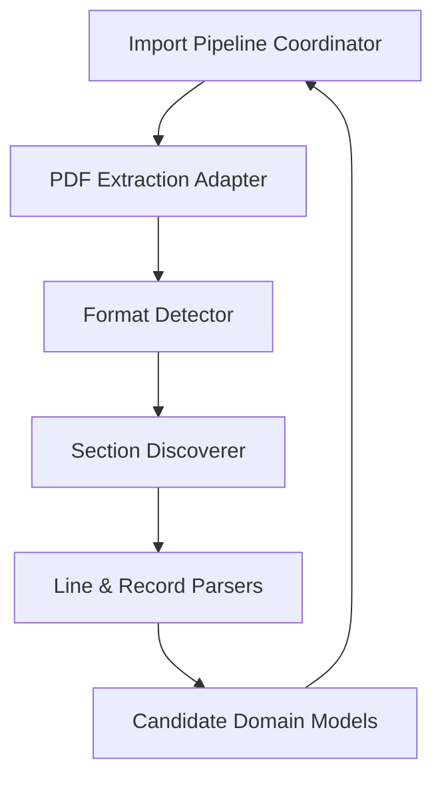

# CAS Analyzer Parser Architecture

**Document Version:** 0.1

**Status:** Draft

**Last Updated:** 2026-08-29

## 1. Purpose

This document defines the architecture of the `MOD-PARSER` module within CAS Analyzer. It outlines how the system extracts raw text from PDF files, detects the statement format, discovers logical sections, and parses text into structured candidate records, while remaining independent of the persistence layer.

## 2. Scope

This document covers:
- The role of the parser module in the overall import pipeline.
- Bounded text extraction to prevent memory exhaustion.
- Format and issuer detection (NSDL vs CDSL).
- Section discovery (Investor Details, Summary, Holdings, Transactions).
- Translation of text to candidate domain models.
- Provenance and diagnostic tracking for parsing errors.

This document does not cover:
- Database schema and persistence (covered in `docs/02_Database/`).
- Pipeline orchestration (covered in `docs/01_Architecture/04_ImportPipelineArchitecture.md`).
- Specific regular expressions or exact extraction rules (covered in detailed parsing docs).

## 3. Goals

The parser architecture must:
1. Extract data deterministically from supported CAS PDFs.
2. Isolate the core parsing logic from the PDF package (Syncfusion PDF) via adapters.
3. Process large statements (200-300 pages) without blocking the UI thread or exhausting memory.
4. Fail gracefully when encountering unsupported formats or malformed structures.
5. Preserve data provenance (e.g., source file name, page, line number) for all extracted candidates to aid explainability.
6. Support adding new parsers easily when NSDL/CDSL layouts change.

## 4. Architecture Position

The `MOD-PARSER` module sits between the generic import orchestration and the domain validation layer. It takes a validated source descriptor (file reference) and produces a stream of candidate models.

## 5. Module Responsibilities

1. **Extraction (IP-04):** Safely extract text chunks from the PDF file in a bounded manner.
2. **Detection (IP-05):** Inspect initial text to route to the correct parser implementation (e.g., `NsdlParser` vs `CdslParser`).
3. **Discovery (IP-06):** Segment the extracted text into logical blocks (e.g., Summary, Folios, Transactions).
4. **Parsing (IP-07):** Apply rules and state machines to convert text lines into typed candidate records (Holdings, Transactions, Nominees).

