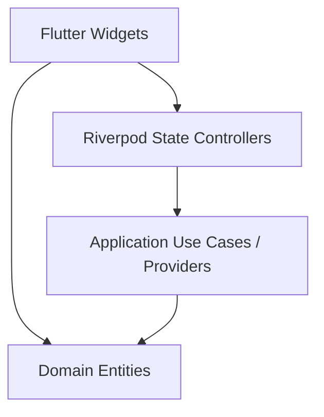

# CAS Analyzer UI Architecture

**Document Version:** 0.1

**Status:** Draft

**Last Updated:** 2026-08-29

## 1. Purpose

This document defines the architecture of the Presentation Layer (UI) for CAS Analyzer. It outlines the principles for building screens, managing state, handling user interactions, and maintaining strict separation from business logic.

## 2. Scope

This document covers:
- The role of the Presentation Layer in the Clean Architecture model.
- Widget organization (Screens vs. Components).
- Error and loading state standardization.
- Separation of concerns between UI, State Controllers, and Use Cases.

## 3. Architecture Position

The UI sits at the top of the dependency graph. It depends on Domain abstractions and Application services but never directly interacts with Data Repositories, SQLite, or the PDF Parser.

## 4. Key Principles

1. **Dumb Widgets:** Widgets should only display state and route user events to controllers. They must not contain parsing, validation, or financial calculation logic.
2. **Offline-First Responsiveness:** The UI must handle potentially long-running local tasks (like parsing a 300-page CAS) asynchronously without freezing.
3. **Immutability:** UI state should be represented by immutable classes, allowing Flutter to efficiently rebuild only when the state instance changes.
4. **Graceful Degradation:** If an error occurs in a specific widget (e.g., a chart fails to render), it should display a localized error boundary rather than crashing the whole screen.

