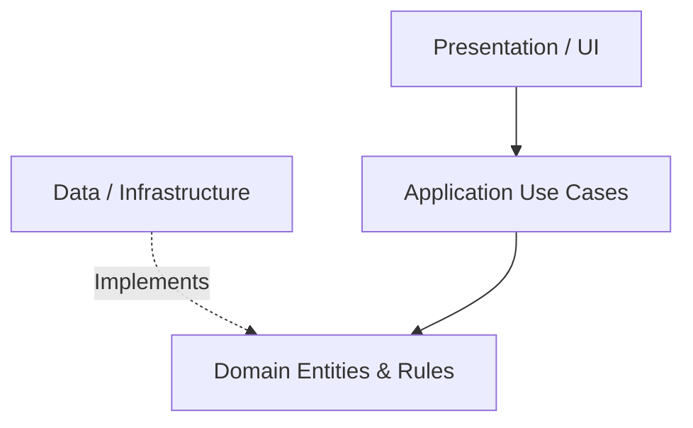

# Business Logic Architecture

**Document Version:** 0.1

**Status:** Draft

**Last Updated:** 2026-08-29

## 1. Purpose

This document defines the architecture of the Domain and Application layers (collectively, the Business Logic) for CAS Analyzer. It explains how financial rules, data validation, and core entities are structured to remain independent of the UI and Database.

## 2. Scope

This document covers:
- The Domain Layer (Entities, Value Objects, Repository Interfaces).
- The Application Layer (Use Cases, Services).
- Inversion of Control (IoC) via interfaces.
- The boundary between business logic and framework-specific code.

## 3. Architecture Position

The Business Logic is the heart of the Clean Architecture. It depends on nothing else. Both the Presentation Layer (Flutter UI) and Data Layer (SQLite/Parsers) depend on it.

## 4. Key Principles

1. **Framework Independence:** Business rules must not import Flutter libraries (e.g., `flutter/material.dart`) or SQLite packages. They use pure Dart.
2. **Immutability:** Domain entities must be immutable. State changes return new instances rather than mutating existing ones.
3. **Deterministic:** Calculations and validations must produce the exact same output given the same input, making them highly testable.
4. **Repository Interfaces:** The domain defines *what* data it needs via Repository abstract classes. The Data layer provides the *how*.

